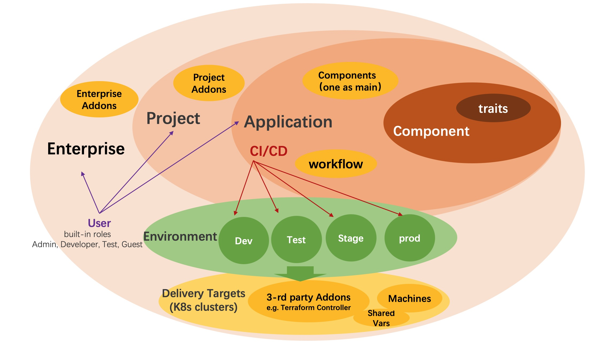

VelaUX is an addon on top of KubeVela, it works as an out-of-box platform which also brings some more concepts.

## Project

Project is where you manage all the applications and collaborate with your team member. Project is one stand alone scope that separates it from other project.

## Environment

Environment refers to the environment for development, testing, and production and it can include multiple Delivery Targets. Only applications in the same environment can visit and share resource with each other.

- <b>Bind Application with Environment</b> The application can be bound to multiple Environments, and for each environment, you can set the unique parameter difference for each environment.

## Delivery Target

Delivery Target describes the space where the application resources actually delivered. One target describes one Kubernetes cluster and namespace, it can also describe a region or VPC for cloud providers which includes shared variables and machine resources.

Kubernetes cluster and Cloud resources are currently the main way for KubeVela application delivery. In one target, credentials of cloud resources created will automatically delievered to the Kubernetes cluster.

## Application

An application in VelaUX is a bit different with KubeVela, we add lifecycle includes:

- <b>Create</b> an application is just create a metadata records, it won't run in real cluster.
- <b>Deploy</b> an application will bind with specified environment and instantiate application resource into Kubernetes clusters.
- <b>Recycle</b> an application will delete the instance of the application and reclaim its resources from Kubernetes clusters.
- <b>Delete</b> an application is actually delete the metadata.

The rest concept in VelaUX Application are align with KubeVela Core.

### Revision

Revision generates each time when the application deployed and holds all infos in one snapshot. You use it for rolling back to whichever version whenever you needed.

## Next Step

- View [Tutorials](../tutorials/webservice) to look on more of what you can achieve with KubeVela.
- View [How To guides](../how-to/dashboard/application/create-application) to check out more features.
