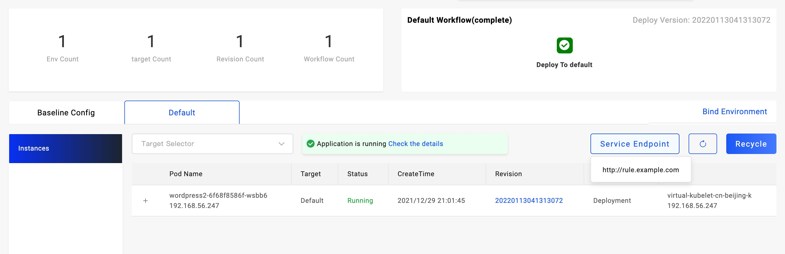

In this docs, we'll guide you how to use the UI console for the whole application lifecycle management.

## Configure Application Basics

Enter the `Applications` page, click `New Application` button, you can see the basic application configuration page. 

### Choose your application(component) type

Currently we only support one component for one application in VelaUX,
so the application type here is actually component type.

There're many component types supported in KubeVela including cloud resources and container based service type. New component types can be easily extended by KubeVela addons or component definition.

- We recommend to use `webservice` for your container based application.
- For helm packages, you can choose `helm` type.

### Configure the component

After you choose component type well, KubeVela will render the configuration
page according to the component type.

Different component types are different significantly, you can fill in the forms with the help of UI. For example, below is the configuration page for `webservice` type.


### Submit your application

After you finished configuring the application, click "Submit" to create the application. This means the application configuration was saved.

## Bind Application with Environment

We can specify bind with one or more environments before deploy.

After we have created application and configured the baseline well, we can bind an application with environment to deploy.

You can bind with one environment as `dev` environment for develop and debug. When everything works well, you can bind with the production environment.

The operation likes below:


As the picture shows, in the application management page, click `Bind Environment`, choose the environment prepared.

If there's no environment, you can click the `Create new environment` for creation.

After choose well, click the `submit` button, it will show the new environment created on the right side of the baseline config as a tab.

KubeVela will automatically generate the deploy workflow for the newly created environments.

In the environment tab, you can click `Deploy` button to deploy the application.

## Deploy Application

After application created and bond with an environment, you can deploy the application instance.

### First time deploy

You can view the application detail page by click the application name or the UI card.

The tabs on the right side of the `Baseline Config` are environments which bond by the application. Choose one of the environment you want to deploy. Click that tab, you'll see the picture below.


If this is the first time deploy, you'll see the Deploy button in the middle of the environment page, just click the `Deploy` button to deploy.

Then the workflow start to running, you can see the workflow status on the top right corner.

If you have configured a suspend workflow step, it will run and stop in that state. It will wait until you have checked your application well and click the approve button.


If there's something wrong with the workflow step, the workflow node will become red. Move your mouse to hover that area, you'll see the error reason.


### Upgrade the application

There's a `Deploy` button on the top right corner, you can click that for deploy. On the right side of the button, there's detail button, you can choose which workflow to run if there's multiple environments configured.


You can upgrade the application in any state, as KubeVela is a declarative system. There will be a kindly reminder for you if the workflow is running when you want to upgrade.

## Manage Workflows

The workflow is bound to the environment where the application is released, that is, each environment of the application has an independent workflow.

### Workflow Revision

When the application is deployed, a certain workflow is executed to release a version. The Revision follows the execution status of the workflow, which means that if the workflow is successfully executed, Revision will increase by +1.


After integrating with the CI system, Revision can be associated with Code Commit to trace the history. Later, the version rollback function will be implemented, and you can choose to roll back an environment to a specified version at any time.

### Edit Workflows

Enter the application workflow management page, select an environment workflow and click the `Edit` button to enter the editing state.


Select the steps you want add and connect, assuming you're adding a `notification` step.

Select the step of `notification` type on the left and drag it into the canvas on the right, the page will automatically pop up the workflow step editing window. In the setting window, you can set the parameters of the step.


After the configuration completed, click `Submit` to save the step configuration. At this time, you need to plan the location of the notification step. By default, it will be added to the end. If you want to place it in the middle step, you need to disconnect the direct connection of the original step, and then notify Steps are placed in the middle of the wire.

After the workflow is configured, please click the Save button at the top right of the workflow window to save all changes. After saving, you can click the `Deploy` on the top right of the page or the select button on the right to choose to execute the workflow and verify whether you can receive a message notification.

## Check Application State

Different tabs of environment will show different application instances inside.

By default, it will display all instances deployed in the environment, you can filter the status by select targets.


As the picture shows, check the application pod details by click the expand button("+") on the left. You can view the pod status including the events and error message about it.

For cloud resources, there will be a link to the cloud console for management.


## View Application Logs


You can view the logs of application in the environment tab.

By default, the logs will refresh every 5s. If your logs didn't have timestamp, you can click the `Show timestamps` to see.

You can also view logs from command line:

```bash
vela logs <app_name> -n <namespace>
```

Select a workload to view the logs.


## Expose your application for public access

You can configure your application for public access.

There're mainly three ways to expose your service.

1. Choose `webservice` Type and configure the service type to be `LoadBalancer` or `NodePort`.
2. Configure `gateway` trait, it works for `webservice`, `worker` and `task` component types. `gateway` trait must configure a domain and works only for HTTP/HTTPs protocols.
3. Case by case component configurations.

### Expose service for `webservice` typed component

You can modify `ExposeType` to choose the way, and you should configure the `Service Ports` to listen the ports and turn on the `Expose` radio.


### Add `gateway` trait

The `gateway` trait requires you have `Ingress Controller` available in your cluster. You can add this trait to expose your service and configure a domain.


As the picture shows, the `Domain` field configure your domain, please configure your DNS for domain to route to the Kubernetes cluster gateway IP.

In the `Http` section, you can configure the routing rules. For example, set `/`:`80` means the domain index page will route to the port `80`. You can configure this rule as you need.

Other component types can also be able to configure the service expose, but they're usually case by case, especially for helm charts.

### Get the service endpoint

After the application deployed with service exposed configuration, you can see a `Service Endpoint` button on the left of the `Recycle` button. You'll see the endpoint when hover your mouse there.



## List Resources Created

If you want to learn the resources created by the applications, you can open the environment status page.


There're three kinds of information including `Applied Resources`,`Conditions` and `Component Status`. The `Applied Resources` are all resources created by the applications.

You can also list resources from command line:

```bash
$ vela status <app_name> -n <namespace> --tree
```

## Recycle Application Instance

When you want to delete the application instance in some environment, you can click the `Recycle` button in that environment.


It will delete the whole application instance with related resources.

> Note that recycle means delete an application, data can't be recovered automatically. Please make sure you have back up all the important data of this instance before recycle it.

## Delete Application

After all application instance were recycled, you can click `Remove` for deletion.


As the picture shows, the `Remove` button is hidden in the application detail.

Now you have learned the basic lifecycle of an application.