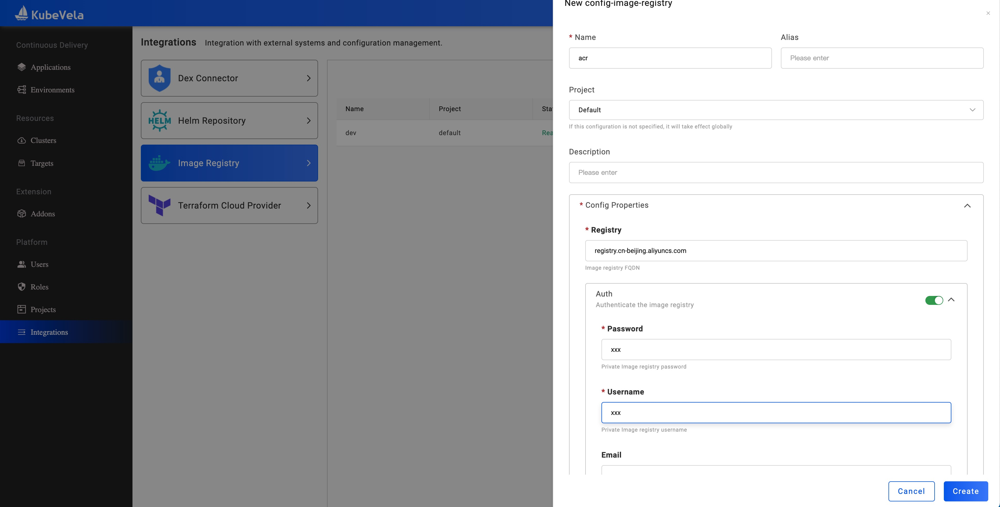
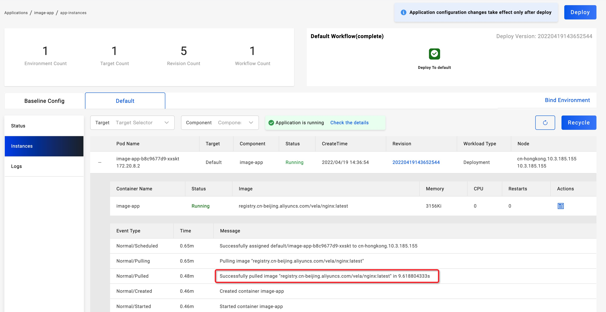

In this guide, we will introduce how to create a private image registry and how to create an application whose image locates in the registry.

## Create an image registry

In Image Registry page, let's create a private image registry `acr` whose url is `registry.cn-beijing.aliyuncs.com`.

## How to use the image registry

Let's follow the [application creation guide](../application/create-application.md) to create an application in project `default`.

Let's set container image to `registry.cn-beijing.aliyuncs.com/vela/nginx:latest` which locates in the private image registry `acr`.
Also set `ImagePullSecrets` to `acr`.

Deploy the application and wait for a while. You can see the application is running and the container image is successfully pulled from the private image registry.

