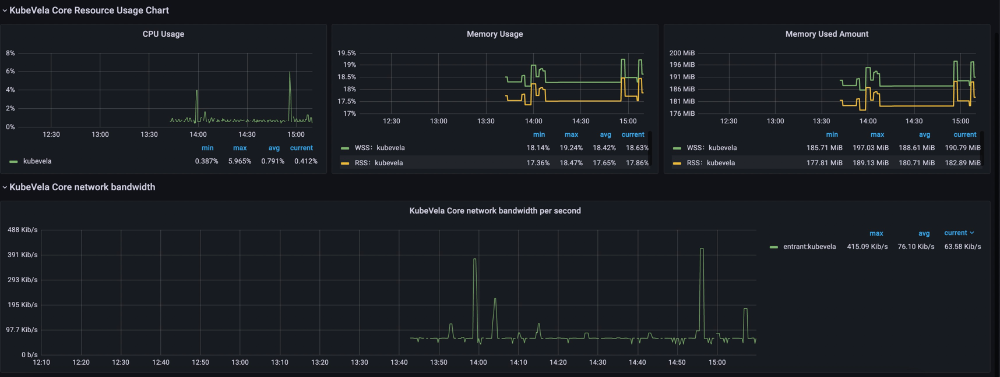

The Observability addon provides system-level monitoring for KubeVela core and business-level monitoring for applications
based on metrics, logging, and tracing data.

The following describes observability capabilities in detail, and how to enable the observability addon and view various
monitoring data.

## Introduction to Observable Capabilities

KubeVela observable capabilities are demonstrated through [Grafana](https://grafana.com/) and provide system-level and
application-level data monitoring.

### Built-in metric category I: KubeVela Core system-level observability

- KubeVela Core resource usage monitoring

1) CPU, memory, and other usage and utilization data


2) Graphical representation of CPU and memory usage and utilization over time (e.g. last three hours), and network bandwidth per second



### Built-in metrics category II: KubeVela Core log monitoring

1) Log statistics

The observable page displays the total number of KubeVela Core logs, as well as the number of `error` occurrences, frequency,
overview of all logs that occur, and details by default.


It also shows the total number and frequency, of `error` log occurrences over time.


2) Logging filter

You can also filter the logs by filling keywords at the top.


## Installing the addon

The observability addon is experimental, [Experimental Addon Registry](../addon/intro.md) should be enabled first. The
addon relies on Prometheus, and Prometheus alert manager, and server depend on PersistentVolume. So the size of PV has to be
set, ie, the parameter `disk-size` in the command line `vela addon enable observability`, and the default value is 20GB.
It also depends on StorageClass, so one default Storage has to be set.

### Self-built/regular Kubernetes clusters

Execute the following command to install the observability plugin. The steps are the same for similar clusters, like KinD.

```shell
$ vela addon enable observability disk-size=2
```

### Kubernetes clusters provided by cloud providers

#### Alibaba Cloud ACK

First pick one StorageClass as the default one.

```shell
$ kubectl get storageclass
NAME                       PROVISIONER     RECLAIMPOLICY   VOLUMEBINDINGMODE   ALLOWVOLUMEEXPANSION   AGE
alicloud-disk-available    alicloud/disk   Delete          Immediate           true                   6d
alicloud-disk-efficiency   alicloud/disk   Delete          Immediate           true                   6d
alicloud-disk-essd         alicloud/disk   Delete          Immediate           true                   6d
alicloud-disk-ssd          alicloud/disk   Delete          Immediate           true                   6d

$ kubectl patch storageclass $StorageClass -p '{"metadata": {"annotations":{"storageclass.kubernetes.io/is-default-class":"true"}}}'
```

Enable the addon and use the default StorageClass size 20GB.

```shell
$ vela addon enable observability
```

#### Kubernetes clusters offered by other cloud providers

Please set the default StorageClass and `disk-size` for different cloud provider's Kubernetes clusters.

## View monitoring data

### Get an account for the monitoring dashboard

```shell
$ kubectl get secret grafana -o jsonpath="{.data.admin-password}" -n vela-system | base64 --decode ; echo
<password printed here>
```

Using username `admin` and the password above to login to the monitoring dashboard below.

### Get the monitoring url

- Self-built/regular clusters

```shell
$ sudo vela port-forward addon-observability -n vela-system 80:80
```

Visit the Dashboard in the browser tab, which was opened by the command line, to view the various monitoring data introduced earlier.


- Kubernetes clusters provided by cloud providers

Access the Grafana domain set up above directly to view the various monitoring data described earlier.

### View monitoring data for various categories

On the Grafana home page, click on the console as shown to access the monitoring data for the appropriate category.

The KubeVela Core System Monitoring Dashboard is the KubeVela Core system-level monitoring console.
The KubeVela Core Logging Dashboard is the KubeVela Core logging monitoring console.

 

