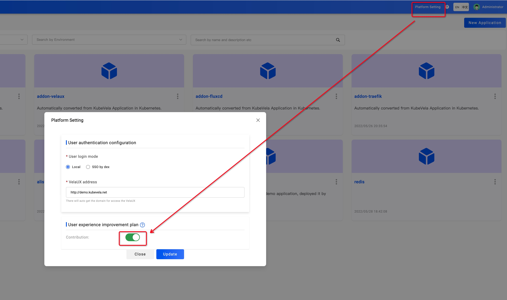

Welcome to join the "User Improvement Plan"! To improve the KubeVela open source product, avoid bugs and improve the product quality, we need to collect some of your system and usage information.

We will use these data to guide us to improve the installation, user experience and performance. That can also help us to make more decision about features and designs.

This plan follows the [CNCF Telemetry data collection and usage policy](https://www.linuxfoundation.org/telemetry-data-policy/), you can learn the collection data and more details [here](https://www.linuxfoundation.org/wp-content/uploads/KubeVela-Review-of-Project-Telemetry-Data-Collection-and-Usage.pdf).

If you don't want to join this plan, just turn off the button in the "platform setting". This won't block you to use any features about the product.

We promise the data collected can only be used within the community to improve the product user experience and help up to make feature design and decisions.

Thanks for your support!
