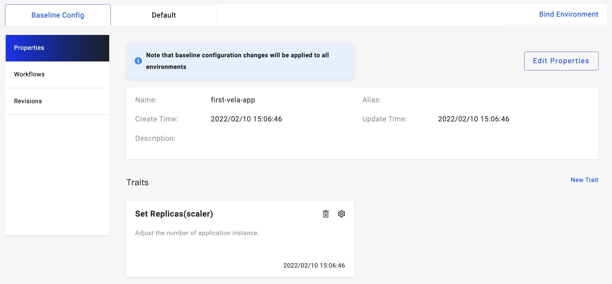
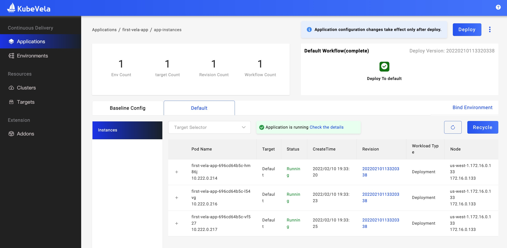

This section introduces how manually modify replicas to apply.

## Before starting

- You've walked through at least one type of application deployment.

## Attaching Trait

KubeVela has a built-in `scaler` Trait by default, which supports the adjustment of replicas in typical workloads, such as `webservice` and `k8s-objects` applications.

> For k8s-objects type applications, when multiple resources are involved, please put the workload resources such as Deployment, Statefulset, Job in the first place so that the Trait of `scaler` can take effect.

Let's take first-vela-app in `Deliver First Application` as an example. First, open the application's `Baseline Config`-`Properties` page:

Next, we click the Settings (gear) button on the right side of Set Replicas to adjust replicas to 3. After clicking save, the changes will be temporarily stored.

Then to make it effective in a certain environment, we need to click the `Deploy` button or the multi-environment workflow selection button next to it and select the corresponding environment to perform the deployment.

After the deployment is complete, you can enter the environment instance page. You'll find 3 rows of data that have appeared in the instance list.

> Trait can extend more powerful features, such as HPA.

## Edit deployment parameters

For applications created using Helm or other custom deployment types, if Traits are not applicable, you can directly edit the deployment parameters to adjust the number of application instances.

For example, in Helm applications, the general Chart package provides parameters for setting the number of replicas, which can be set by setting Values.

Take [apache chart](https://github.com/bitnami/charts/tree/master/bitnami/apache) as an example, set `replicaCount=3` in Values to adjust the number of replicas.

## Next step

- [View Application Logs](../how-to/dashboard/application/get-application-log)
- [Customize Scaler Trait](../platform-engineers/traits/customize-trait)
