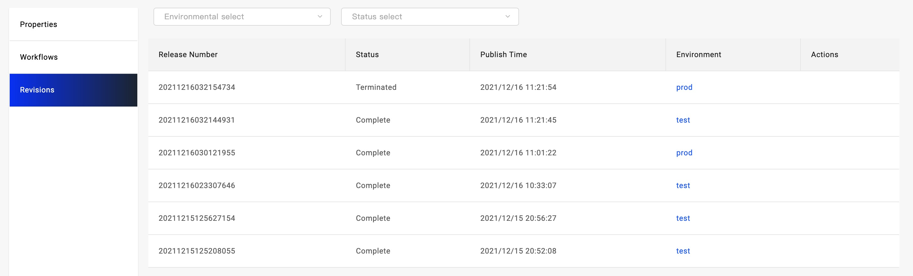

This section introduces the usage of Workflow and gives you a full picture of it.

In the section of [Deploy Kubernetes Objects](./k8s-object), we first learned the usage of workflow, that is, manual approval in the process of multi-cluster publishing. Now we continue to introduce the following topics:

1. Learn more about Workflow, Revision, and Environment, as well as all the built-in Workflow steps.
2. Implement notifications in the workflow.
3. Perform data initialization in the workflow.

## Before starting

We assume that you've learned from [Deliver the first application](../quick-start), [Deliver Docker image](./webservice), and other articles to understand the basic

## Workflow and Revision

When the application is deployed, a certain workflow is executed to release a version. The Revision follows the execution status of the workflow, which means that if the workflow is successfully executed, Revision will increase by +1.

The workflow is bound to the environment where the application is released, that is, each environment of the application has an independent workflow.

After docking with the CI system, Revision can be associated with Code Commit to trace the history. Later, the version rollback function will be implemented, and you can choose to roll back an environment to a specified version at any time.

## Built-in Workflow steps

In [Deliver Kubernetes Native Resources](./k8s-object), we used the manual review step `suspend`. Let's take a look at what the other built-in steps do:

- `deploy2env`: The application is delivered to the designated Target. This step will be automatically generated according to the Target configured in the environment.
- `deploy-cloud-resource`: Cloud resource applications are delivered to the designated Target. Note that the difference between this type of step and deploy2env is that the CR resource created by the control cloud resource is deployed to the control cluster. After the service is created and the access key (Secret) is generated, the Secret is distributed to the Target designated cluster and Namespace.
- `share-cloud-resource`: Distribute the secret generated by a cloud service to the specified targets. Thus when one cloud service is created in a multi-cluster application, and its access key can be shared to the other of multiple clusters.
- `notification`: three notification modes: DingTalk, Mail, and Slack, place them in any stage of the workflow to implement message notifications.
- `webhook`: place it at any stage of the workflow to call back external systems.

## Implement notification

Use the `notification` step to implement three notification modes: DingTalk, Email, and Slack. Enter the application workflow management page, select an environment workflow and click the `Edit` button to enter the editing state.

Select the step of `notification` type on the left and drag it into the canvas on the right, the page will automatically pop up the workflow step editing window. In the setting window, you can set three kinds of notifications as needed. In the same step, if you set multiple Notices, it takes effect at the same time.

If you set `Dingding` notification, click the enable button on the right side of the `Dingding` window, and two input boxes will appear on the page, one is the webhook address of the Dingding group notification robot, refer to [Dingding group robot reference document](https:// open.dingtalk.com/document/group/custom-robot-access). The other is the notification content input box, you can customize any notification content that needs to be sent.

`Slack` is similar to `Dingding` configuration, please refer to [Get Webhook Address in Slack](https://api.slack.com/messaging/webhooks).

`Email` has more configuration data. It needs to configure the mail server, mail content and sending destination mail address, etc.

After the configuration is complete, click `Submit` to save the step configuration. At this time, you need to plan the location of the notification step. By default, it will be added to the end. If you want to place it in the middle step, you need to disconnect the direct connection of the original step, and then notify Steps are placed in the middle of the wire.

After the workflow is configured, please click the Save button at the top right of the workflow window to save all changes. After saving, you can click the `Deploy` on the top right of the page or the select button on the right to choose to execute the workflow and verify whether you can receive a message notification.

## Next Steps

- [Deploy the application to the environment](../how-to/dashboard/application/deploy-application)