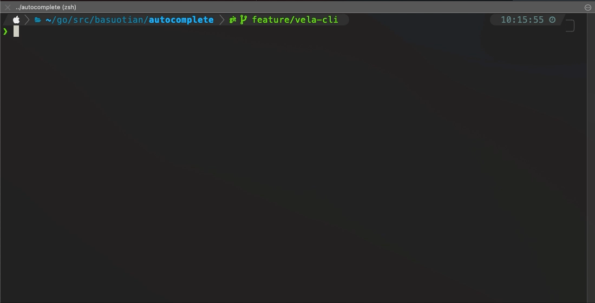

## Installation & Usage

- Using Homebrew: `brew install --cask fig`
- Download from their website: [fig.io](https://fig.io/welcome)



## Maintain KubeVela auto-complete scripts

- Fork the git repo [withfig/autocomplete](https://github.com/withfig/autocomplete)
- Clone your forked repo

```
# Replace `YOUR_GITHUB_USERNAME` with your own github username
git clone https://github.com/YOUR_GITHUB_USERNAME/autocomplete.git fig-autocomplete
cd fig-autocomplete

# Add withfig/autocomplete as a remote
git remote add upstream https://github.com/withfig/autocomplete.git

# Install packages
npm install
```

- edit vela-cli spec in `src/vela.ts`, the spec is easy to understand 
- run dev mode to review your change, use `npm run dev`
- send a PR to the main repo

