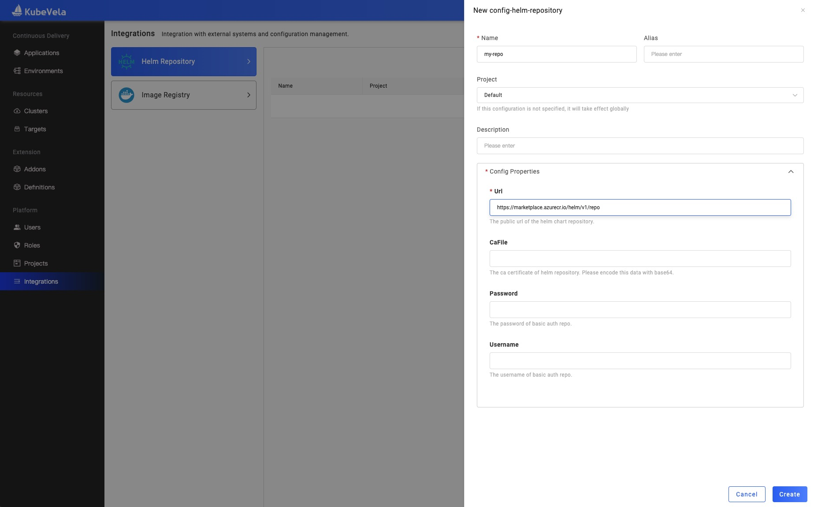
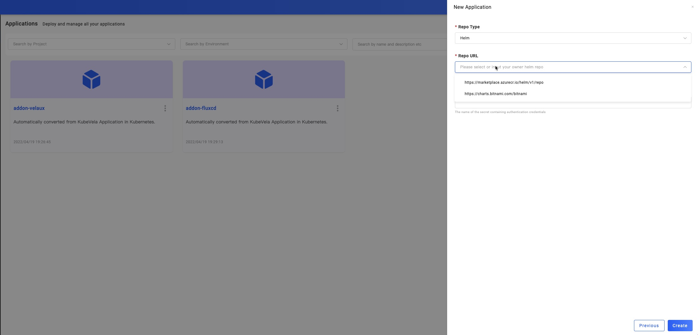

In this guide, we will introduce how to use Integration create a private helm repository and create a helm type application to use this repo.

Notice: You must enable the `fluxcd` addon firstly.

## Create a helm repo

You can set the url of your private repository in `url` field. If your repo have set up the HTTP basic authentication , you can set the `username` and `password` for it.

In this image we use the [azure](https://marketplace.azurecr.io/helm/v1/repo) helm repo.

If your helm repo's certificate is self-signed, you can set the `caFile` field with your own certificate.

## Use the helm repo

You can follow the [application creation guide](../application/create-application) to create a helm type application in project `default`. eg:

Then you can choose the helm repo url configured before like this image, and use the available charts in this repo.

