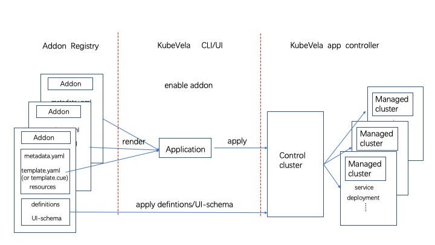

A KubeVela addon is a collection that can contain the following two types of files；
* `Extension configuration file` that defines KubeVela extensibility points, such as [X-definitions](../../getting-started/definition), [UI-Schema](../../reference/ui-schema) or [topology-rules](../../reference/topology-rule).
* `Resource description file` that defines Kubernetes resource objects. They may be the kubernetes operator behind a X-definition, or the webserver, etc.

The picture below shows what KubeVela does when an addon is enabled. There are mainly three process:
* [Addon Registry](./addon-registry) store addons which can be used to share and distribute addons anywhere, it can be any git repo, helm repo.
* When an addon is enabled through UX/CLI, it will pull these resource files from the Addon Registry, render them and create a KubeVela application.
* Finally, the KubeVela controller take care the rest things and deliver the addon as a normal application into control plane or multi-clusters.



## Make an addon

To make an addon, you should follow some basic rules as follows.

You need to create an addon directory to place addon resource files. Won't bother to create? `vela addon init` command will create a basic structure for you (vela CLI v1.5 or later). Please refer to `vela addon init -h` for details. For quick starts, we will just use `vela addon init your-addon-name` now.

Typically, the directory hierarchy looks like below:

```shell
├── resources/
│   ├── xxx.cue
│   └── xxx.yaml
├── definitions/
├── schemas/
├── README.md
├── metadata.yaml
├── parameter.cue
└── template.yaml(or template.cue)
```

Not all of these directories or files are necessary, let's explain them one by one.

### metadata.yaml(Required)

A `metadata.yaml` describes the basic information of an addon, such as the name, version, description, etc. With this basic info, an addon can be recognized by UX/CLI, an example likes:

```yaml
name: example
version: 1.0.0
description: Example adddon.
icon: xxx
url: xxx

tags:
  - only_example

deployTo:
  runtimeCluster: false

dependencies:
- name: addon_name

system:
  vela: ">=v1.4.0"
  kubernetes: ">=1.19.0-0"

invisible: false
```

Here's the usage of every field:

| Field | Required  | Type | Usage  |
|:----:|:---:|:--:|:------:|
|  name    |  yes | string | The name of the addon.  |
|  version    | yes  | string | The version of addon, increase for every changes and follow [SemVer](https://semver.org/) rule.  |
| description     | yes  | string | Description of the addon.  |
| icon     | no  | string | Icon of the addon, will display in addon dashboard.  |
| url     | no  | string | The official website of the project behind the addon.  |
| tags     | no  | []string | The tags to display and organize the addon.  |
| dependencies     | no  | []{ name: string } | Names of other addons it depends on. KubeVela will make sure these dependencies are enabled before installing this addon.  |
| system.vela     | no  | string | Required version of vela controller, vela CLI will block the installation if vela controller can't match the requirements.  |
| system.kubernetes     | no  | string | Required version of Kubernetes, vela CLI will block the installation if Kubernetes cluster can't match the requirements.  |
| deployTo.runtimeCluster     | no  | bool | By default, the addon will not be installed in the managed clusters. If it's `true`, it will be delivered to all managed clusters automatically. (This filed will only take effect when template is CUE file) |

### README.md (Required)

The README of this addon, it will be displayed in the dashboard for end user who's going to install this addon. So you should let them understand the basic knowledge of the addon which contains:

* What is the addon?
* Why to use this addon? The use case and scenarios.
* How to use this addon? It is the `end user` who should understand. An end to end demo is recommended.
* What will be installed? The definitions along with the CRD controllers behind.

There're no restrict rules for an [experimental addon](https://github.com/kubevela/catalog/tree/master/experimental/addons), but if the addon want to be [verified](https://github.com/kubevela/catalog/tree/master/addons), the README is the most important thing.

### template file (Optional)

Through the above introduction, we know that a very important part of an addon is resource description file that define the kubernetes resource objects that needs to be installed. You can write the `template file` (template.yaml or template.cue) or files below `resources/` dir to define these resources. These resources will be rendered into a KubeVela application, which applied to each cluster by the KubeVela controller. So the template file here can be used to define the basic framework of the application. You can use this file to describe the specific information of the application, for example: labels or annotations of the application, and of course you can directly add components, policies and set workflows in the template file. The type of template file can be YAML (template.yaml) or CUE (template.cue).

Which to choose depends on whether you want to change the application by parameters when the addon is enabled.

>Please notice: You can only choose one of `template.cue` or `template.yaml`, otherwise will report an error when enable the addon.

#### template.yaml

If you don't want to change the resources when enabled, a simple `template.yaml` file is enough. For example:

```yaml
apiVersion: core.oam.dev/v1beta1
kind: Application
metadata:
  name: velaux
  namespace: vela-system
spec:
  components:
    - name: namespace
      type: k8s-objects
      properties:
        objects:
        - apiVersion: v1
          kind: Namespace
          metadata:
            name: my-namespace
```

In this example, we define the basic framework of an application. This application contains a `k8s-objects` type component that contains `namespace` resource. After the addon is enabled, this namespace will be applied by KubeVela to all clusters.

#### template.cue

If you want the end user to determine some fields of the application by setting parameters when enabling the addon, you need write a `template.cue` file to do so. You can define the `template.cue` file like this to allow end-user specify the name of namespace in the above example:

```cue
package main

output: {
	apiVersion: "core.oam.dev/v1beta1"
	kind:       "Application"
	metadata: {
		name:      "example"
		namespace: "vela-system"
	}
	spec: {
		components: [
			{
				type: "k8s-objects"
				name: "example-namespace"
				properties: objects: [{
					apiVersion: "v1"
					kind:       "Namespace"
					metadata: name: parameter.namespace
				}]
			},
		]
	}
}
```

As we can see, this CUE file mainly contain a `ouput` block. The `output` block must be a KubeVela application that may contain components, policies, or workflow. 

> Notice: This CUE file must have a `package main` header.

In this example, we also define a namespace in `k8s-objects` component, and the name of it is set by parameters. If you want the created namespace is `my-namespace` you can execute the command like this:

```shell
$ vela addon enable <addon-name> namespace=my-namespace
```

After rendered, the resulting application is:

```yaml
kind: Application
metadata:
  name: example
  namespace: vela-system
spec:
  components:
    - name: namespace
      type: k8s-objects
      properties:
        objects:
          - apiVersion: v1
            kind: Namespace
            metadata:
              name: my-namespace
```

> Please notice: The name of Application in template file will be replaced by the addon name in `metadata.yaml`. The addon application will always have a unified name in the format of `addon-<addon_name>`.

Although you can define the entire content of the application in the template file, but this may cause the template file to become very large, so you can choose to split a part of some content into the `resources` directory, latter section will introduce the all details.

##### Auxiliary resources

You also can define some auxiliary resources that only to applied to control-plane in `outputs` CUE block of `template.cue` file. These resources will applied to control-plane directly. For example:

```cue
package main

output: {
	apiVersion: "core.oam.dev/v1beta1"
	kind:       "Application"
	metadata: {
		name:      "example"
		namespace: "vela-system"
	}
	spec: {
		
	}
	... 
}

outputs: resourceTree: {
	apiVersion: "v1"
	kind:       "ConfigMap"
	metadata: {
		name:      "resource-tree"
		namespace: "vela-system"
		labels: {
			"rules.oam.dev/resources":       "true"
			"rules.oam.dev/resource-format": "json"
		}
	}
	data: rules: json.Marshal(_rules)
}

_rules: {...}
```

In this example, we define a configmap `resourceTree` as an auxiliary resource, this configmap is actually a [resource topology rule](../../reference/topology-rule) that only need to be applied to control-plane.

##### Determine which clusters to be installed by parameters in `template.cue`

If you want the resources in the addon to be installed not only in the control-plane, but also in various other managed-clusters, and installed clusters need to be specified by the user by setting the `clusters` parameter when enabling the addon. You can do this by adding a topology policy in `template.cue` as shown below:

```cue
package main

output: {
	apiVersion: "core.oam.dev/v1beta1"
	kind:       "Application"
	metadata: {
		name:      "example"
		namespace: "vela-system"
	}
	spec: {
		components:{...}
		policies: [{
			type: "topology"
			name: "deploy-topology"
			properties: {
				if parameter.clusters != _|_ {
					clusters: parameter.clusters
				}
				if parameter.clusters == _|_ {
					clusterLabelSelector: {}
				}
			}
		}]
	}}
```

If you execute command like below to enable the addon, resources will be deployed to `local` cluster and `cluster1` cluster.

```shell
$ vela addon enable <addon-name> clusters=local,cluser1
```

The render result will be:

```yaml
kind: Application
metadata:
  name: example
  namespace: vela-system
spec:
  components: ...
  policies:
    - type: "topology"
      name: "deploy-topology"
      properties:
        clusters:
          - local
          - cluster1
```

Since an empty `clusterLabelSelector` topology will choose all exist clusters as target clusters, you can just enable the addon without `clsuters` parameter to install it to all clusters:

```shell
$ vela addon enable <addon-name>
```

The render result is :

```yaml
kind: Application
metadata:
  name: example
  namespace: vela-system
spec:
  components: ...
  policies:
    - type: "topology"
      name: "deploy-topology"
      properties:
        clusterLabelSelector: {}
```

#### Examples

Here are some existing addons made by community.

* [OCM control plane](https://github.com/kubevela/catalog/blob/master/addons/ocm-hub-control-plane/template.yaml), this addon needn't change any content while enabling, so it chooses to use `template.yaml`.
* [ingress-nginx](https://github.com/kubevela/catalog/tree/master/addons/ingress-nginx) addon is an example define a `template.cue` file, which can change some content of resources.

### parameter.cue (Optional)

In the example above, we used `parameter.namespace` parameter to set the name of namespace, and the `parameter.clusters` set the clusters that to be installed. We also need a parameter definition file (`parameter.cue`) to define what parameters the addon has. For examples:

```cue
parameter: {		
  //+usage=clsuters install to
  clsuters: [...string]
  //+usage=namespace to create
  namespace: string
}
```

### `resources/` directory (Optional)

Except writing every thing about an application in  one `temaplte.cue` or `template.yaml`, you also can split some resource description file to `resources` directory to avoid a very huge template file. File type in this dir can be YAML or CUE.

#### YAML resources

The YAML type files must be Kubernetes objects, you can define many objects one by one in a file. It will be directly added to the application as a `K8s-object` type component during rendering. For example:

```yaml
apiVersion: v1
kind: ServiceAccount
metadata:
  name: my-service-account
  namespace: default
secrets:
- name: my-secret
```

In this example, we define a service account resource. The render result is :

```yaml
kind: Application
metadata:
  name: example
  namespace: vela-system
spec:
  components:
    -
    #   ...
    #   other contents defined in template file
    #   ...
    - name: namespace
      type: k8s-objects
      components:
        objects:
        -  apiVersion: v1
           kind: ServiceAccount
           metadata:
            name: my-service-account
            namespace: default
            secrets:
            - name: my-secret
```

An example is [OCM](https://github.com/kubevela/catalog/tree/master/addons/ocm-hub-control-plane). All files in this addon is YAML.

#### CUE resources

Unlike the YAML resource description file, the CUE resource description file defines the CUE block that can be referenced by `template.cue`

Continuing with the example in the introduction of `template.cue`, we split the CUE blocks that define the `namesapce` component and `topology` policy into the `resources` directory, the directory structure is as follows:

```shell
├── resources/
│   ├── namespace.cue
│   └── topology.cue
├── README.md
├── metadata.yaml
├── parameter.cue
└── template.cue
```

The `topology.cue` is:

```cue
// resources/topology.cue
package main

topology: {
	type: "topology"
	name: "deploy-topology"
	properties: {
		if parameter.clusters != _|_ {
			clusters: parameter.clusters
		}
		if parameter.clusters == _|_ {
			clusterLabelSelector: {}
		}
	}
}
```

`namespace.cue` is:

```cue
// resources/namespace.cue
package main

namespace: {
	type: "k8s-objects"
	name: "example-namespace"
	properties: objects: [{
		apiVersion: "v1"
		kind:       "Namespace"
		metadata: name: parameter.namespace
	}]
}
```

Then wen can reference the two CUE block in `template.cue` like this:

```cue
// template.cue

package main

output: {
	apiVersion: "core.oam.dev/v1beta1"
	kind:       "Application"
	metadata: {
		name:      "example"
		namespace: "vela-system"
	}
	spec: {
		// reference namespace block from resources/naemspace.cue
		components: [namespace]
		// reference topology block from resources/topology.cue
		policies: [topology]
	}
}
```

After enabled with command `$ vela addon enable <addon-name> namespace=my-namespace clusters=local,cluser1`, the resulting application is:

```yaml
apiVersion: core.oam.dev/v1beta1
kind: Application
metadata:
  name: example
  namespace: vela-system
spec:
  components:
    - name: namespace
      type: k8s-objects
      properties:
        objects:
          - apiVersion: v1
            kind: Namespace
            metadata:
              name: my-namespace
  policies:
    - type: "topology"
      name: "deploy-topology"
      properties:
        clusters:
          - local
          - cluster1
```

> Please notice: Only those CUE files with header `package main` can be reference by `template.cue`.

You can refer to the [CUE basic](../cue/basic) to learn language details.

#### Use metadata of context 

In addition to dynamically rendering the application by parameters, you can also read fields defined in `metadata.yaml` for rendering. For example, you can define a `templatec.cue` file as follows:

```cue
output: {
	apiVersion: "core.oam.dev/v1beta1"
	kind:       "Application"
	metadata: {
		name:      "example"
		namespace: "vela-system"
	}
	spec: {
		components: [
			{
				type: "webservice"
				properties: {
					image: "oamdev/vela-apiserver:" + context.metadata.version
				}
			},
		]
	}
}

```

When rendering, the fields defined in `metadata.yaml` will be put into the CUE block of `context` and rendered together with other CUE files, if the `metadata.yaml` is:

```yaml
...
name: velaux
version: 1.2.4
...
```

Resulting application is:

```yaml
apiVersion: core.oam.dev/v1beta1
kind:       Application
metadata:
  name: example
  namespace: "vela-system"
spec:
  components:
    - type: webservice
      properties:
        image: "oamdev/vela-apiserver:v1.2.4"
```

The image tag becomes the addon's version due to the `context.metadata.version` points to. The real example is [VelaUX](https://github.com/kubevela/catalog/blob/master/addons/velaux/resources/apiserver.cue). Other available fields please refer to [metadata](#metadata.yaml(Required)).

### `definitions/` directory(Optional)

The `definitions` directory is used to store `X-Definitions`, which can be a YAML file of ComponentDefinition, traitDefinitions or workflowStepDefinitions Kubernetes CR. It can also be a CUE type of  KubeVela [def](../../getting-started/definition), which will be rendered into the corresponding X-definitions CR when enabled and applied to the cluster.

> Please notice: These definitions only will be applied to control-plane

#### Binding X-definition to a component

If you want to bind a X-definition to a component in the application, to achieve dynamically enable the ability of one X-definition, you can do it by setting `addon.oam.dev/bind-component` annotation on the definition.

An actual example is [`fluxcd`](https://github.com/kubevela/catalog/tree/master/addons/fluxcd/definitions) addon. 

Component definition `kustomize` in this addon is:

```cue
kustomize: {
	attributes: workload: type: "autodetects.core.oam.dev"
	description: "kustomize can fetching, building, updating and applying Kustomize manifests from git repo."
	type:        "component"
	annotations: {
		 "addon.oam.dev/ignore-without-component": "fluxcd-kustomize-controller"
   }
}

...
```

This definition has an annotation `"addon.oam.dev/bind-component": "fluxcd-kustomize-controller"`, which means, bind the ComponentDefinition to `fluxcd-kustomize-controller` component.

The `template.cue` of this addon is:

```cue
//...

kustomizeController: {
	type: "webService"
	Name: "fluxcd-kustomize-controller",
	//....
}

gitOpsController: [...]

if parameter.onlyHelmComponents == false {
	gitOpsController: [kustomizeController]
}

output: {
	apiVersion: "core.oam.dev/v1beta1"
	kind:       "Application"
	spec: {
		//...
		components: [
			helmController,
			sourceController,
		] + gitOpsController
		//...
	}
}
//...
```

The `fluxcd-kustomize-controller` component is not added to the application when the user enables the addon with the following command. This definition won't be applied to control-plane either. Also `kustomize` ComponentDefinitions will not be applied.

```shell
$ vela addon enable fluxcd `onlyHelmComponents=true`
```

### `schemas/` directory(Optional)

The `schemas/` directory is used to store the [UI schema](../../reference/ui-schema) files corresponding to `Definitions`, which is used to enhance the display effect when displaying the parameters required by `Definitions` in UX.

The above is a complete introduction to how to make an addon, you can find the complete description of the above-mentioned addon in this [catalog](https://github.com/kubevela/catalog/tree/master/experimental/addons/example) example.

In addition to uploading the addon resource files to your addon repository, you can also submit a pull request to KubeVela [community addon repository](https://github.com/kubevela/catalog/tree/master/addons) and [experimental addon repository](https://github.com/kubevela/catalog/tree/master/experimental/addons) to addon new addons. After pr merged your addons can be discovered and used by other KubeVela users.

## Install Addon Locally

You can install addon from local to debug your own addon:

```
vela addon enable ./your-addon-dir/
```

## Known Limits

- Cannot only install addon in the sub-clusters. Because of KubeVela need render out every kind of resource in control plane, if an addon contain some [CRD](https://kubernetes.io/docs/concepts/extend-kubernetes/api-extension/custom-resources/), these CRD must be installed in control plane, otherwise Vela-core controller will meet an error of cannot find CRD.

## Extend Terraform Addon

*  We have built some tools to extend cloud resource as addons  for convenience, you can refer to the [extend terraform addon docs](./terraform).

## Contribution

If you have developed your own addons, welcome to contribute to the [community catalog](https://github.com/kubevela/catalog). 

Meanwhile, any bugfix of existing addons are welcomed. Just make a pull request to [this](https://github.com/kubevela/catalog) repo.