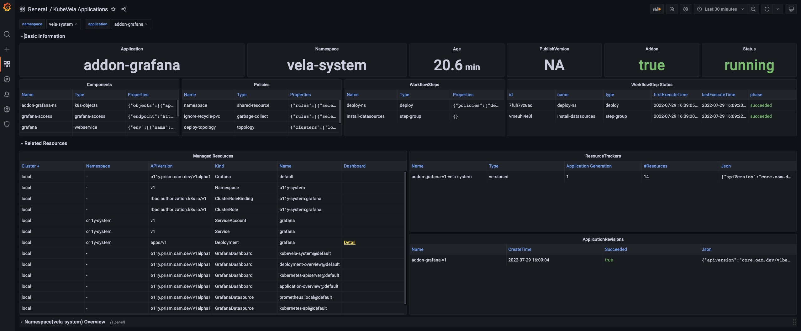
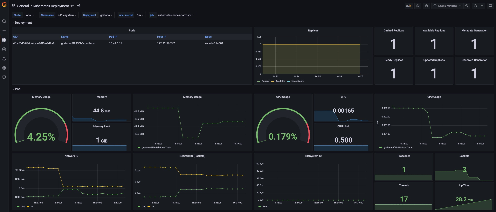
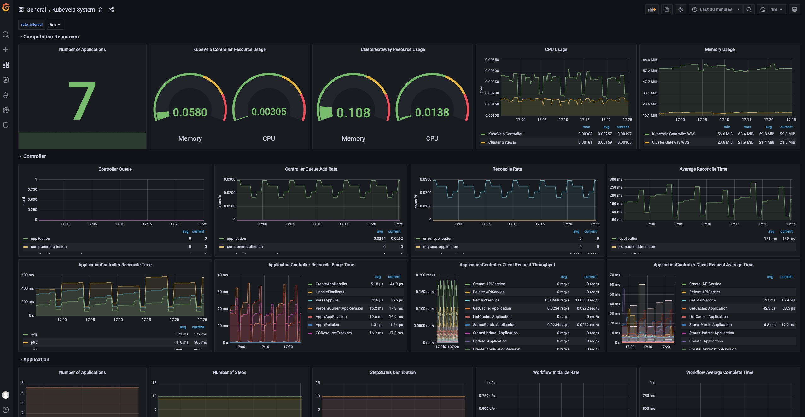
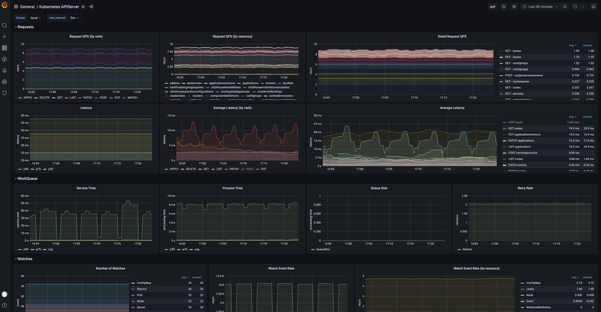
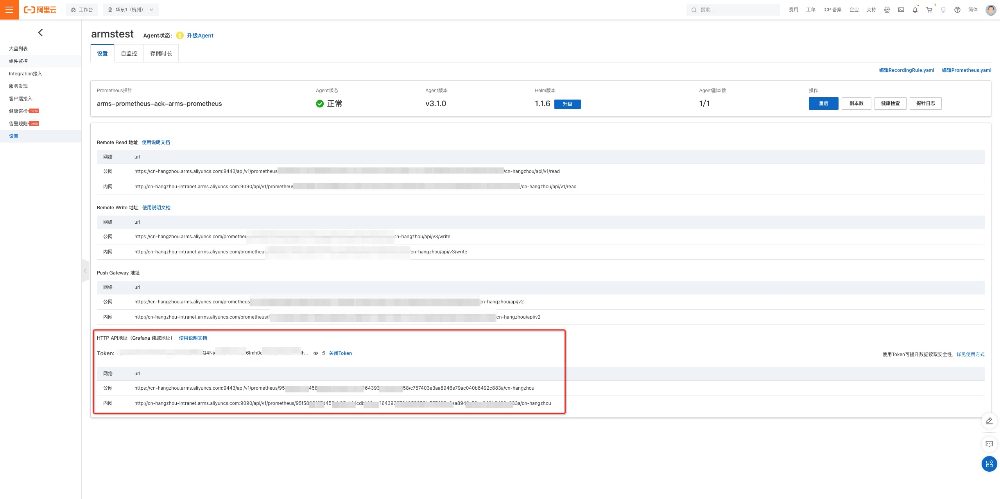

Observability is critical for infrastructures and applications. Without observability system, it is hard to identify what happens when system broke down. On contrary, a strong observabilty system can not only provide confidences for operators but can also help developers quickly locate the performance bottleneck or the weak points inside the whole system.

To help users build their own observability system, KubeVela provides a list of addons, including

- prometheus-server: A server records metrics in time series with flexible queries supported.
- kube-state-metrics: A metrics collector for the Kubernetes system.
- node-exporter: A metrics collector for the running Kubernetes nodes.
- grafana: A web application that provides analytics and interactive visualizations.

More addons for logging and tracing will be introduced in later versions.

## Prerequisite

1. The observability suite includes several addons which requires some computation resources to work properly. The recommended installation resources for you cluster is 2 core + 4 Gi memory.

2. The required KubeVela version (both Server-side controller and Client-side CLI) for installation is **not below ** v1.5.0-beta.4.

## Quick Start

To enable the addon suites, you simply needs to run the `vela addon enable` commands as below.

> If your KubeVela is multi-cluster scenario, see the [multi-cluster installation](#multi-cluster-installation) section below.

1. Install the kube-state-metrics addon

```shell
> vela addon enable kube-state-metrics
```

2. Install the node-exporter addon

```shell
> vela addon enable node-exporter
```

3. Install the prometheus-server

```shell
> vela addon enable prometheus-server
```

4. Install the grafana addon.

```shell
> vela addon enable grafana
```

5. Access your grafana through port-forward.

```shell
> kubectl port-forward svc/grafana -n o11y-system 8080:3000
```

Now you can access your grafana by access `http://localhost:8080` in your browser. The default username and password are `admin` and `kubevela` respectively.

## Automated Dashboards

There are four automated dashboards you can navigate and view your system.

### KubeVela Application

This dashboard shows the basic information for one application.

URL: http://localhost:8080/d/application-overview/kubevela-applications



<details>
  The KubeVela Application dashboard shows the overview of the metadata for the application. It directly accesses the Kubernetes API to retrieve the runtime application information, where you can use it as an entrance.

---

The **Basic Information** section extracts key information into panels and give you the most straightforward view for the current application.

---

The **Related Resource** section shows those resources that work together with the application itself, including the managed resources, the recorded ResourceTrackers and the revisions.

</details>

### Kubernetes Deployemnt

This dashboard shows the overview of native deployments. You can navigate deployments across clusters.

URL: http://localhost:8080/d/deployment-overview/kubernetes-deployment



<details>
  The Kubernetes Deployment dashboard gives you the detail running status for the deployment.

---

The **Pods** panel shows the pods that the deployment itself is currently managing.

---

The **Replicas** panel shows how the number of replicas changes, which can be used to diagnose when and how your deployment shifted to undesired state.

---

The **Pod** section includes the details for the resource usage (including the CPU / Memory / Network / Storage) which can be used to identify if the pod is facing resource pressure or making/receiving unexpected traffics.

</details>

### KubeVela System

This dashboard shows the overview of the KubeVela system. It can be used to see if KubeVela controller is healthy.

URL: http://localhost:8080/d/kubevela-system/kubevela-system



<details>
  The KubeVela System dashboard gives you the running details of the KubeVela core modules, including the controller and the cluster-gateway. Other modules like velaux or prism are expected to be added in the future.

---

The **Computation Resource** section shows the usage for core modules. It can be used to track if there is any memory leak (if the memory usage is continuously increasing) or under high pressure (the cpu usage is always very high). If the memory usage hits the resource limit, the corresponding module will be killed and restarted, which indicates the lack of computation resource. You should add more CPU/Memory for them.

---

The **Controller** section includes a wide range of panels which can help you to diagnose the bottleneck of the KubeVela controller in your scenario.

The **Controller Queue** and **Controller Queue Add Rate** panels show you the controller working queue changes. If the controller queue is increasing continuously, it means there are too much applications or application changes in the system, and the controller is unable to handle them in time. Then it means there is performance issues for KubeVela controller. A temporary increase for the controller queue is tolerable, but keeping for a long time will lead to memory increase which will finally cause Out-Of-Memory problems.

**Reconcile Rate** and **Average Reconcile Time** panels give you the overview of the controller status. If reconcile rate is steady and average reconcile time is reasonable (like under 500ms, depending on your scenario), your KubeVela controller is healthy. If the controller queue add rate is increasing but the reconcile rate does not go up, it will gradually lead to increase for the controller queue and cause troubles. There are various cases that your controller is unhealthy:

1. Reconcile is healthy but there are too much applications, you will find everything is okay except the controller queue metrics increasing. Check your CPU/Memory usage for the controller. You might need to add more computation resources.
2. Reconcile is not healthy due to too much errors. You will find lots of errors in the **Reconcile Rate** panel. This means your system is continuously facing process errors for application. It could be caused by invalid application configurations or unexpected errors while running workflows. Check application details and see which applications are causing errors.
3. Reconcile is not healthy due to long reconcile times. You need to check **ApplicationController Reconcile Time** panel and see whether it is a common case (the average reconcile time is high), or only part of your applications have problems (the p95 reconcile time is high). For the former case, usually it is caused by either insufficient CPU (CPU usage is high) or too much requests and rate limited by kube-apiserver (check **ApplicationController Client Request Throughput** and **ApplicationController Client Request Average Time** panel and see which resource requests is slow or excessive). For the later case you need to check which application is large and uses lots of time for reconciliations.

Sometimes you might need refer to **ApplicationController Reconcile Stage Time** and see if there is some special reconcile stages are abnormal. For example, GCResourceTrackers use lots of time means there might be blockings for recycling resource in KubeVela system.

---

The **Application** section shows the overview of the applications in your whole KubeVela system. It can be used to see the changes of the application numbers and the used workflow steps. The **Workflow Initialize Rate** is an auxiliary panel which can be used to see how frequent new workflow execution is launched. The **Workflow Average Complete Time** can further show how much time it costs to finish the whole workflow.

</details>

### Kubernetes APIServer

This dashboard shows the running status of all Kubernetes apiservers.

URL: http://localhost:8080/d/kubernetes-apiserver/kubernetes-apiserver



<details>
  The Kubernetes APIServer dashboard helps you to see the most fundamental part for your Kubernetes system. If your Kubernetes APIServer is not running healthy, all of your controllers and modules in your Kubernetes system will be abnormal and unable to handle requests successfully. So it is important to make sure everything is fine in this dashboard.

---

The **Requests** section includes a series of panels which shows the QPS and latency for various kind of requests. Usually your APIServer could fail to respond if it is flooded by too much requests. At this time, you can see which type of requests is causing trouble.

---

The **WorkQueue** section shows the process status of the Kubernetes APIServer. If the **Queue Size** is large, it means the number of requests is out of the process capability of your Kubernetes APIServer.

---

The **Watches** section shows the number of watches in your Kubernetes APIServer. Compared to other types of requests, WATCH requests will continuously consume computation resources in Kubernetes APIServer, so it will be helpful to keep the number of watches limited.

</details>

## Customization

The above installation process can be customized in several ways.

### Multi-cluster installation

If you want to install observability addons in multi-cluster scenario, make sure your Kubernetes clusters support LoadBalancer service and are mutatually accessible.

By default, the installation process for `kube-state-metrics`, `node-exporter` and `prometheus-server` are natually multi-cluster supported (they will be automatically installed to all clusters). But to let your `grafana` on the control plane to be able to access prometheus-server in managed clusters, you need to use the following command to enable `prometheus-server`.

```shell
> vela addon enable prometheus-server thanos=true serviceType=LoadBalancer
```

This will install [thanos](https://github.com/thanos-io/thanos) sidecar & query along with prometheus-server. Then enable grafana, you will be able to see aggregated prometheus metrics now.

You can also choose which clusters to install addons by using commands as below

```shell
> vela addon enable kube-state-metrics clusters=\{local,c2\}
```

> If you add new clusters to your control plane after addons being installed, you need to re-enable the addon to let it take effect.

### Custom Prometheus configuration

If you want to make customization to your prometheus-server installation, you can put your configuration into a individual ConfigMap, like `my-prom` in namespace o11y-system. To distribute your custom config to all clusters, you can also use a KubeVela Application to do the job.

#### Recording rules

For example, if you want to add some recording rules to all your prometheus server configurations in all clusters, you can firstly create an application to distribute your recording rules as below.

```yaml
# my-prom.yaml
apiVersion: core.oam.dev/v1beta1
kind: Application
metadata:
  name: my-prom
  namespace: o11y-system
spec:
  components:
    - type: k8s-objects
      name: my-prom
      properties:
        objects:
          - apiVersion: v1
            kind: ConfigMap
            metadata:
              name: my-prom
              namespace: o11y-system
            data:
              my-recording-rules.yml: |
                groups:
                - name: example
                  rules:
                  - record: apiserver:requests:rate5m
                    expr: sum(rate(apiserver_request_total{job="kubernetes-nodes"}[5m]))
  policies:
    - type: topology
      name: topology
      properties:
        clusterLabelSelector: {}
```

Then you need to add `customConfig` parameter to the enabling process of the prometheus-server addon, like

```shell
> vela addon enable prometheus-server thanos=true serviceType=LoadBalancer storage=1G customConfig=my-prom
```

Then you will be able to see the recording rules configuration being delivered into all prome

#### Alerting rules & Other configurations

To make customization to other configurations like alerting rules, the process is same with the recording rules example shown above. You only need to change/add prometheus configurations in the application.

```yaml
data:
  my-alerting-rules.yml: |
    groups:
    - name: example
      rules:
      - alert: HighApplicationQueueDepth
        expr: sum(workqueue_depth{app_kubernetes_io_name="vela-core",name="application"}) > 100
        for: 10m
        annotations:
          summary: High Application Queue Depth
```


### Customize Grafana credential

If you want to change the default username and password for Grafana, you can run the following command

```shell
> vela addon enable grafana adminUser=super-user adminPassword=PASSWORD
```

This will change your default admin user to `super-user` and its password to `PASSWORD`.

### Custom storage

If you want your prometheus-server and grafana to persist data in volumes, you can also specify `storage` parameter for your installation, like

```shell
> vela addon enable prometheus-server storage=1G
```

This will create PersistentVolumeClaims and let the addon use the provided storage. The storage will not be automatically recycled even if the addon is disabled. You need to clean up the storage manually.

## Integrate other Prometheus & Grafana

Sometimes, you might already have Prometheus & Grafana instances. They might be built by other tools, or come from cloud providers. Follow the below guide to integrate with existing systems.

### Integrate Prometheus

If you already have external prometheus service and you want to connect it to Grafana (established by vela addon), you can create a GrafanaDatasource to register it through KubeVela application.

```yaml
apiVersion: core.oam.dev/v1beta1
kind: Application
metadata:
  name: register-prometheus
spec:
  components:
    - type: grafana-datasource
      name: my-prometheus
      properties:
        access: proxy
        basicAuth: false
        isDefault: false
        name: MyPrometheus
        readOnly: true
        withCredentials: true
        jsonData:
          httpHeaderName1: Authorization
          tlsSkipVerify: true
        secureJsonFields:
          httpHeaderValue1: <token of your prometheus access>
        type: prometheus
        url: <my-prometheus url>
```

For example, if you are using the Prometheus service on Alibaba Cloud (ARMS), you can go to the Prometheus setting page and find the access url & access token.



> You need to ensure your grafana access is already available. You can run `kubectl get grafana default` and see if it exists.

### Integrate Grafana

If you already have existing Grafana, similar to Prometheus integration, you can create a Grafana access through KubeVela application.

```yaml
apiVersion: core.oam.dev/v1beta1
kind: Application
metadata:
  name: register-grafana
spec:
  components:
    - type: grafana-access
      name: my-grafana
      properties:
        name: my-grafana
        endpoint: <my-grafana url>
        token: <access token>
```

To get your grafana access, you can go into your Grafana instance and configure API keys.


Then copy the token into your grafana registration configuration.


After the application is successfully dispatched, you can check the registration by running the following command.

```shell
> kubectl get grafana
NAME         ENDPOINT                                                      CREDENTIAL_TYPE
default      http://grafana.o11y-system:3000                               BasicAuth
my-grafana   https://grafana-rngwzwnsuvl4s9p66m.grafana.aliyuncs.com:80/   BearerToken
```

Now you can manage your dashboard and datasource on your grafana instance through the native Kubernetes API as well.

```shell
# show all the dashboard you have
> kubectl get grafanadashboard -l grafana=my-grafana
# show all the datasource you have
> kubectl get grafanadatasource -l grafana=my-grafana
```

For more details, you can refer to [vela-prism](https://github.com/kubevela/prism#grafana-related-apis).

### Integrate Other Tools or Systems

There are a wide range of community tools or eco-systems that users can leverage for building their observability system, such as prometheus-operator or DataDog. By far, KubeVela does not have existing best practices for those integration. We may integrate with those popular projects through KubeVela addons in the future. We are also welcome to community contributions for broader explorations and more connections.

## Comparisons

### Compared with Helm

Although it is possible to install these resources into your Kubernetes system through Helm, one of the major benefits for using KubeVela addon to install them is that it supports multi-cluster delivery natively, which means, once you add your managed clusters into the KubeVela control plane, you would be able to install, upgrade or uninstall these addons in all clusters through one line.

### Compared with legacy observability addon

The old [KubeVela observability addon](https://github.com/kubevela/catalog/tree/master/experimental/addons/observability) install prometheus, grafana and other widgets as a whole. The latest observability addon suites (after KubeVela v1.5.0) divides it into multiple parts, which allows users to only install part of the suite.

Besides, the old observability addon relies on the fluxcd addon to install the widgets as Helm release. The latest version, uses the native webservice component in KubeVela, which allows more flexible customizations.

## Future

KubeVela will integrate more observability addons in the future, such as logging and tracing addons. Community operators like [prometheus-operator](https://github.com/prometheus-operator/prometheus-operator) also provide alternative ways for managing observability application, which are intended to be included in KubeVela addons as well. We are also welcome to more integrations through KubeVela addon ecosystem.
