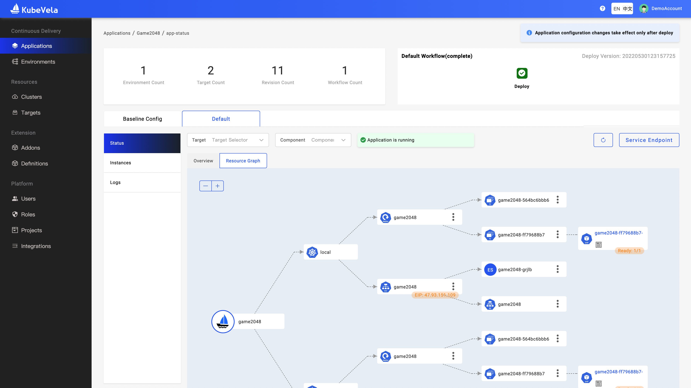

`Resource type relationship rules` mainly specify the relationship between two types of resources. Its main function is to help KubeVela establish the topological relationship of the resources managed by a KubeVela application. For example, the system has a built-in relationship rule: The sub-resources under the [Deployment](https://kubernetes.io/docs/concepts/workloads/controllers/deployment/)  can only be [ReplicaSet ](https://kubernetes.io/docs/concepts/workloads/controllers/replicaset/), and the child resource of ReplicaSet can only be [Pod](https://kubernetes.io/docs/concepts/workloads/pods/ ).

When a KubeVela application with Deployment as the workload is created, then view the topology graph of the application on VelaUX, KubeVela will first list all ReplicaSets in the same namespace with the Deployment, and filter out the results whose OwnerReference don't point to the Deployment, and then find the Pod under the ReplicaSet with the same way. This can help to establish the topology hierarchy of the managed resources under the application.

In general, these `resource type relationship rules` are mainly used in the following scenarios:

- Help to display the topology graph of an application on VelaUX. The following is an example of topology graph:



- When using `vela port-forward`, `vela logs`, `vela exec` and `vela status --endpoint` via cli or check the log or access port of an application on VelaUX, it helps KubeVela to discover the pods or services of an application.

## Add more rules

The built-in `resource type relationship rules` in the system are limited. You can add new relationship rules to the system by creating a Kubernetes `configmap` in the control plane. An example is as follows:

```yaml
apiVersion: v1
kind: ConfigMap
metadata:
  name: clone-set-relation
  namespace: vela-system
  labels:
    "rules.oam.dev/resources": "true"
data:
  rules: |-
    - parentResourceType:
        group: apps.kruise.io
        kind: CloneSet
      childrenResourceType:
        - apiVersion: v1
          kind: Pod
```

As the example shows the configmap must contain a special label `"rules.oam.dev/resources": "true"`. Only a configmap containing such a label will be recognized by KubeVela as a configuration of `resource type relationship rule`. At the same time, in this example, we also add a `"rules.oam.dev/resource-format": "yaml"` annotation to specify the rules in `data.rules` field defined with YAML format, except Using YAML format, you can also define these rules with JSON format as follows:

```yaml
apiVersion: v1
kind: ConfigMap
metadata:
  name: clone-set-relation
  namespace: vela-system
  annotations:
   "rules.oam.dev/resource-format": "json"
  labels:
    "rules.oam.dev/resources": "true"
data:
  rules: |-
   [
     {
       "parentResourceType": {
           "group": "apps.kruise.io",
           "kind": "CloneSet"
       },
       "childrenResourceType": [
           {
               "apiVersion": "v1",
               "kind": "Pod"
           }
       ]
     }
  ]
```

The function of these two `configmap` is totally the same.

In the example above, the parent type is `Cloneset` in group `apps.kruise.io`, his child resource type is `v1/Pod`

All customized rules specified in these configmaps would be merged with built-in rules and take effect in searching child resources.

## Contained by an addon

A KubeVela [addon](../platform-engineers/addon/intro) may install some Kubernetes CRD operators. By default, KubeVela cannot know what types of sub-resources this CRD can have, so you may encounter that the resources under the CRD cannot be displayed in the topology graph or cannot check the container logs of the application. Then you can add a configmap that define the relationship of resource type to solve this problem. You can define the configmap in `outputs` field in application template file of the addon. An example is as follows:

```cue
package main

output: {
	apiVersion: "core.oam.dev/v1beta1"
	kind:       "Application"
	spec: {
		
	}
	... 
}

outputs: resourceTree: {
	apiVersion: "v1"
	kind:       "ConfigMap"
	metadata: {
		name:      "resource-tree"
		namespace: "vela-system"
		labels: {
			"rules.oam.dev/resources":       "true"
			"rules.oam.dev/resource-format": "json"
		}
	}
	data: rules: json.Marshal(_rules)
}

_rules: {...}
```

Please refer to [doc](../platform-engineers/addon/addon-cue#auxiliary-resources) for more details.