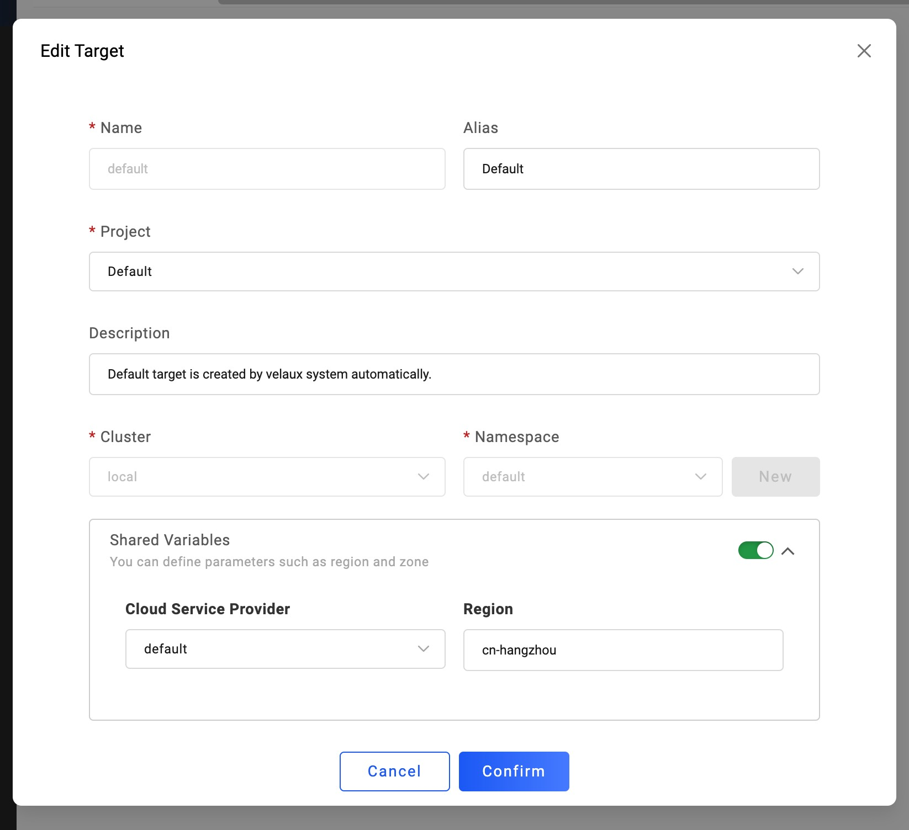
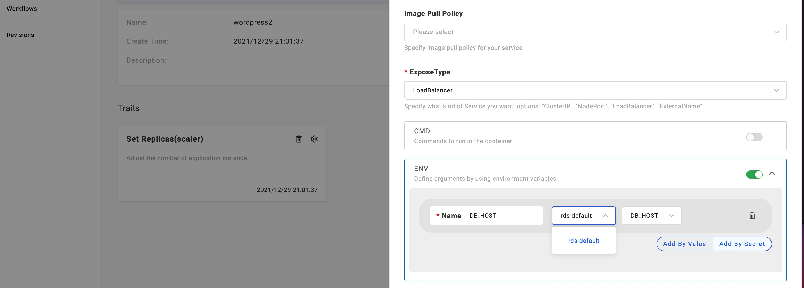

KubeVela efficiently and securely integrates different types of cloud resources in hybrid/multi-cloud environments.

You can use the integrated cloud resources as out-of-box components or integrate by Terraform or Crossplane easily.
With the help of KubeVela, you can use cloud resources from various providers in a unified way.

This tutorial will mainly focus on talking about how to provision cloud resources by [Terraform](https://github.com/kubevela/terraform-controller).
If you'd like to know more about cloud resources from [Crossplane](https://crossplane.io/), please refer to [this guide](../end-user/components/cloud-services/provision-cloud-resources-by-crossplane).

## Provision Cloud Resources

### Prerequisites

* Enable Terraform addon and authenticate the target cloud provider per the [instruction](../reference/addons/terraform).

Let's take Alibaba Cloud as an example.

### Familiar with cloud resources specification

All supported Terraform cloud resources can be seen in the [list](../end-user/components/cloud-services/cloud-resources-list). You can also filter them by
command `vela components --label type=terraform`.

You can use any of the following ways to check the specification of one cloud resource.

- Using command `vela show <component type name>` .

```console
$ vela show alibaba-oss
### Properties
+----------------------------+-------------------------------------------------------------------------+-----------------------------------------------------------+----------+---------+
|            NAME            |                               DESCRIPTION                               |                           TYPE                            | REQUIRED | DEFAULT |
+----------------------------+-------------------------------------------------------------------------+-----------------------------------------------------------+----------+---------+
| acl                        | OSS bucket ACL, supported 'private', 'public-read', 'public-read-write' | string                                                    | false    |         |
| bucket                     | OSS bucket name                                                         | string                                                    | false    |         |
| writeConnectionSecretToRef | The secret which the cloud resource connection will be written to       | [writeConnectionSecretToRef](#writeConnectionSecretToRef) | false    |         |
+----------------------------+-------------------------------------------------------------------------+-----------------------------------------------------------+----------+---------+

...snip...
```

You can also add flag `--web` to view the usage by a local browser.

- Reading [official docs](../end-user/components/cloud-services/cloud-resources-list).

For example, you can check the specification for Alibaba OSS at [here](../end-user/components/cloud-services/terraform/alibaba-oss). 

For different vendors, these parameters update accordingly. All cloud resources have the following common parameters.

- `writeConnectionSecretToRef`: `struct` Type, represents the outputs of Terraform will become key/values in the secret with the name specified here.
  - `name`, specifies the name of the secret.
  - `namespace`, specifies the namespace of the secret.
- `providerRef`: `struct` Type, represents the Provider which is referenced by a cloud service.
  - `name`, specifies the name of the provider.
- `deleteResource`: `bool` Type, specify whether to delete the corresponding cloud service when the app is deleted. By Default it's `true`.
- `customRegion`: `string` Type, specify region for resources, it will override the default region from `providerRef`.

### Provision by Creating Application

Use the following Application to provision an OSS bucket:

```yaml
apiVersion: core.oam.dev/v1beta1
kind: Application
metadata:
  name: provision-cloud-resource-sample
spec:
  components:
    - name: sample-oss
      type: alibaba-oss
      properties:
        bucket: vela-website-0911
        acl: private
        writeConnectionSecretToRef:
          name: oss-conn
```

The above `alibaba-oss` component will create an OSS bucket named `vela-website-0911`, with `private` acl, with connection
information stored in a secreted named `oss-conn`.

Apply the above application, then check the status:

```shell
$ vela ls
APP                            	COMPONENT 	TYPE       	TRAITS	PHASE  	HEALTHY	STATUS                                       	CREATED-TIME
provision-cloud-resource-sample	sample-oss	alibaba-oss	      	running	healthy	Cloud resources are deployed and ready to use	2021-09-11 12:55:57 +0800 CST
```

After the phase becomes `running` and `healthy`, you can then check the OSS bucket in Alibaba Cloud console.

## Provision with UI Console

Provision cloud resources from UI Console can be more appropriate.

### Before starting

- Enable [VelaUX](../reference/addons/velaux) addon.

- Enable [Terraform](../reference/addons/terraform) addon, just like the prerequisites in CLI part above. VelaUX can also enable these addons in UI console.


- Bind the cloud provider to the [target](../how-to/dashboard/target/overview.md). You can do that in `Resources/Targets` page. Edit the `Shared Variables`, select provider you want to bind to this target.



### Creating your cloud service

The UI console operations are the same, you can refer to [this guide](../how-to/dashboard/application/create-application).

Firstly, Create an application and choose the type of your cloud service, they will always has a prefix of vendor such as `aws-`, `azure` or `alibaba-`.

Set the above parameters according to your needs to complete creating the application, and then deploy the application. The resources will be provisioned after the application become ready.

### Viewing cloud resource creation status

- Check the cloud instance list

Like other apps, cloud service apps also need to switch to the corresponding environment page to view instance information.
By default, there are several targets in an environment, and the cloud service will generate a corresponding number of instances.


In the instance list, the instance name, status, resource type, and location are displayed. In the beginning, the name is empty,
because the cloud service instance generation takes a certain amount of time, and the name will appear when the instance is generated normally.

- View the cloud resource in the console of the cloud provider

You can visit the instance in the console of the cloud provider. For example, you can check the name or console to visit it.


It will redirect to the UI Console of the provider, in our example, resources from Alibaba Cloud will go to [https://console.aliyun.com](https://console.aliyun.com).

- Check details and status of the cloud instance

Click the `Check the detail` button to view the application details.


You will find that each instance generates a Secret resource, which generally records the service's access address and
key information. Secret resources will be distributed to the cluster and Namespace where the target is located while the
control cluster exists. Therefore, other applications in the same environment can directly use the resource in the
environment variable to obtain the access address and key.



In the last section `Component Status`, the health status and the message of the cloud service instance is displayed.

## FAQ

- The cloud service is always ProvisioningAndChecking and has no name

> The creation of cloud services generally takes a certain amount of time. Please wait or enter the cloud vendor console to view the creation progress.

## More

For more usages of cloud resources, like how to provision and consume cloud resources, please refer to [Scenarios of Cloud Resources Management](./../end-user/components/cloud-services/cloud-resource-scenarios).
