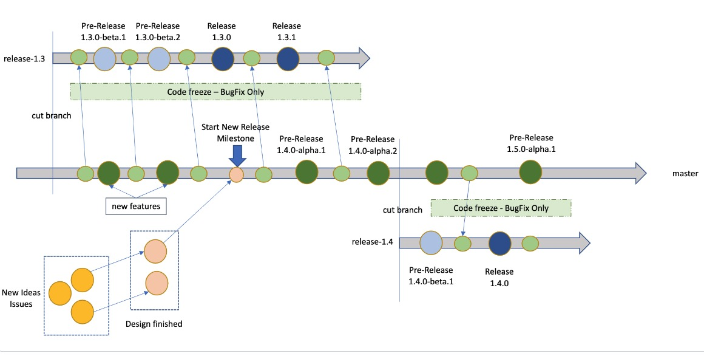

KubeVela is being developed using the following process:

* Maintainers commit to work on set of features and enhancements and create GitHub milestone to track the work.
* We are trying to avoid delaying release and prefer moving the feature into the next release if we cannot complete it on time.
* The new release is published every **2~3 month**.
* Critical bug-fixes are cherry-picked into the release branch and delivered using patch releases as frequently as needed, we will maintain the last **2 releases**.

## Release Planning

We are using [GitHub milestones](https://github.com/kubevela/kubevela/milestones) to perform release planning and tracking. Each release milestone includes two type of issues:

* Issues that maintainers committed to working on. Maintainers decide which features they are committing to work on during the next release based on their availability. Typically issues added offline by each maintainer and finalized during the contributors' meeting or [community meetings](https://github.com/kubevela/community#community-meetings). Each such issue should be assigned to maintainer who plans to implement and test it.
* Nice to have improvements contributed by community contributors. Nice to have issues are typically not critical, smallish enhancements that could be contributed by community contributors. Maintainers are not committing to implement them but committing to review PR from the community.

The milestone should have a clear description of the most important features as well as the expected end date. This should provide clarity to end-users about what to expect from the next release and when.

In addition to the next milestone, we need to maintain a draft of the upcoming release milestone.

## Community Contributions

We receive a lot of contributions from our awesome community, and we're very grateful for that fact. However, reviewing and testing PRs is a lot of (unplanned) work and therefore, we cannot guarantee that contributions (especially large or complex ones) made by the community receive a timely review within a release's time frame. Maintainers may decide on their own to put work on a PR together with the contributor and in this case, the maintainer will self-assigned the PR and thereby committing to review, eventually merge and later test it on the release scope.

## Release Testing

We have a code freeze period two weeks before the release until the release branch is created. During code freeze no feature PR should be merged and it is ok to merge bug fixes.

Maintainers should drive testing and work on fixing last-minute issues before every release. 

## Release SOP

The maintainers are responsible to drive releases and follow the standard operating procedure to make sure the quality of this release.

> We're following the `major.minor.patch` version. The `major` version is incremented when there are incompatible API changes. The `minor` version is incremented when there are new features. The `patch` version is incremented when there are bug fixes.

1. Write a clear release note including:
   * New Features, Enhancement and Bugfixes.
   * Deprecation and Breaking Changes.
   * Brief notes about how to install and upgrade.
2. Create a new release branch from the `release-x.y` branch when release a new `minor` release.
3. Create new `patch` releases corresponding to the release branch.
4. Make sure the release materials are generated successfully from the Github actions:
   * Images from [Registry Pipeline](https://github.com/kubevela/kubevela/actions/workflows/registry.yml).
   * Helm Charts from [Publish Chart Pipeline](https://github.com/kubevela/kubevela/actions/workflows/chart.yml).
   * CLI binaries from [Release Pipeline](https://github.com/kubevela/kubevela/actions/workflows/release.yml).
5. Update docs and examples to use the new release.
   * Create a new docs version for the new `minor` release.
   * Update the [migration doc](../platform-engineers/system-operation/migration-from-old-version) when release a new `minor` release.
   * Update the `top tip` in `docusaurus.config.js` for every `patch` release.