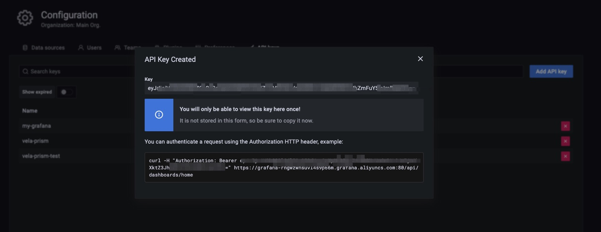

Sometimes, you might already have Prometheus & Grafana instances. They might be built by other tools, or come from cloud providers. Follow the below guide to integrate with existing systems.

## Integrate Prometheus

If you already have external prometheus service and you want to connect it to Grafana (established by vela addon), you can create a GrafanaDatasource to register it through KubeVela application.

```yaml
apiVersion: core.oam.dev/v1beta1
kind: Application
metadata:
  name: register-prometheus
spec:
  components:
    - type: grafana-datasource
      name: my-prometheus
      properties:
        access: proxy
        basicAuth: false
        isDefault: false
        name: MyPrometheus
        readOnly: true
        withCredentials: true
        jsonData:
          httpHeaderName1: Authorization
          tlsSkipVerify: true
        secureJsonFields:
          httpHeaderValue1: <token of your prometheus access>
        type: prometheus
        url: <my-prometheus url>
```

For example, if you are using the Prometheus service on Alibaba Cloud (ARMS), you can go to the Prometheus setting page and find the access url & access token.


> You need to ensure your grafana access is already available. You can run `kubectl get grafana default` and see if it exists.

## Integrate Grafana

If you already have existing Grafana, similar to Prometheus integration, you can create a Grafana access through KubeVela application.

```yaml
apiVersion: core.oam.dev/v1beta1
kind: Application
metadata:
  name: register-grafana
spec:
  components:
    - type: grafana-access
      name: my-grafana
      properties:
        name: my-grafana
        endpoint: <my-grafana url>
        token: <access token>
```

To get your grafana access, you can go into your Grafana instance and configure API keys.


Then copy the token into your grafana registration configuration.



After the application is successfully dispatched, you can check the registration by running the following command.

```shell
kubectl get grafana
```
```shell
NAME         ENDPOINT                                                      CREDENTIAL_TYPE
default      http://grafana.o11y-system:3000                               BasicAuth
my-grafana   https://grafana-rngwzwnsuvl4s9p66m.grafana.aliyuncs.com:80/   BearerToken
```

Now you can manage your dashboard and datasource on your grafana instance through the native Kubernetes API as well.

```shell
# show all the dashboard you have
kubectl get grafanadashboard -l grafana=my-grafana
```
```shell
# show all the datasource you have
kubectl get grafanadatasource -l grafana=my-grafana
```

For more details, you can refer to [vela-prism](https://github.com/kubevela/prism#grafana-related-apis).

## Integrate through KubeVela Config Management

It is also possible to make integrations through KubeVela's configuration management system, no matter you are using CLI or VelaUX.

### Prometheus

You can read the Configuration Management documentation for more details.

## Integrate Other Tools or Systems

There are a wide range of community tools or eco-systems that users can leverage for building their observability system, such as prometheus-operator or DataDog. By far, KubeVela does not have existing best practices for those integration. We may integrate with those popular projects through KubeVela addons in the future. We are also welcome to community contributions for broader explorations and more connections.