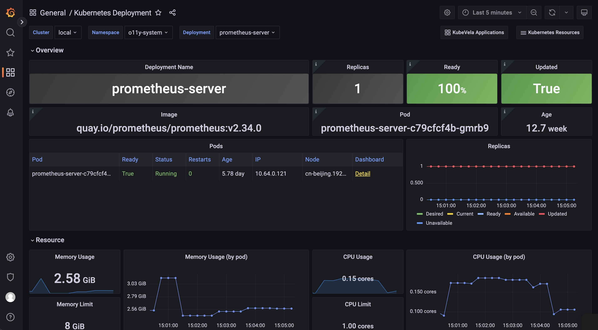

Visualization is one of the methods to present the observability information.
For example, metrics can be plotted into different types of graphs depending on their categories and logs can be filtered and listed.

In KubeVela, leveraging the power of Kubernetes Aggregated API layer, it is easy for users to manipulate dashboards on Grafana and make customizations to application visualizations.

## Pre-installed Dashboards

When enabling `grafana` addon to KubeVela system, a series of dashboards will be pre-installed and provide basic panels for viewing observability data.

### KubeVela Application

This dashboard shows the basic information for one application.

URL: http://localhost:8080/d/application-overview/kubevela-applications


<details>
  The KubeVela Application dashboard shows the overview of the metadata for the application. It directly accesses the Kubernetes API to retrieve the runtime application information, where you can use it as an entrance. You can navigate to detail information for application resources by clicking the `detail` link in the *Managed Resources* panel.

---

The **Basic Information** section extracts key information into panels and give you the most straightforward view for the current application.

---

The **Related Resources** section shows those resources that work together with the application itself, including the managed resources, the recorded ResourceTrackers and the revisions.

</details>

### Kubernetes Deployemnt

This dashboard shows the overview of native deployments. You can navigate deployments across clusters.

URL: http://localhost:8080/d/kubernetes-deployment/kubernetes-deployment



<details>
  The Kubernetes Deployment dashboard gives you the detail running status for the deployment.

---

The **Pods** panel shows the pods that the deployment itself is currently managing.

---

The **Replicas** panel shows how the number of replicas changes, which can be used to diagnose when and how your deployment shifted to undesired state.

---

The **Resource** section includes the details for the resource usage (including the CPU / Memory / Network / Storage) which can be used to identify if the pods of the deployment are facing resource pressure or making/receiving unexpected traffics.

---

There are a list of dashboards for various types of Kubernetes resources, such as DaemonSet and StatefulSet. You can navigate to those dashboards depending on your workload type.

</details>

### KubeVela System

This dashboard shows the overview of the KubeVela system. It can be used to see if KubeVela controller is healthy.

URL: http://localhost:8080/d/kubevela-system/kubevela-system


<details>
  The KubeVela System dashboard gives you the running details of the KubeVela core modules, including the controller and the cluster-gateway. Other modules like velaux or prism are expected to be added in the future.

---

The **Computation Resource** section shows the usage for core modules. It can be used to track if there is any memory leak (if the memory usage is continuously increasing) or under high pressure (the cpu usage is always very high). If the memory usage hits the resource limit, the corresponding module will be killed and restarted, which indicates the lack of computation resource. You should add more CPU/Memory for them.

---

The **Controller** section includes a wide range of panels which can help you to diagnose the bottleneck of the KubeVela controller in your scenario.

The **Controller Queue** and **Controller Queue Add Rate** panels show you the controller working queue changes. If the controller queue is increasing continuously, it means there are too much applications or application changes in the system, and the controller is unable to handle them in time. Then it means there is performance issues for KubeVela controller. A temporary increase for the controller queue is tolerable, but keeping for a long time will lead to memory increase which will finally cause Out-Of-Memory problems.

**Reconcile Rate** and **Average Reconcile Time** panels give you the overview of the controller status. If reconcile rate is steady and average reconcile time is reasonable (like under 500ms, depending on your scenario), your KubeVela controller is healthy. If the controller queue add rate is increasing but the reconcile rate does not go up, it will gradually lead to increase for the controller queue and cause troubles. There are various cases that your controller is unhealthy:

1. Reconcile is healthy but there are too much applications, you will find everything is okay except the controller queue metrics increasing. Check your CPU/Memory usage for the controller. You might need to add more computation resources.
2. Reconcile is not healthy due to too much errors. You will find lots of errors in the **Reconcile Rate** panel. This means your system is continuously facing process errors for application. It could be caused by invalid application configurations or unexpected errors while running workflows. Check application details and see which applications are causing errors.
3. Reconcile is not healthy due to long reconcile times. You need to check **ApplicationController Reconcile Time** panel and see whether it is a common case (the average reconcile time is high), or only part of your applications have problems (the p95 reconcile time is high). For the former case, usually it is caused by either insufficient CPU (CPU usage is high) or too much requests and rate limited by kube-apiserver (check **ApplicationController Client Request Throughput** and **ApplicationController Client Request Average Time** panel and see which resource requests is slow or excessive). For the later case you need to check which application is large and uses lots of time for reconciliations.

Sometimes you might need refer to **ApplicationController Reconcile Stage Time** and see if there is some special reconcile stages are abnormal. For example, GCResourceTrackers use lots of time means there might be blockings for recycling resource in KubeVela system.

---

The **Application** section shows the overview of the applications in your whole KubeVela system. It can be used to see the changes of the application numbers and the used workflow steps. The **Workflow Initialize Rate** is an auxiliary panel which can be used to see how frequent new workflow execution is launched. The **Workflow Average Complete Time** can further show how much time it costs to finish the whole workflow.

</details>

### Kubernetes APIServer

This dashboard shows the running status of all Kubernetes apiservers.

URL: http://localhost:8080/d/kubernetes-apiserver/kubernetes-apiserver


<details>
  The Kubernetes APIServer dashboard helps you to see the most fundamental part for your Kubernetes system. If your Kubernetes APIServer is not running healthy, all of your controllers and modules in your Kubernetes system will be abnormal and unable to handle requests successfully. So it is important to make sure everything is fine in this dashboard.

---

The **Requests** section includes a series of panels which shows the QPS and latency for various kind of requests. Usually your APIServer could fail to respond if it is flooded by too much requests. At this time, you can see which type of requests is causing trouble.

---

The **WorkQueue** section shows the process status of the Kubernetes APIServer. If the **Queue Size** is large, it means the number of requests is out of the process capability of your Kubernetes APIServer.

---

The **Watches** section shows the number of watches in your Kubernetes APIServer. Compared to other types of requests, WATCH requests will continuously consume computation resources in Kubernetes APIServer, so it will be helpful to keep the number of watches limited.

</details>


## Dashboard Customization

Except for the pre-defined dashboards provided by the `grafana` addon, KubeVela users can deploy customized dashboards to their system as well.

:::tip
If you do not know how to build Grafana dashboards and export them as json data, you can refer to the following Grafana docs for details.
1. [Build your first dashboard](https://grafana.com/docs/grafana/latest/getting-started/build-first-dashboard/)
2. [Exporting a dashboard](https://grafana.com/docs/grafana/latest/dashboards/export-import/#exporting-a-dashboard)
:::

### Using Dashboard as Component 

One way to manage your customized dashboard is to use the component in KubeVela application like below.

```yaml
apiVersion: core.oam.dev/v1beta1
kind: Application
metadata:
  name: my-dashboard
spec:
  components:
    - name: my-dashboard
      type: grafana-dashboard
      properties:
        uid: my-example-dashboard
        data: |
          {
            "panels": [{
                "gridPos": {
                    "h": 9,
                    "w": 12
                },
                "targets": [{
                    "datasource": {
                        "type": "prometheus",
                        "uid": "prometheus-vela"
                    },
                    "expr": "max(up) by (cluster)"
                }],
                "title": "Clusters",
                "type": "timeseries"
            }],
            "title": "My Dashboard"
          }
```


### Using Dashboard as Trait

An alternative way for adding customized dashboard to your application is to use the `grafana-dashboard` trait.

```yaml
apiVersion: core.oam.dev/v1beta1
kind: Application
metadata:
  name: my-app
spec:
  components:
    - name: my-app
      type: webservice
      properties:
        image: somefive/prometheus-client-example:new
      traits:
        - type: prometheus-scrape
        - type: grafana-dashboard
          properties:
            data: |
                {"__inputs":[{"name":"DS_PROMETHEUS","label":"prometheus-vela","description":"","type":"datasource","pluginId":"prometheus","pluginName":"Prometheus"}],"__elements":[],"__requires":[{"type":"grafana","id":"grafana","name":"Grafana","version":"8.5.3"},{"type":"panel","id":"graph","name":"Graph (old)","version":""},{"type":"datasource","id":"prometheus","name":"Prometheus","version":"1.0.0"}],"annotations":{"list":[{"builtIn":1,"datasource":{"type":"grafana","uid":"-- Grafana --"},"enable":true,"hide":true,"iconColor":"rgba(0, 211, 255, 1)","name":"Annotations & Alerts","target":{"limit":100,"matchAny":false,"tags":[],"type":"dashboard"},"type":"dashboard"}]},"description":"Auto-generated Dashboard","editable":true,"fiscalYearStartMonth":0,"graphTooltip":0,"id":null,"iteration":1667283876999,"links":[],"liveNow":false,"panels":[{"aliasColors":{},"bars":false,"dashLength":10,"dashes":false,"datasource":{"type":"prometheus","uid":"${DS_PROMETHEUS}"},"description":"Build information about the main Go module.","fill":1,"fillGradient":0,"gridPos":{"h":8,"w":6,"x":0,"y":0},"hiddenSeries":false,"id":1,"legend":{"avg":false,"current":false,"max":false,"min":false,"show":false,"total":false,"values":false},"lines":true,"linewidth":1,"nullPointMode":"null","options":{"alertThreshold":true},"percentage":false,"pluginVersion":"8.5.3","pointradius":2,"points":false,"renderer":"flot","seriesOverrides":[],"spaceLength":10,"stack":false,"steppedLine":false,"targets":[{"expr":"sum(go_build_info)","refId":"A"}],"thresholds":[],"timeRegions":[],"title":"go_build_info","tooltip":{"shared":true,"sort":0,"value_type":"individual"},"type":"graph","xaxis":{"mode":"time","show":true,"values":[]},"yaxes":[{"format":"short","logBase":1,"show":true},{"format":"short","logBase":1,"show":true}],"yaxis":{"align":false}},{"aliasColors":{},"bars":false,"dashLength":10,"dashes":false,"datasource":{"type":"prometheus","uid":"${DS_PROMETHEUS}"},"description":"A summary of the pause duration of garbage collection cycles.","fill":1,"fillGradient":0,"gridPos":{"h":8,"w":6,"x":6,"y":0},"hiddenSeries":false,"id":2,"legend":{"avg":false,"current":false,"max":false,"min":false,"show":true,"total":false,"values":false},"lines":true,"linewidth":1,"nullPointMode":"null","options":{"alertThreshold":true},"percentage":false,"pluginVersion":"8.5.3","pointradius":2,"points":false,"renderer":"flot","seriesOverrides":[],"spaceLength":10,"stack":false,"steppedLine":false,"targets":[{"expr":"sum(rate(go_gc_duration_seconds_sum[$rate_interval])) / sum(rate(go_gc_duration_seconds_count[$rate_interval]))","legendFormat":"avg","refId":"A"},{"expr":"histogram_quantile(0.75, sum(rate(go_gc_duration_seconds_bucket[$rate_interval])) by (le))","legendFormat":"p75","refId":"B"},{"expr":"histogram_quantile(0.99, sum(rate(go_gc_duration_seconds_bucket[$rate_interval])) by (le))","legendFormat":"p99","refId":"C"}],"thresholds":[],"timeRegions":[],"title":"go_gc_duration_seconds","tooltip":{"shared":true,"sort":0,"value_type":"individual"},"type":"graph","xaxis":{"mode":"time","show":true,"values":[]},"yaxes":[{"format":"short","logBase":1,"show":true},{"format":"short","logBase":1,"show":true}],"yaxis":{"align":false}},{"aliasColors":{},"bars":false,"dashLength":10,"dashes":false,"datasource":{"type":"prometheus","uid":"${DS_PROMETHEUS}"},"description":"Number of goroutines that currently exist.","fill":1,"fillGradient":0,"gridPos":{"h":8,"w":6,"x":12,"y":0},"hiddenSeries":false,"id":3,"legend":{"avg":false,"current":false,"max":false,"min":false,"show":false,"total":false,"values":false},"lines":true,"linewidth":1,"nullPointMode":"null","options":{"alertThreshold":true},"percentage":false,"pluginVersion":"8.5.3","pointradius":2,"points":false,"renderer":"flot","seriesOverrides":[],"spaceLength":10,"stack":false,"steppedLine":false,"targets":[{"expr":"sum(go_goroutines)","refId":"A"}],"thresholds":[],"timeRegions":[],"title":"go_goroutines","tooltip":{"shared":true,"sort":0,"value_type":"individual"},"type":"graph","xaxis":{"mode":"time","show":true,"values":[]},"yaxes":[{"format":"short","logBase":1,"show":true},{"format":"short","logBase":1,"show":true}],"yaxis":{"align":false}},{"aliasColors":{},"bars":false,"dashLength":10,"dashes":false,"datasource":{"type":"prometheus","uid":"${DS_PROMETHEUS}"},"description":"Information about the Go environment.","fill":1,"fillGradient":0,"gridPos":{"h":8,"w":6,"x":18,"y":0},"hiddenSeries":false,"id":4,"legend":{"avg":false,"current":false,"max":false,"min":false,"show":false,"total":false,"values":false},"lines":true,"linewidth":1,"nullPointMode":"null","options":{"alertThreshold":true},"percentage":false,"pluginVersion":"8.5.3","pointradius":2,"points":false,"renderer":"flot","seriesOverrides":[],"spaceLength":10,"stack":false,"steppedLine":false,"targets":[{"expr":"sum(go_info)","refId":"A"}],"thresholds":[],"timeRegions":[],"title":"go_info","tooltip":{"shared":true,"sort":0,"value_type":"individual"},"type":"graph","xaxis":{"mode":"time","show":true,"values":[]},"yaxes":[{"format":"short","logBase":1,"show":true},{"format":"short","logBase":1,"show":true}],"yaxis":{"align":false}},{"aliasColors":{},"bars":false,"dashLength":10,"dashes":false,"datasource":{"type":"prometheus","uid":"${DS_PROMETHEUS}"},"description":"Number of bytes allocated and still in use.","fill":1,"fillGradient":0,"gridPos":{"h":8,"w":6,"x":0,"y":8},"hiddenSeries":false,"id":5,"legend":{"avg":false,"current":false,"max":false,"min":false,"show":false,"total":false,"values":false},"lines":true,"linewidth":1,"nullPointMode":"null","options":{"alertThreshold":true},"percentage":false,"pluginVersion":"8.5.3","pointradius":2,"points":false,"renderer":"flot","seriesOverrides":[],"spaceLength":10,"stack":false,"steppedLine":false,"targets":[{"expr":"sum(go_memstats_alloc_bytes)","refId":"A"}],"thresholds":[],"timeRegions":[],"title":"go_memstats_alloc_bytes","tooltip":{"shared":true,"sort":0,"value_type":"individual"},"type":"graph","xaxis":{"mode":"time","show":true,"values":[]},"yaxes":[{"format":"short","logBase":1,"show":true},{"format":"short","logBase":1,"show":true}],"yaxis":{"align":false}},{"aliasColors":{},"bars":false,"dashLength":10,"dashes":false,"datasource":{"type":"prometheus","uid":"${DS_PROMETHEUS}"},"description":"Total number of bytes allocated, even if freed.","fill":1,"fillGradient":0,"gridPos":{"h":8,"w":6,"x":6,"y":8},"hiddenSeries":false,"id":6,"legend":{"avg":false,"current":false,"max":false,"min":false,"show":false,"total":false,"values":false},"lines":true,"linewidth":1,"nullPointMode":"null","options":{"alertThreshold":true},"percentage":false,"pluginVersion":"8.5.3","pointradius":2,"points":false,"renderer":"flot","seriesOverrides":[],"spaceLength":10,"stack":false,"steppedLine":false,"targets":[{"expr":"sum(rate(go_memstats_alloc_bytes_total[$rate_interval]))","refId":"A"}],"thresholds":[],"timeRegions":[],"title":"go_memstats_alloc_bytes_total","tooltip":{"shared":true,"sort":0,"value_type":"individual"},"type":"graph","xaxis":{"mode":"time","show":true,"values":[]},"yaxes":[{"format":"short","logBase":1,"show":true},{"format":"short","logBase":1,"show":true}],"yaxis":{"align":false}},{"aliasColors":{},"bars":false,"dashLength":10,"dashes":false,"datasource":{"type":"prometheus","uid":"${DS_PROMETHEUS}"},"description":"Number of bytes used by the profiling bucket hash table.","fill":1,"fillGradient":0,"gridPos":{"h":8,"w":6,"x":12,"y":8},"hiddenSeries":false,"id":7,"legend":{"avg":false,"current":false,"max":false,"min":false,"show":false,"total":false,"values":false},"lines":true,"linewidth":1,"nullPointMode":"null","options":{"alertThreshold":true},"percentage":false,"pluginVersion":"8.5.3","pointradius":2,"points":false,"renderer":"flot","seriesOverrides":[],"spaceLength":10,"stack":false,"steppedLine":false,"targets":[{"expr":"sum(go_memstats_buck_hash_sys_bytes)","refId":"A"}],"thresholds":[],"timeRegions":[],"title":"go_memstats_buck_hash_sys_bytes","tooltip":{"shared":true,"sort":0,"value_type":"individual"},"type":"graph","xaxis":{"mode":"time","show":true,"values":[]},"yaxes":[{"format":"short","logBase":1,"show":true},{"format":"short","logBase":1,"show":true}],"yaxis":{"align":false}},{"aliasColors":{},"bars":false,"dashLength":10,"dashes":false,"datasource":{"type":"prometheus","uid":"${DS_PROMETHEUS}"},"description":"Total number of frees.","fill":1,"fillGradient":0,"gridPos":{"h":8,"w":6,"x":18,"y":8},"hiddenSeries":false,"id":8,"legend":{"avg":false,"current":false,"max":false,"min":false,"show":false,"total":false,"values":false},"lines":true,"linewidth":1,"nullPointMode":"null","options":{"alertThreshold":true},"percentage":false,"pluginVersion":"8.5.3","pointradius":2,"points":false,"renderer":"flot","seriesOverrides":[],"spaceLength":10,"stack":false,"steppedLine":false,"targets":[{"expr":"sum(rate(go_memstats_frees_total[$rate_interval]))","refId":"A"}],"thresholds":[],"timeRegions":[],"title":"go_memstats_frees_total","tooltip":{"shared":true,"sort":0,"value_type":"individual"},"type":"graph","xaxis":{"mode":"time","show":true,"values":[]},"yaxes":[{"format":"short","logBase":1,"show":true},{"format":"short","logBase":1,"show":true}],"yaxis":{"align":false}},{"aliasColors":{},"bars":false,"dashLength":10,"dashes":false,"datasource":{"type":"prometheus","uid":"${DS_PROMETHEUS}"},"description":"Number of bytes used for garbage collection system metadata.","fill":1,"fillGradient":0,"gridPos":{"h":8,"w":6,"x":0,"y":16},"hiddenSeries":false,"id":9,"legend":{"avg":false,"current":false,"max":false,"min":false,"show":false,"total":false,"values":false},"lines":true,"linewidth":1,"nullPointMode":"null","options":{"alertThreshold":true},"percentage":false,"pluginVersion":"8.5.3","pointradius":2,"points":false,"renderer":"flot","seriesOverrides":[],"spaceLength":10,"stack":false,"steppedLine":false,"targets":[{"expr":"sum(go_memstats_gc_sys_bytes)","refId":"A"}],"thresholds":[],"timeRegions":[],"title":"go_memstats_gc_sys_bytes","tooltip":{"shared":true,"sort":0,"value_type":"individual"},"type":"graph","xaxis":{"mode":"time","show":true,"values":[]},"yaxes":[{"format":"short","logBase":1,"show":true},{"format":"short","logBase":1,"show":true}],"yaxis":{"align":false}},{"aliasColors":{},"bars":false,"dashLength":10,"dashes":false,"datasource":{"type":"prometheus","uid":"${DS_PROMETHEUS}"},"description":"Number of heap bytes allocated and still in use.","fill":1,"fillGradient":0,"gridPos":{"h":8,"w":6,"x":6,"y":16},"hiddenSeries":false,"id":10,"legend":{"avg":false,"current":false,"max":false,"min":false,"show":false,"total":false,"values":false},"lines":true,"linewidth":1,"nullPointMode":"null","options":{"alertThreshold":true},"percentage":false,"pluginVersion":"8.5.3","pointradius":2,"points":false,"renderer":"flot","seriesOverrides":[],"spaceLength":10,"stack":false,"steppedLine":false,"targets":[{"expr":"sum(go_memstats_heap_alloc_bytes)","refId":"A"}],"thresholds":[],"timeRegions":[],"title":"go_memstats_heap_alloc_bytes","tooltip":{"shared":true,"sort":0,"value_type":"individual"},"type":"graph","xaxis":{"mode":"time","show":true,"values":[]},"yaxes":[{"format":"short","logBase":1,"show":true},{"format":"short","logBase":1,"show":true}],"yaxis":{"align":false}},{"aliasColors":{},"bars":false,"dashLength":10,"dashes":false,"datasource":{"type":"prometheus","uid":"${DS_PROMETHEUS}"},"description":"Number of heap bytes waiting to be used.","fill":1,"fillGradient":0,"gridPos":{"h":8,"w":6,"x":12,"y":16},"hiddenSeries":false,"id":11,"legend":{"avg":false,"current":false,"max":false,"min":false,"show":false,"total":false,"values":false},"lines":true,"linewidth":1,"nullPointMode":"null","options":{"alertThreshold":true},"percentage":false,"pluginVersion":"8.5.3","pointradius":2,"points":false,"renderer":"flot","seriesOverrides":[],"spaceLength":10,"stack":false,"steppedLine":false,"targets":[{"expr":"sum(go_memstats_heap_idle_bytes)","refId":"A"}],"thresholds":[],"timeRegions":[],"title":"go_memstats_heap_idle_bytes","tooltip":{"shared":true,"sort":0,"value_type":"individual"},"type":"graph","xaxis":{"mode":"time","show":true,"values":[]},"yaxes":[{"format":"short","logBase":1,"show":true},{"format":"short","logBase":1,"show":true}],"yaxis":{"align":false}},{"aliasColors":{},"bars":false,"dashLength":10,"dashes":false,"datasource":{"type":"prometheus","uid":"${DS_PROMETHEUS}"},"description":"Number of heap bytes that are in use.","fill":1,"fillGradient":0,"gridPos":{"h":8,"w":6,"x":18,"y":16},"hiddenSeries":false,"id":12,"legend":{"avg":false,"current":false,"max":false,"min":false,"show":false,"total":false,"values":false},"lines":true,"linewidth":1,"nullPointMode":"null","options":{"alertThreshold":true},"percentage":false,"pluginVersion":"8.5.3","pointradius":2,"points":false,"renderer":"flot","seriesOverrides":[],"spaceLength":10,"stack":false,"steppedLine":false,"targets":[{"expr":"sum(go_memstats_heap_inuse_bytes)","refId":"A"}],"thresholds":[],"timeRegions":[],"title":"go_memstats_heap_inuse_bytes","tooltip":{"shared":true,"sort":0,"value_type":"individual"},"type":"graph","xaxis":{"mode":"time","show":true,"values":[]},"yaxes":[{"format":"short","logBase":1,"show":true},{"format":"short","logBase":1,"show":true}],"yaxis":{"align":false}},{"datasource":{"type":"prometheus","uid":"${DS_PROMETHEUS}"},"description":"Number of allocated objects.","gridPos":{"h":8,"w":6,"x":0,"y":24},"id":13,"legend":{"show":false},"targets":[{"expr":"sum(go_memstats_heap_objects)","refId":"A"}],"title":"go_memstats_heap_objects","type":"graph"},{"datasource":{"type":"prometheus","uid":"${DS_PROMETHEUS}"},"description":"Number of heap bytes released to OS.","gridPos":{"h":8,"w":6,"x":6,"y":24},"id":14,"legend":{"show":false},"targets":[{"expr":"sum(go_memstats_heap_released_bytes)","refId":"A"}],"title":"go_memstats_heap_released_bytes","type":"graph"},{"datasource":{"type":"prometheus","uid":"${DS_PROMETHEUS}"},"description":"Number of heap bytes obtained from system.","gridPos":{"h":8,"w":6,"x":12,"y":24},"id":15,"legend":{"show":false},"targets":[{"expr":"sum(go_memstats_heap_sys_bytes)","refId":"A"}],"title":"go_memstats_heap_sys_bytes","type":"graph"},{"datasource":{"type":"prometheus","uid":"${DS_PROMETHEUS}"},"description":"Number of seconds since 1970 of last garbage collection.","gridPos":{"h":8,"w":6,"x":18,"y":24},"id":16,"legend":{"show":false},"targets":[{"expr":"sum(go_memstats_last_gc_time_seconds)","refId":"A"}],"title":"go_memstats_last_gc_time_seconds","type":"graph"},{"datasource":{"type":"prometheus","uid":"${DS_PROMETHEUS}"},"description":"Total number of pointer lookups.","gridPos":{"h":8,"w":6,"x":0,"y":32},"id":17,"legend":{"show":false},"targets":[{"expr":"sum(rate(go_memstats_lookups_total[$rate_interval]))","refId":"A"}],"title":"go_memstats_lookups_total","type":"graph"},{"datasource":{"type":"prometheus","uid":"${DS_PROMETHEUS}"},"description":"Total number of mallocs.","gridPos":{"h":8,"w":6,"x":6,"y":32},"id":18,"legend":{"show":false},"targets":[{"expr":"sum(rate(go_memstats_mallocs_total[$rate_interval]))","refId":"A"}],"title":"go_memstats_mallocs_total","type":"graph"},{"datasource":{"type":"prometheus","uid":"${DS_PROMETHEUS}"},"description":"Number of bytes in use by mcache structures.","gridPos":{"h":8,"w":6,"x":12,"y":32},"id":19,"legend":{"show":false},"targets":[{"expr":"sum(go_memstats_mcache_inuse_bytes)","refId":"A"}],"title":"go_memstats_mcache_inuse_bytes","type":"graph"},{"datasource":{"type":"prometheus","uid":"${DS_PROMETHEUS}"},"description":"Number of bytes used for mcache structures obtained from system.","gridPos":{"h":8,"w":6,"x":18,"y":32},"id":20,"legend":{"show":false},"targets":[{"expr":"sum(go_memstats_mcache_sys_bytes)","refId":"A"}],"title":"go_memstats_mcache_sys_bytes","type":"graph"},{"datasource":{"type":"prometheus","uid":"${DS_PROMETHEUS}"},"description":"Number of bytes in use by mspan structures.","gridPos":{"h":8,"w":6,"x":0,"y":40},"id":21,"legend":{"show":false},"targets":[{"expr":"sum(go_memstats_mspan_inuse_bytes)","refId":"A"}],"title":"go_memstats_mspan_inuse_bytes","type":"graph"},{"datasource":{"type":"prometheus","uid":"${DS_PROMETHEUS}"},"description":"Number of bytes used for mspan structures obtained from system.","gridPos":{"h":8,"w":6,"x":6,"y":40},"id":22,"legend":{"show":false},"targets":[{"expr":"sum(go_memstats_mspan_sys_bytes)","refId":"A"}],"title":"go_memstats_mspan_sys_bytes","type":"graph"},{"datasource":{"type":"prometheus","uid":"${DS_PROMETHEUS}"},"description":"Number of heap bytes when next garbage collection will take place.","gridPos":{"h":8,"w":6,"x":12,"y":40},"id":23,"legend":{"show":false},"targets":[{"expr":"sum(go_memstats_next_gc_bytes)","refId":"A"}],"title":"go_memstats_next_gc_bytes","type":"graph"},{"datasource":{"type":"prometheus","uid":"${DS_PROMETHEUS}"},"description":"Number of bytes used for other system allocations.","gridPos":{"h":8,"w":6,"x":18,"y":40},"id":24,"legend":{"show":false},"targets":[{"expr":"sum(go_memstats_other_sys_bytes)","refId":"A"}],"title":"go_memstats_other_sys_bytes","type":"graph"},{"datasource":{"type":"prometheus","uid":"${DS_PROMETHEUS}"},"description":"Number of bytes in use by the stack allocator.","gridPos":{"h":8,"w":6,"x":0,"y":48},"id":25,"legend":{"show":false},"targets":[{"expr":"sum(go_memstats_stack_inuse_bytes)","refId":"A"}],"title":"go_memstats_stack_inuse_bytes","type":"graph"},{"datasource":{"type":"prometheus","uid":"${DS_PROMETHEUS}"},"description":"Number of bytes obtained from system for stack allocator.","gridPos":{"h":8,"w":6,"x":6,"y":48},"id":26,"legend":{"show":false},"targets":[{"expr":"sum(go_memstats_stack_sys_bytes)","refId":"A"}],"title":"go_memstats_stack_sys_bytes","type":"graph"},{"datasource":{"type":"prometheus","uid":"${DS_PROMETHEUS}"},"description":"Number of bytes obtained from system.","gridPos":{"h":8,"w":6,"x":12,"y":48},"id":27,"legend":{"show":false},"targets":[{"expr":"sum(go_memstats_sys_bytes)","refId":"A"}],"title":"go_memstats_sys_bytes","type":"graph"},{"datasource":{"type":"prometheus","uid":"${DS_PROMETHEUS}"},"description":"Number of OS threads created.","gridPos":{"h":8,"w":6,"x":18,"y":48},"id":28,"legend":{"show":false},"targets":[{"expr":"sum(go_threads)","refId":"A"}],"title":"go_threads","type":"graph"},{"datasource":{"type":"prometheus","uid":"${DS_PROMETHEUS}"},"description":"Total user and system CPU time spent in seconds.","gridPos":{"h":8,"w":6,"x":0,"y":56},"id":29,"legend":{"show":false},"targets":[{"expr":"sum(rate(process_cpu_seconds_total[$rate_interval]))","refId":"A"}],"title":"process_cpu_seconds_total","type":"graph"},{"datasource":{"type":"prometheus","uid":"${DS_PROMETHEUS}"},"description":"Maximum number of open file descriptors.","gridPos":{"h":8,"w":6,"x":6,"y":56},"id":30,"legend":{"show":false},"targets":[{"expr":"sum(process_max_fds)","refId":"A"}],"title":"process_max_fds","type":"graph"},{"datasource":{"type":"prometheus","uid":"${DS_PROMETHEUS}"},"description":"Number of open file descriptors.","gridPos":{"h":8,"w":6,"x":12,"y":56},"id":31,"legend":{"show":false},"targets":[{"expr":"sum(process_open_fds)","refId":"A"}],"title":"process_open_fds","type":"graph"},{"datasource":{"type":"prometheus","uid":"${DS_PROMETHEUS}"},"description":"Resident memory size in bytes.","gridPos":{"h":8,"w":6,"x":18,"y":56},"id":32,"legend":{"show":false},"targets":[{"expr":"sum(process_resident_memory_bytes)","refId":"A"}],"title":"process_resident_memory_bytes","type":"graph"},{"datasource":{"type":"prometheus","uid":"${DS_PROMETHEUS}"},"description":"Start time of the process since unix epoch in seconds.","gridPos":{"h":8,"w":6,"x":0,"y":64},"id":33,"legend":{"show":false},"targets":[{"expr":"sum(process_start_time_seconds)","refId":"A"}],"title":"process_start_time_seconds","type":"graph"},{"datasource":{"type":"prometheus","uid":"${DS_PROMETHEUS}"},"description":"Virtual memory size in bytes.","gridPos":{"h":8,"w":6,"x":6,"y":64},"id":34,"legend":{"show":false},"targets":[{"expr":"sum(process_virtual_memory_bytes)","refId":"A"}],"title":"process_virtual_memory_bytes","type":"graph"},{"datasource":{"type":"prometheus","uid":"${DS_PROMETHEUS}"},"description":"Maximum amount of virtual memory available in bytes.","gridPos":{"h":8,"w":6,"x":12,"y":64},"id":35,"legend":{"show":false},"targets":[{"expr":"sum(process_virtual_memory_max_bytes)","refId":"A"}],"title":"process_virtual_memory_max_bytes","type":"graph"},{"datasource":{"type":"prometheus","uid":"${DS_PROMETHEUS}"},"description":"RPC latency distributions.","gridPos":{"h":8,"w":6,"x":18,"y":64},"id":36,"targets":[{"expr":"sum(rate(rpc_durations_histogram_seconds_sum[$rate_interval])) / sum(rate(rpc_durations_histogram_seconds_count[$rate_interval]))","legendFormat":"avg","refId":"A"},{"expr":"histogram_quantile(0.75, sum(rate(rpc_durations_histogram_seconds_bucket[$rate_interval])) by (le))","legendFormat":"p75","refId":"B"},{"expr":"histogram_quantile(0.99, sum(rate(rpc_durations_histogram_seconds_bucket[$rate_interval])) by (le))","legendFormat":"p99","refId":"C"}],"title":"rpc_durations_histogram_seconds","type":"graph"},{"datasource":{"type":"prometheus","uid":"${DS_PROMETHEUS}"},"description":"RPC latency distributions.","gridPos":{"h":8,"w":6,"x":0,"y":72},"id":37,"targets":[{"expr":"sum(rate(rpc_durations_seconds_sum[$rate_interval])) / sum(rate(rpc_durations_seconds_count[$rate_interval]))","legendFormat":"avg","refId":"A"},{"expr":"histogram_quantile(0.75, sum(rate(rpc_durations_seconds_bucket[$rate_interval])) by (le))","legendFormat":"p75","refId":"B"},{"expr":"histogram_quantile(0.99, sum(rate(rpc_durations_seconds_bucket[$rate_interval])) by (le))","legendFormat":"p99","refId":"C"}],"title":"rpc_durations_seconds","type":"graph"}],"refresh":"30s","schemaVersion":36,"style":"dark","tags":[],"templating":{"list":[{"allFormat":"glob","current":{"selected":false,"text":"prometheus-vela","value":"prometheus-vela"},"hide":2,"includeAll":false,"label":"Data Source","multi":false,"name":"datasource","options":[],"query":"prometheus","refresh":1,"regex":"","skipUrlSync":false,"type":"datasource"},{"allFormat":"glob","auto":false,"auto_count":30,"auto_min":"10s","current":{"selected":false,"text":"3m","value":"3m"},"hide":2,"label":"Rate","name":"rate_interval","options":[{"selected":true,"text":"3m","value":"3m"},{"selected":false,"text":"5m","value":"5m"},{"selected":false,"text":"10m","value":"10m"},{"selected":false,"text":"30m","value":"30m"}],"query":"3m,5m,10m,30m","refresh":2,"skipUrlSync":false,"type":"interval"}]},"time":{"from":"now-1h","to":"now"},"timepicker":{},"timezone":"","title":"my-app","uid":"my-app-default","version":4,"weekStart":""}
```

### Import Dashboard from URL

Sometimes, you might already have some Grafana dashboards stored in OSS or served by other HTTP server. To import these dashboards in your system, you can leverage the `import-grafana-dashboard` workflow step as below.

```yaml
apiVersion: core.oam.dev/v1beta1
kind: Application
metadata:
  name: my-dashboard
spec:
  components: []
  workflow:
    steps:
      - type: import-grafana-dashboard
        name: import-grafana-dashboard
        properties: 
          uid: my-dashboard
          title: My Dashboard
          url: https://kubevelacharts.oss-accelerate.aliyuncs.com/dashboards/up-cluster-dashboard.json
```

In the `import-grafana-dashboard` step, the application will download the dashboard json from the URL and create dashboards on Grafana with correct format.

### Using CUE to Generate Dashboards Dynamically

With CUE, you can customize the process of creating dashboards. This will empower you to construct dashboards dynamically and combined with other actions. For example, you can make a WorkflowStepDefinition called `create-dashboard`, which finds the service created by the application itself and get the metrics from the exposed endpoint. Then, the step will build Grafana dashboard panels from those metrics automatically.

```cue
import (
	"vela/op"
	"vela/ql"
	"strconv"
	"math"
	"regexp"
)

"create-dashboard": {
	type: "workflow-step"
	annotations: {}
	labels: {}
	description: "Create dashboard for application."
}
template: {
    resources: ql.#CollectServiceEndpoints & {
		app: {
			name:      context.name
			namespace: context.namespace
			filter: {}
		}
	} @step(1)

    status: {
		endpoints: *[] | [...{...}]
		if resources.err == _|_ && resources.list != _|_ {
			endpoints: [ for ep in resources.list if ep.endpoint.port == parameter.port {
                name: "\(ep.ref.name):\(ep.ref.namespace):\(ep.cluster)"
				portStr: strconv.FormatInt(ep.endpoint.port, 10)
				if ep.cluster == "local" && ep.ref.kind == "Service" {
					url: "http://\(ep.ref.name).\(ep.ref.namespace):\(portStr)"
				}
				if ep.cluster != "local" || ep.ref.kind != "Service" {
					url: "http://\(ep.endpoint.host):\(portStr)"
				}
			}]
		}
	} @step(2)

    getMetrics: op.#Steps & {
        for ep in status.endpoints {
            "\(ep.name)": op.#HTTPGet & {
                url: ep.url + "/metrics"
            }
        }
    } @step(3)

    checkErrors: op.#Steps & {
        for ep in status.endpoints if getMetrics["\(ep.name)"] != _|_ {
            if getMetrics["\(ep.name)"].response.statusCode != 200 {
                "\(ep.name)": op.#Steps & {
                    src: getMetrics["\(ep.name)"]
                    err: op.#Fail & {
                        message: "failed to get metrics for \(ep.name) from \(ep.url), code \(src.response.statusCode)"
                    }
                }
            }
        }
    } @step(4)

    createDashboards: op.#Steps & {
        for ep in status.endpoints if getMetrics["\(ep.name)"] != _|_ {
            if getMetrics["\(ep.name)"].response.body != "" {
                "\(ep.name)": dashboard & {
                    title: context.name
                    uid: "\(context.name)-\(context.namespace)"
                    description: "Auto-generated Dashboard"
                    metrics: *[] | [...{...}]
                    metrics: regexp.FindAllNamedSubmatch(#"""
                        # HELP \w+ (?P<desc>[^\n]+)\n# TYPE (?P<name>\w+) (?P<type>\w+)
                        """#, getMetrics["\(ep.name)"].response.body, -1)
                }
            }
        }
    } @step(5)

    applyDashboards: op.#Steps & {
        for ep in status.endpoints if createDashboards["\(ep.name)"] != _|_ {
            "\(ep.name)": op.#Apply & {
                db: {for k, v in createDashboards["\(ep.name)"] if k != "metrics" {
                    "\(k)": v
                }}
                value: {
                    apiVersion: "o11y.prism.oam.dev/v1alpha1"
                    kind:       "GrafanaDashboard"
                    metadata: name: "\(db.uid)@\(parameter.grafana)"
                    spec: db
                }
            }
        }
    } @step(6)

    dashboard: {
        title: *"Example Dashboard" | string
        uid: *"" | string
        description: *"" | string
        metrics: [...{...}]
        time: {
            from: *"now-1h" | string
            to: *"now" | string
        }
        refresh: *"30s" | string
        templating: list: [{
            type: "datasource"
            name: "datasource"
            label: "Data Source"
            query: "prometheus"
            hide: 2
        }, {
            type: "interval"
            name: "rate_interval"
            label: "Rate"
            query: "3m,5m,10m,30m"
            hide: 2
        }]

        panels: [for i, m in metrics {
            title: m.name
            type: "graph"
            datasource: {
                uid: "${datasource}"
                type: "prometheus"
            }
            gridPos: {
                w: 6
                h: 8
                x: math.Floor((i - y * 4) * 6)
                y: math.Floor(i / 4)
            }
            description: m.desc
            if m.type == "gauge" {
                targets: [{
                    expr: "sum(\(m.name))"
                }]
                legend: show: false
            }
            if m.type == "counter" {
                targets: [{
                    expr: "sum(rate(\(m.name)[$rate_interval]))"
                }]
                legend: show: false
            }
            if m.type == "histogram" || m.type == "summary" {
                targets: [{
                    expr: "sum(rate(\(m.name)_sum[$rate_interval])) / sum(rate(\(m.name)_count[$rate_interval]))"
                    legendFormat: "avg"
                }, {
                    expr: "histogram_quantile(0.75, sum(rate(\(m.name)_bucket[$rate_interval])) by (le))"
                    legendFormat: "p75"
                }, {
                    expr: "histogram_quantile(0.99, sum(rate(\(m.name)_bucket[$rate_interval])) by (le))"
                    legendFormat: "p99"
                }]
            }
        }]
    }

	parameter: {
		port: *8080 | int
		grafana: *"default" | string
	}
}
```

Then you can create an application as follows.

```yaml
apiVersion: core.oam.dev/v1beta1
kind: Application
metadata:
  name: my-app
spec:
  # the core workload
  components:
    - name: my-app
      type: webservice
      properties:
        image: somefive/prometheus-client-example:new
      traits:
        - type: prometheus-scrape
  # deploy and create dashboard automatically
  workflow:
    steps:
      - type: deploy
        name: deploy
        properties:
          policies: []
      - type: create-dashboard
        name: create-dashboard
```

This application will deploy your webservice first, and generate dashboard automatically according to the metrics collected from the webservice.