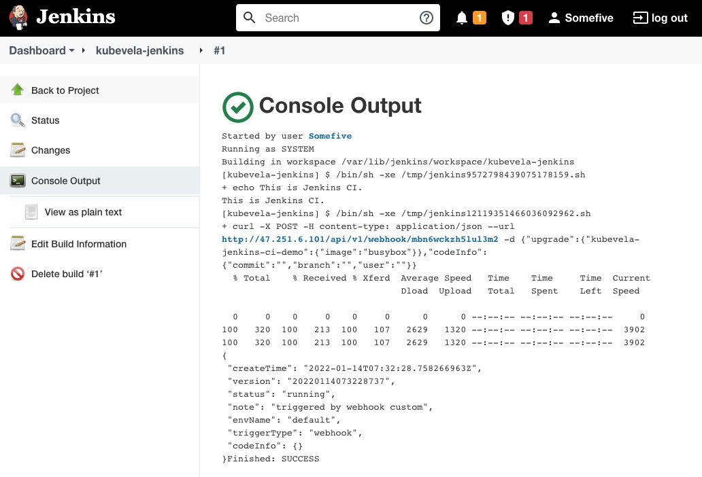

### Introduction

The workflow execution of KubeVela application can be triggered by webhooks. Therefore, it is rather easy for user to integrate KubeVela with existing Continuous Integration platforms, such as Jenkins or Gitlab.

From KubeVela 1.2, [VelaUX](../install#2-install-velaux) provides webhook triggers for applications to use. Only a simple curl command in Jenkins pipeline is needed to bridge CI and CD systems.

In this section, we will demonstrate how to integrate KubeVela with Jenkins in details.

### Prerequisite

The following requirements are needed to be ensured before starting this tutorial
- KubeVela v1.2.0+ with VelaUX installed.
- Jenkins installed.
- VelaUX can be accessed by Jenkins. (If KubeVela is installed in an offline environment, you need to check this condition.)

### Create Application

To use triggers, we need to create a new application on VelaUX first. For example, let's deploy a new WebService type application and use LoadBalancer to expose port 80 for access.


### Setup Webhook Trigger for Jenkins

In the application view, we can see a default trigger as below


Click **Manual Trigger**, we can see the Webhook URL and the Curl Command. Either one is available to copy and use into Jenkins pipeline script.


### Use Webhook in Jenkins

To use the webhook in Jenkins, we can paste the Curl Command in either Jenkins *Freestyle* project or *Pipeline* project.
- In *Freestyle* project, click **Add Build Step** and select **Execute Shell**. Copy the Curl Command above into it.
- In *Pipeline* projetct, similarly copy the Curl Command and wraps it with a `sh` command like the code below
```groovy
stage('Deploy') {
    steps {
        sh '''#!/bin/bash
            set -ex
            curl -X POST -H 'content-type: application/json' --url http://47.251.6.101/api/v1/webhook/mbn6wckzh5lul3m2 -d '{"upgrade":{"kubevela-jenkins-ci-demo":{"image":"busybox"}},"codeInfo":{"commit":"","branch":"","user":""}}'
        '''
    }
}
```
Now when jenkins execute these build steps, it will notify KubeVela to execute the application workflow automatically.



### Advanced: Secure your Webhook URL

The KubeVela webhook url in Jenkins can be secured by storing it in Jenkins credentials, instead of directly referring it in the project. You can set up a `secret text` type credential in Jenkins and use it in the project.