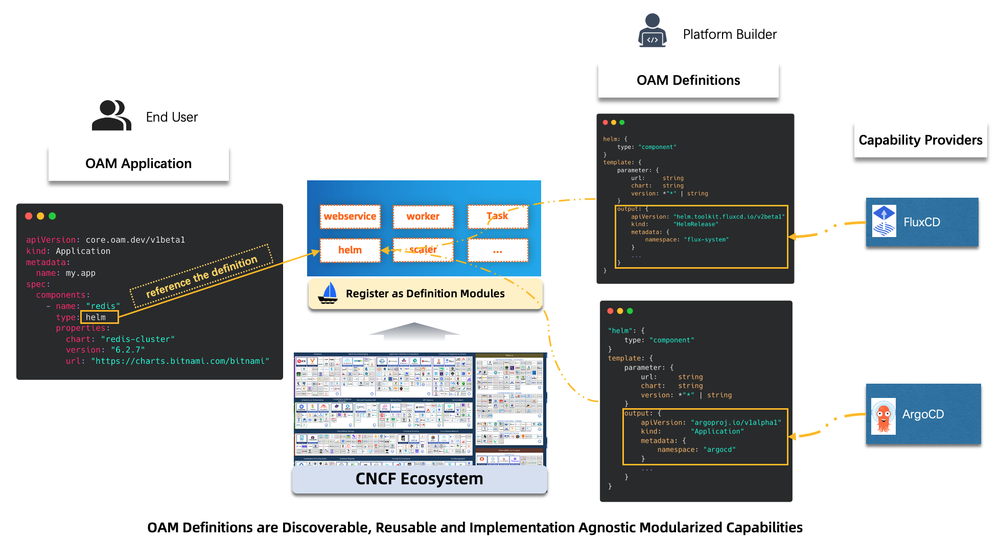

OAM Definitions are basic building blocks of the KubeVela platform. A definition encapsulates an arbitrarily complex automation as a lego style module, then safely shared, discovered and be used to compose an Application delivered by any KubeVela engine.

With the help of OAM definitions, the platform builder can easily adopt infrastructure capabilities from ecosystem, hide complexity with their best practices without losing any extensibility, the most important is the application won't be affected even if we change the capability providers.



The picture above is an example of `helm` definition, we can use [FluxCD](https://fluxcd.io/) or [ArgoCD](https://argo-cd.readthedocs.io/) as Helm capability provider. Once the platform builder registered the definition written by [CUE](https://cuelang.org/), the end user can discover the helm capability and define application by referring to the type.

There're mainly four types of definitions in KubeVela, they're `ComponentDefinition`, `TraitDefinition`, `PolicyDefinition` and `WorkflowStepDefinition`, corresponding to the application concepts. As an end user, you can get out-of-box definitions from KubeVela community.

## How to get out-of-box Definitions?

There're two sources to get out-of-box definitions:

* Built-in definitions will be installed along with KubeVela helm chart. You can refer to the following links to learn more about built-in definitions.
    - [Component Definition](../end-user/components/references.md)
    - [Trait Definition](../end-user/traits/references.md)
    - [Policy Definition](../end-user/policies/references.md)
    - [Workflow Step Definition](../end-user/workflow/built-in-workflow-defs.md)
* Install [Addons](../reference/addons/overview.md), they're scenario-oriented system extensions of KubeVela, each addon contains a bunch of definitions along its CRD controllers.
    - The community has a [verified addon registry](https://github.com/kubevela/catalog) which contains a large catalog of addons, the registry is maintained by the KubeVela team.

## Lifecycle of a Definition

A definition's lifecycle usually has 3 stages:

### Discovery

When definitions installed in the system, they can be discovered by end user immediately.

* Check the definition list

```
vela def list
```

<details>
<summary>expected output</summary>

```
NAME                         	TYPE                  	NAMESPACE  	DESCRIPTION
webservice                   	ComponentDefinition   	vela-system	Describes long-running, scalable, containerized services
                             	                      	           	that have a stable network endpoint to receive external
                             	                      	           	network traffic from customers.
gateway                      	TraitDefinition       	vela-system	Enable public web traffic for the component, the ingress API
                             	                      	           	matches K8s v1.20+.
health                       	PolicyDefinition      	vela-system	Apply periodical health checking to the application.
notification                 	WorkflowStepDefinition	vela-system	Send message to webhook
...snip...
```
</details>

* Show property details of one definition

```
vela show webservice
```

<details>
<summary>expected output</summary>

```
# Properties
+------------------+-------------------------------------------------------------------------------------------+-----------------------------------+----------+---------+
|       NAME       |                                        DESCRIPTION                                        |               TYPE                | REQUIRED | DEFAULT |
+------------------+-------------------------------------------------------------------------------------------+-----------------------------------+----------+---------+
| cmd              | Commands to run in the container                                                          | []string                          | false    |         |
| env              | Define arguments by using environment variables                                           | [[]env](#env)                     | false    |         |
| labels           | Specify the labels in the workload                                                        | map[string]string                 | false    |         |
| annotations      | Specify the annotations in the workload                                                   | map[string]string                 | false    |         |
| image            | Which image would you like to use for your service                                        | string                            | true     |         |
| ports            | Which ports do you want customer traffic sent to, defaults to 80                          | [[]ports](#ports)                 | false    |         |
+------------------+-------------------------------------------------------------------------------------------+-----------------------------------+----------+---------+
...snip...
```
</details>

You can also view the details from documentation website, the following command will launch a server and invoke your browser automatically:

```
vela show webservice --web
```

* Discover in UI console ([`velaux`](../reference/addons/velaux.md))

Once installed, these definitions can be discovered and generated with forms by the UI console automatically. More than that, you can even customize the layout by defining the [ui schema](../reference/ui-schema.md) like below.


### Use

Using definition on UI console is very straight forward, just click along with the application creation process.

1. Create Application and choose Component type which is actually choosing which component definition to use.
2. Fill the properties of component is actually fill the parameter of component definition.
3. The same step for trait, policy and workflow.

Finally, the UI console will compose the whole deployment plan in the format of OAM like below, then KubeVela controller will take care of the rest things:

```
apiVersion: core.oam.dev/v1beta1
kind: Application
metadata:
  name: first-vela-app
spec:
  components:
    - name: express-server
      type: webservice
      properties:
        image: oamdev/hello-world
        ports:
         - port: 8000
           expose: true
      traits:
        - type: scaler
          properties:
            replicas: 1
  policies:
    - name: target-default
      type: topology
      properties:
        clusters: ["local"]
        namespace: "default"
    - name: target-prod
      type: topology
      properties:
        clusters: ["local"]
        namespace: "prod"
    - name: deploy-ha
      type: override
      properties:
        components:
          - type: webservice
            traits:
              - type: scaler
                properties:
                  replicas: 2
  workflow:
    steps:
      - name: deploy2default
        type: deploy
        properties:
          policies: ["target-default"]
      - name: manual-approval
        type: suspend
      - name: deploy2prod
        type: deploy
        properties:
          policies: ["target-prod", "deploy-ha"]
```

Use the definition in `vela` command line works the same, you can compose the application yaml manually and deploy by `vela up` command.

```
vela up -f https://kubevela.net/example/applications/first-app.yaml
```

Application is also one kind of Kubernetes CRD, you can also use `kubectl apply` or invoke Kubernetes API to integrate with vela application.

### Customize

:::caution
In most cases, you don't need to customize any definitions **unless you're going to extend the capability of KubeVela**. Before that, you should check the built-in definitions and addons to confirm if they can fit your needs.
:::

A new definition is built in a declarative template in [CUE configuration language](https://cuelang.org/). If you're not familiar with CUE, you can refer to [CUE Basic](../platform-engineers/cue/basic.md) for some knowledge. 

A definition describes the module's inputs, outputs, operations, and the wiring between them. Here is an example of a simple component definition:

```
webserver: {
	type: "component"
	attributes: {}
}

template: {
	parameter: {
		name:  string
		image: string
	}
	output: {
		apiVersion: "apps/v1"
		kind:       "Deployment"
		spec: {
			containers: [{
				name:  parameter.name
				image: parameter.image
			}]
		}
	}
}
```

The `type` defines what kind of definition it is, the `parameter` defines the inputs, while the `output` section defines the outputs.
You can refer to detail docs about [how to manage definition](../platform-engineers/cue/definition-edit.md) or learn the [definition protocol](../platform-engineers/oam/x-definition.md).

