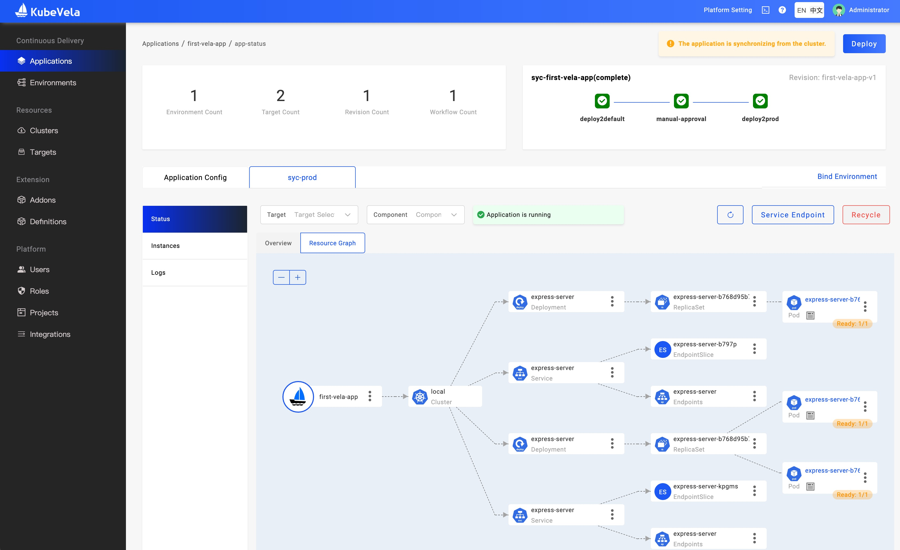

:::note
Before starting, please confirm that you've installed KubeVela and enabled the VelaUX addon according to [the installation guide](./install.mdx).
:::

Welcome to KubeVela! This section will guide you to deliver your first app.

## Deploy a classic application

Below is a classic KubeVela application which contains one component with one operational trait, basically, it means to deploy a container image as webservice with one replica. Additionally, there are three policies and workflow steps, it means to deploy the application into two different environments with different configurations.

```yaml
apiVersion: core.oam.dev/v1beta1
kind: Application
metadata:
  name: first-vela-app
spec:
  components:
    - name: express-server
      type: webservice
      properties:
        image: oamdev/hello-world
        ports:
         - port: 8000
           expose: true
      traits:
        - type: scaler
          properties:
            replicas: 1
  policies:
    - name: target-default
      type: topology
      properties:
        # The cluster with name local is installed the KubeVela.
        clusters: ["local"]
        namespace: "default"
    - name: target-prod
      type: topology
      properties:
        clusters: ["local"]
        # This namespace must be created before deploying.
        namespace: "prod"
    - name: deploy-ha
      type: override
      properties:
        components:
          - type: webservice
            traits:
              - type: scaler
                properties:
                  replicas: 2
  workflow:
    steps:
      - name: deploy2default
        type: deploy
        properties:
          policies: ["target-default"]
      - name: manual-approval
        type: suspend
      - name: deploy2prod
        type: deploy
        properties:
          policies: ["target-prod", "deploy-ha"]
```

* Create an environment for your first app.

```bash
# This command will create a namespace in the local cluster
vela env init prod --namespace prod
```

<details>
<summary>expected output</summary>

```console
environment prod with namespace prod created
```
</details>

* Starting deploy the application

```
vela up -f https://kubevela.net/example/applications/first-app.yaml
```

<details>
<summary>expected output</summary>

```console
Applying an application in vela K8s object format...
I0516 15:45:18.123356   27156 apply.go:107] "creating object" name="first-vela-app" resource="core.oam.dev/v1beta1, Kind=Application"
✅ App has been deployed 🚀🚀🚀
    Port forward: vela port-forward first-vela-app
             SSH: vela exec first-vela-app
         Logging: vela logs first-vela-app
      App status: vela status first-vela-app
        Endpoint: vela status first-vela-app --endpoint
Application prod/first-vela-app applied.
```
</details>

* View the process and status of the application deploy

```bash
vela status first-vela-app
```

<details>
<summary>expected output</summary>

```console
About:

  Name:      	first-vela-app
  Namespace: 	prod
  Created at:	2022-05-16 15:45:18 +0800 CST
  Status:    	workflowSuspending

Workflow:

  ...

Services:

  - Name: express-server
    Cluster: local  Namespace: default
    Type: webservice
    Healthy Ready:1/1
    Traits:
      ✅ scaler
```
</details>

The application will become a `workflowSuspending` status, it means the workflow has finished the first two steps and waiting for manual approval as the step specified.

* Access the application

We can check the application by:

```bash
vela port-forward first-vela-app 8000:8000
```

It will invoke your browser and your can see the website:

<details>
<summary>expected output</summary>

```
<xmp>
Hello KubeVela! Make shipping applications more enjoyable. 

...snip...
```
</details>

* Resume the workflow

After we finished checking the application, we can approve the workflow to continue:

```bash
vela workflow resume first-vela-app
```

<details>
<summary>expected output</summary>

```console
Successfully resume workflow: first-vela-app
```
</details>

Then the rest will be delivered in the `prod` namespace:

```bash
vela status first-vela-app
```

<details>
<summary>expected output</summary>

```console
About:

  Name:      	first-vela-app
  Namespace: 	prod
  Created at:	2022-05-16 15:45:18 +0800 CST
  Status:    	running

Workflow:

  ...snipt...

Services:

  - Name: express-server
    Cluster: local  Namespace: prod
    Type: webservice
    Healthy Ready:2/2
    Traits:
      ✅ scaler
  - Name: express-server
    Cluster: local  Namespace: default
    Type: webservice
    Healthy Ready:1/1
    Traits:
      ✅ scaler
```
</details>

Great! You have finished deploying your first KubeVela application, you can also view and manage it in UI.

## Manage application with UI Console

After finished [the installation of VelaUX](./install.mdx#2-install-velaux), you can view and manage the application created.

* Port forward the UI if you don't have endpoint for access:
  ```
  vela port-forward addon-velaux -n vela-system 8080:80
  ```

* VelaUX need authentication, default username is `admin` and the password is **`VelaUX12345`**.

It requires you to override with a new password for the first login, please make sure to remember the new password.

* Check the resources deployed

Click the application card, then you can view the details of the application.



The UI console shares a different metadata layer with the controller. It's more like a PaaS architecture of a company which choose a database as the source of truth instead of relying on the etcd of Kubernetes.

By default, if you're using CLI to manage the applications directly from Kubernetes API, we will sync the metadata to UI backend automatically. Once you deployed the application from the UI console, the automatic sync process will be stopped as the source of truth may be changed.

:::tip
If the namespace of the application operated by CLI has already been associated with the corresponding environment in UI, then the application will be automatically synchronized to the project associated with that environment in UI. Otherwise, the application will be synchronized to the default project.
If you want to specify which project in UI console an application should be synchronized to, please refer to [Creating environments for the project](how-to/dashboard/user/project.md#creating-environments-for-the-project).
:::

If there're any changes happen from CLI after that, the UI console will detect the difference and show it for you. However, it's not recommended to modify the application properties from both sides.

In conclusion, if you're a CLI/YAML/GitOps user, you'd better just use CLI to manage the application CRD and just use the UI console (velaux) as a dashboard. Once you've managed the app from the UI console, you need to align the behavior and manage apps from UI, API, or Webhook provided by velaux.

## Clean up

```bash
vela delete first-vela-app
```

<details>
<summary>expected output</summary>

```console
Deleting Application "first-vela-app"
app "first-vela-app" deleted from namespace "prod"
```
</details>

That's it! You succeed at the first application delivery. Congratulation!

## Next Step

- View [Core Concepts](./getting-started/core-concept.md) to learn more about how it works.
- View [User Guide](./tutorials/webservice.mdx) to look on more of what you can achieve with KubeVela.
