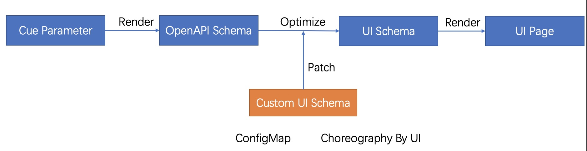

VelaUX uses the UI-Schema specification to customize UI elements of components, workflow steps, and operation and maintenance feature resources, in the case of variable input parameters, to achieve a more native UI experience.

At present, the UI-Schema specification mainly acts on the data input side and will be extended to the data visualization side in the future.

### How UI-Schema works

The components, workflow steps, and operation and maintenance feature types with different UI-Schema working principles are defined through CUE, which we call XDefinition, and almost every definition includes the definition of input parameters. for example:

```cue
scaler: {
	type: "trait"
	annotations: {}
	labels: {}
	description: "Manually scale K8s pod for your workload which follows the pod spec in path 'spec.template'."
	attributes: {
		podDisruptive: false
		appliesToWorkloads: ["*"]
	}
}
template: {
	parameter: {
		// +usage=Specify the number of workload
		replicas: *1 | int
	}
	// +patchStrategy=retainKeys
	patch: spec: replicas: parameter.replicas
}
```

In the above example, the user input parameter is `replicas`.

In the UI we want the user to be able to set the number of replicas via a number input form.



Its workflow is in the figure above. The API Schema is [generated through the defined CUE](../platform-engineers/openapi-v3-json-schema.md), and then the default UI Schema is generated through the API Schema. If there is a custom UI Schema, the default configuration is patched with the custom configuration. The UI renders the front-end page based on the final UI Schema.

The spec are as follows:

```yaml
- jsonKey: string         The field name
  label: string           The show name in UI
  description: string     The help info in UI
  uiType: string          The react component type in UI
  sort: int               The sort number
  disabled: bool          Disable this field.
  style:  
    colSpan: int          Defines the number of grids for the form, with 24 representing 100% width.
  conditions:             Control whether fields are enabled or disabled by certain conditions.
    - jsonKey: string     Specifies the path of the field, support the peer and subordinate fields.
      op: == | != | in    
      value: any          Specifies the expected value.
      action: enable|disable
  validate:               The value validate rule, It must be defined as a whole. 
    defaultValue: any     The default values.
    required: bool
    max: int              The max value for number.
    min: int              The min value for number.
    maxLength: int        The max length for string.
    minLength: int        The min length for string.
    pattern: string
    options:              Optional, for select forms
    - label: string
      value: string
    immutable: bool       Set the immutable is true, indicates that the parameter cannot be changed.
  subParameters:
    - jsonKey: string
      ...
```

### Supported react component types

#### Basic form

- [x] Input
- [x] Number
- [x] Select
- [x] Switch
- [x] Radio
- [x] Password

#### Business form

- [x] Ignore: There are subordinate fields, and the current field is not displayed.
- [x] SecretSelect: Load the secret list to assist user selection
- [x] SecretKeySelect: Load the secret key list by the secret name of the user selected to assist user selection
- [x] CPUNumber: CPU-style number input form.
- [x] MemoryNumber: Memory-style number input form.
- [x] DiskNumber: Disk-style number input form.
- [x] K8sObjectsCode: The YAML input form of Kubernetes resource.
- [x] HelmRepoSelect: Load the helm repositories from integration configs to assist user selection.
- [x] HelmChartSelect: Load the helm charts to assist user selection.
- [x] HelmChartVersionSelect: Load the versions of the selected helm chart to assist user selection.
- [x] HelmValues: Load the default values of the selected helm chart and version to assist the user to configure the custom values.
- [x] PolicySelect: Load the policies of the current application to assist user selection.
- [x] ImageInput: Load and show the image info by users input image name.
- [x] CertBase64: Support users upload or input the string, automatically base64 encoded. Suitable the fields such as the certificates and keys. (Added in 1.5+)

#### Combination form

- [x] KV
- [x] Strings
- [x] Structs
- [x] Group: render as a titled container

### Example

KubeVela store UISchema config in a ConfigMap in the same namespace with the definition object.
> The default KubeVela system namespace is vela-system, the built-in capabilities and uischemas are laid there.

You can use the following command to get the ConfigMap list of Custom UISchema.
```bash 
kubectl get configmap -n vela-system | grep uischema
```
```bash
NAME                                                   DATA   AGE
addon-uischema-velaux                                  1      25h
component-uischema-helm                                1      25h
component-uischema-k8s-objects                         1      25h
component-uischema-kustomize                           1      25h
component-uischema-task                                1      25h
config-uischema-helm-repository                        1      25h
config-uischema-image-registry                         1      25h
```
The ConfigMap name is in the format of `<your-definition-type>-uischema-<your-definition-name>`, and the data key is `ui-schema`.

For example, we can use the following command to get the UISchema of `k8s-objects` which tpe is `component`.
```bash
kubectl get configmap -n vela-system component-uischema-k8s-objects -oyaml
```
```bash
apiVersion: v1
kind: ConfigMap
metadata:
  name: component-uischema-k8s-objects
  namespace: vela-system
data:
  ui-schema: '[{"jsonKey":"objects","uiType":"K8sObjectsCode"}]'
```

For more examples, please refer to the following links：[https://github.com/kubevela/catalog/tree/master/addons/velaux/schemas](https://github.com/kubevela/catalog/tree/master/addons/velaux/schemas)

### How to expand

UI-Schema mainly extends front-end react components, refer to [https://github.com/kubevela/velaux/tree/main/packages/velaux-ui/src/extends](https://github.com/kubevela/velaux/tree/main/packages/velaux-ui/src/extends)
