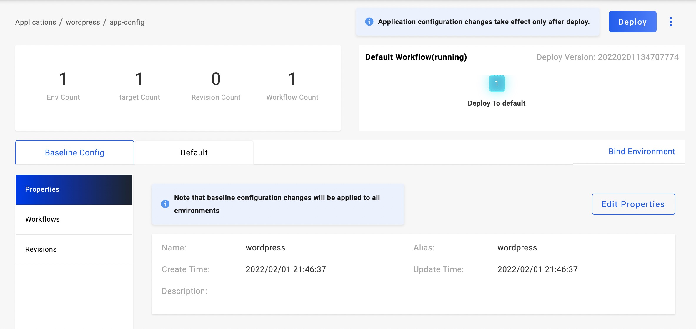
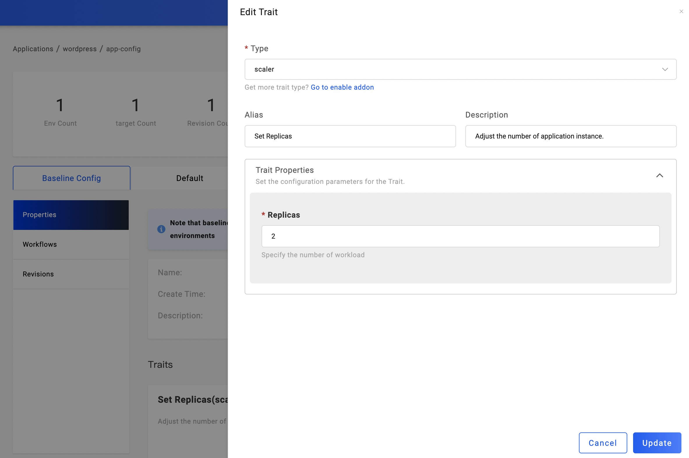

import Tabs from '@theme/Tabs';
import TabItem from '@theme/TabItem';

In this section, we will introduce how to deploy a container-based application with KubeVela. The guide will run the whole process with UI console as it's quite the same with the [quick start](../quick-start.md) if you're using CLI.

## Before starting

- Containerize your business, you need a container image within your image registry that can be accessed by KubeVela.
- Make sure you have [VelaUX addon](../reference/addons/velaux.md) enabled.
  ```
  vela addon enable velaux
  ```

## Creating an application

Enter the page of Application on the left, and click `New Application` to create. Pick your name, alias, and description; Select type of `webservice`; Decide your environment, Default environment is already available in the first place. You could also enter the page of Environments to set up new.

Click `Next Step` so to the configuration page. You need to set up the Image address and resources limit. If you want to set up a command for the image, open up the row `CMD`.

If you want to deploy the private image, please create the registry integration configuration. refer to: [Image registry configuration](../how-to/dashboard/config/image-registry.md)

After inputting the Image address, the system will load the Image info from the registry. If the image belongs to the private image registry, the `Secret` field will be automatically assigned values.

You could refer to their information to configure the `Service Ports` and `Persistent Storage`.


Done by clicking `Create` and then we enter the management page.

## Deploying the application

Click the `Deploy` button on the upper right and select a workflow. Note that each Environment of the application has its workflow. On the right of the `Baseline Config` tab is the environments. Check out the status of the environment and its instance information as you wish.



When it has several targets in this environment, you may find them all in the `Instances` list. If you want to look at the process of application deployment, click `Check the details` to reveal.

In the `Instances` list, you may find some of them are in pending status. Click `+` in the beginning to figure out the reason in more detail.

## Update image

After the first deployment, our business keeps evolving and the following updates come along.

Click `Baseline Config` and you can see the all components. Then click the component name and open the configuration page, you can update your latest requirements for image, version, and environment variable.

## Update replicas

If your business requires more than one replica, enter the `Properties` page. By default, The component has a `Set Replicas` trait. Click it so that you can update the replicas.



## Upgrading the application

By twos steps as above, it is still in a draft state, we need to click the deployment button again to complete the upgrade of the application.

## Application recycling and deletion

If you need to delete the application after testing, you need to recycle all the deployed environments first. Click the environment name to enter the environment instance list, and click the `Recycle` button to recycle the deployment of the application in that environment. After it's done, the application in this environment rolls back as an undeployed one.

After all of the environments have been recycled, the application can be deleted. Currently, the entry for application deletion is on the application list page. Back to the application list page, mouse on the menu icon on the right side of the application name, and click the `Remove` option.


At this point, you have basically mastered the deployment method of Docker image.

You can refer to [how to manage applications](../how-to/dashboard/application/create-application.md) to learn the details about the UI console operations.

## Deploy via CLI

You also can deploy the application via CLI.

```yaml
cat <<EOF | vela up -f -
# YAML begins
apiVersion: core.oam.dev/v1beta1
kind: Application
metadata:
  name: webservice-app
spec:
  components:
    - name: frontend
      type: webservice
      properties:
        image: oamdev/testapp:v1
        cmd: ["node", "server.js"]
        ports:
          - port: 8080
            expose: true
        exposeType: NodePort
        cpu: "0.5"
        memory: "512Mi"
      traits:
        - type: scaler
          properties:
            replicas: 1
# YAML ends
EOF
```

:::note
The application created by CLI will be synced to UI automatically.
:::

You can also save the YAML file as webservice-app.yaml and use the `vela up -f webservice-app.yaml` command to deploy.

Next, check the deployment status of the application through `vela status webservice-app`

```
About:

  Name:      	test-app
  Namespace: 	default
  Created at:	2022-04-21 12:03:42 +0800 CST
  Status:    	running

...snip...

Services:

  - Name: frontend
    Cluster: local  Namespace: default
    Type: webservice
    Healthy Ready:1/1
    Traits:
      ✅ scaler
```

Depending on how you install KubeVela, you can choose the way to access the endpoint.

<Tabs
  defaultValue="standalone-local"
  values={[
    {label: 'Standalone Local', value: 'standalone-local'},
    {label: 'Standalone Remote', value: 'standalone-remote'},
    {label: 'Kubernetes', value: 'kubernetes'},
  ]}>
<TabItem value="standalone-local">

You can access the endpoint by port-forward command:

```shell
vela port-forward webservice-app -n default 8080:8080
```

This command will open a browser automatically. Or you could access the endpoint by `http://127.0.0.1:8080` in your browser.

</TabItem>
<TabItem value="standalone-remote">

Since we have install KubeVela in a remote server with accessible IP address, you can check the application endpoint using `vela status --endpoint`. This command can detect multiple kinds of endpoints.
In this case, it is a NodePort Service under the hood. You can access the endpoint listed in the output.

```shell
vela status webservice-app --endpoint
```

<details>
<summary>expected output</summary>

```shell
I0816 21:20:08.536617   59163 utils.go:156] find cluster gateway service vela-system/kubevela-cluster-gateway-service:9443
Please access webservice-app from the following endpoints:
+---------+-----------+--------------------------+----------------------------+-------+
| CLUSTER | COMPONENT | REF(KIND/NAMESPACE/NAME) |          ENDPOINT          | INNER |
+---------+-----------+--------------------------+----------------------------+-------+
| local   | frontend  | Service/default/frontend | http://182.92.178.219:30128 | false |
+---------+-----------+--------------------------+----------------------------+-------+
```

</details>

:::caution open the port
If you are using a cloud server, please open this port in secure group.
:::

</TabItem>
<TabItem value="kubernetes">

You can check the application endpoint using `vela status --endpoint`. This command can detect multiple kinds of endpoints.
In this case, it is a NodePort Service under the hood. You can access the endpoint listed in the output.

```shell
vela status webservice-app --endpoint
```

<details>
<summary>expected output</summary>

```shell
I0816 21:20:08.536617   59163 utils.go:156] find cluster gateway service vela-system/kubevela-cluster-gateway-service:9443
Please access webservice-app from the following endpoints:
+---------+-----------+--------------------------+----------------------------+-------+
| CLUSTER | COMPONENT | REF(KIND/NAMESPACE/NAME) |          ENDPOINT          | INNER |
+---------+-----------+--------------------------+----------------------------+-------+
| local   | frontend  | Service/default/frontend | http://182.92.178.219:30128 | false |
+---------+-----------+--------------------------+----------------------------+-------+
```

</details>

:::caution open the port
The output from the preceding command shows that the NodePort service is exposed externally on the port (30128) of the available cluster node.
Before you access NodeIP:NodePort(182.92.178.219:30128) from outside the cluster, you must set the security group of the nodes to allow incoming traffic.
You should allow incoming traffic through the port (30128).
:::

</TabItem>
</Tabs>


Now, you have finished learning the basic delivery for container images. Then, you could:

* Refer to [webservice details](../end-user/components/references.md#webservice) to know usage of full fields.
* Refer to [trait reference](../end-user/traits/references.md) to know which traits can be used for webservice.
* Refer to [multi-cluster delivery](../case-studies/multi-cluster.md) to know how to deploy container image into hybrid environment and multi-clusters.