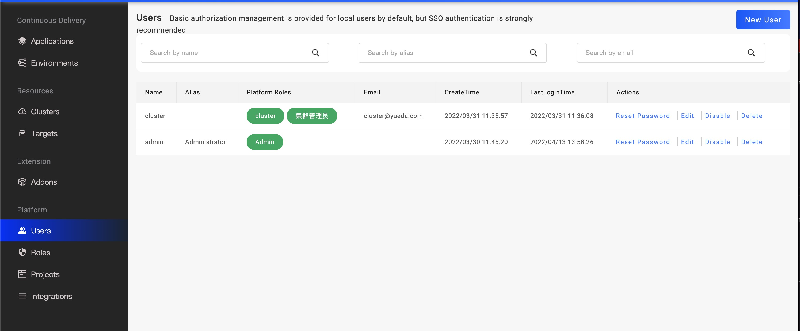

:::tip
The User Management feature only works when you're using VelaUX UI console.
:::

Once VelaUX is installed, there's a built-in administrator user with full access to the system. It is recommended to use the admin user only for the initial configuration, then switch to another user or configure the SSO integration.

## Local users/accounts

The local users/accounts feature serves two main use-cases:

* For the restful API users，it is possible to configure an API account with limited permissions and generate an authentication token. users can use token to communicate with the API to create applications, etc.
* For a very small team where use of SSO integration might be considered an overkill. There could only use local users to authentication. 

### Get full users list

If the logged-in user has the list user permission, he can switch to the `Platforms/Users` page and get the full list of users.

As shown in the picture above， there are user's name、alias, and platform roles in tables. we will record the user's last login time and show it.

### Creating users

Click the `New User` button, you can open the drawer page for creating a user. you should input some required info, such as the user's name、email, and password. Click the `Create` button then complete.

### Enable/disable users

You can click the disable or enable button, it could set the user's status. If a user is disabled, this user can not login.

### Reset user's password

You can click the reset password button and input a new password then commit it.

### Updating users

For existing users supports updating alias and platform role information. If a user has an empty email, support set a new email.

## SSO

SSO is our recommended way, please refer to [SSO login](../../../tutorials/sso.md) document.
