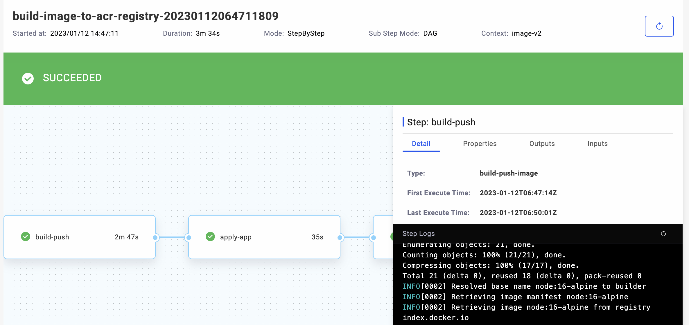

## Overview

From code to application, one of the indispensable step is to build image. This section will introduce how to orchestrate image build, image push and application delivery in KubeVela.

## How to use

### Use standalone workflow

KubeVela introduced [standalone workflow](../end-user/pipeline/workflowrun) in version v1.6 that can be used **independently**, which can be used to orchestrate the process between CI steps and application delivery. Different from the workflow in the KubeVela application, it is **one-time** and does not manage resources. Even if the workflow is deleted, the created resources will not be deleted.

:::tip
Please make sure that you have enabled workflow addon with `vela addon enable vela-workflow`.
:::

Apply the following workflow:

```yaml
apiVersion: core.oam.dev/v1alpha1
kind: WorkflowRun
metadata:
  name: build-push-image
  namespace: default
spec:
  context:
    image: my-registry/test-image:v2
  workflowSpec:
   steps:
    # or use kubectl create secret generic git-token --from-literal='GIT_TOKEN=<your-token>'
    - name: create-git-secret
      type: export2secret
      properties:
        secretName: git-secret
        data:
          token: <git token>
    # or use kubectl create secret docker-registry docker-regcred \
    # --docker-server=https://index.docker.io/v1/ \
    # --docker-username=<your-username> \
    # --docker-password=<your-password> 
    - name: create-image-secret
      type: export2secret
      properties:
        secretName: image-secret
        kind: docker-registry
        dockerRegistry:
          username: <username>
          password: <password>
    - name: build-push
      type: build-push-image
      inputs:
        - from: context.image
          parameterKey: image
      properties:
        # use your kaniko executor image like below, if not set, it will use default image oamdev/kaniko-executor:v1.9.1
        # kanikoExecutor: gcr.io/kaniko-project/executor:latest
        # you can use context with git and branch or directly specify the context, please refer to https://github.com/GoogleContainerTools/kaniko#kaniko-build-contexts
        context:
          git: github.com/FogDong/simple-web-demo
          branch: main
        # Note that this field will be replaced by the image in inputs
        image: my-registry/test-image:v1
        # specify your dockerfile, if not set, it will use default dockerfile ./Dockerfile
        # dockerfile: ./Dockerfile
        credentials:
          image:
            name: image-secret
        # buildArgs:
        #   - key="value"
        # platform: linux/arm
    - name: apply-app
      type: apply-app
      inputs:
        - from: context.image
          parameterKey: data.spec.components[0].properties.image
      properties:
        data:
          apiVersion: core.oam.dev/v1beta1
          kind: Application
          metadata:
            name: my-app
          spec:
            components:
              - name: my-web
                type: webservice
                properties:
                  # Note that this field will be replaced by the image in inputs
                  image: my-registry/test-image:v1
                  imagePullSecrets:
                    - image-secret
                  ports:
                    - port: 80
                      expose: true
```

The workflow has four steps in total:

1. Create a secret with Git token, which is used to pull the code from the private repository to build the image. If your repository is public, you can skip this step. You can also skip this step and use the `kubectl create secret generic git-token --from-literal='GIT_TOKEN=<your-token>'` command to create the secret.
2. Create a secret with the image registry token to push the image to your image registry. You can also skip this step and use `kubectl create secret docker-registry docker-regcred --docker-server=https://index.docker.io/v1/ --docker-username=<your-username> -- docker-password=<your-password>` command to create the secret.
3. Use the `build-push-image` step type to build and push the image. This step will use the specified Git url and the code in its branch to build the image. You can also directly specify in the context field. The bottom layer of this step will use [Kaniko](https://github.com/GoogleContainerTools/kaniko) for image building. During the building, you can use `vela workflow logs build-push-image --step build-push` to view the log of the step. Note that this step has an input from `context.image`, which will override the image field in properties. As you can see, we currently declare `image: my-registry/test-image:v2` in the context. When we need to reuse this workflow to build a new image version, we only need to update the data in the context to update the entire process.
4. In the last step, the image version in `context.image` will be used to publish the application. When the application starts, you can use `vela port-forward my-app 8080:80` to check the result.

If you configure the process in VelaUX's Pipeline, you can directly see the status and sequence of all steps on the page, including step logs, input and output, etc.



### Use Application workflow

You can also directly build the image in the application, and use the newly built image in the component. Apply the following application:

```yaml
apiVersion: core.oam.dev/v1beta1
kind: Application
metadata:
  name: build-push-image
  namespace: default
spec:
  components:
  - name: my-web
    type: webservice
    properties:
      image: my-registry/test-image:v1
      ports:
        - port: 80
          expose: true
  workflow:
    steps:
    - name: build-push
      type: build-push-image
      properties:
        # use your kaniko executor image like below, if not set, it will use default image oamdev/kaniko-executor:v1.9.1
        # kanikoExecutor: gcr.io/kaniko-project/executor:latest
        # you can use context with git and branch or directly specify the context, please refer to https://github.com/GoogleContainerTools/kaniko#kaniko-build-contexts
        context:
          git: github.com/FogDong/simple-web-demo
          branch: main
        # you must align the image value with image field of the component properties
        image: my-registry/test-image:v1
        # specify your dockerfile, if not set, it will use default dockerfile ./Dockerfile
        # dockerfile: ./Dockerfile
        credentials:
          image:
            name: image-secret
        # buildArgs:
        #   - key="value"
        # platform: linux/arm
    - name: apply-comp
      type: apply-component
      properties:
        component: my-web
```

In the application above, the first step in the workflow will use the `build-push-image` step to build the image, and the second step will deploy the component with the newly built image.