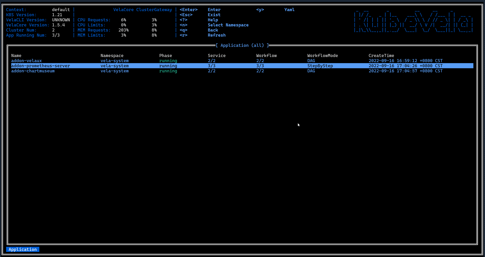
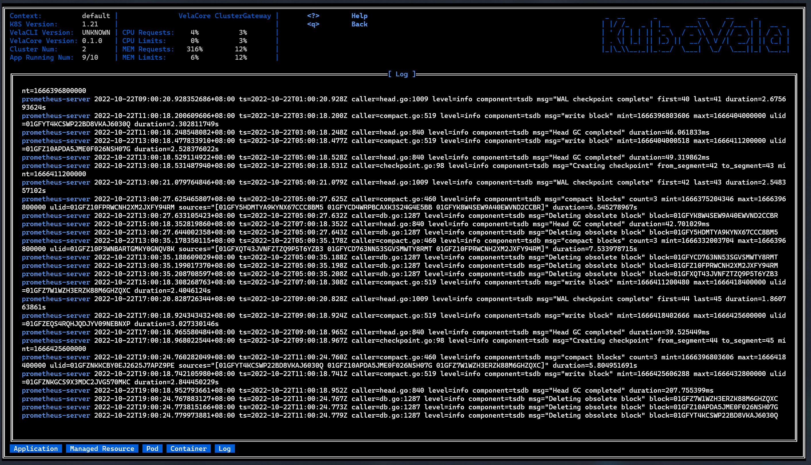

In this guide, we want to introduce you how to use the vela top tool in KubeVela. This tool is a UI based CLI tool provided in KubeVela. By using it, you can obtain the overview information of the platform and diagnose the resource status of the application.

At present, the tool has provided the following feature:
- Platform information overview
- Display of resource status information at Application, Managed Resource, Pod and Container levels
- Display Application Resource Topology
- Display resource YAML text
- Display log of pod and container

### Launch tool

When launching the tool, we can specify the Namespace of the Application displayed in the Application view which is the home page.

- Default Namespace
    ```shell
  vela top
  ```

- Aimed Namespace
    ```shell
  vela top -n <namespace>
  ```

- All Namespace
  ```shell
  vela top -A
  ```

After starting the tool, we will enter the home page: Application view, as shown below:


The tool is divided into three parts as a whole, as shown in the figure, they are the Header part containing basic information, platform system information, menu and logo, the Body part where the resource view is located, and the Footer part where the breadcrumb component of the resource level is located.

### Overview of platform information


This information panel component will display the performance information of the KubeVela system, including the version of Vela Core and Vela CLI, the proportion of applications running in the KubeVela system to all applications, and the performance information of the Vela controller (Vela Core) and the Vela gateway (Vela Cluster GateWay). The current usage of CPU and memory accounts for the proportion of the two set values of request and limit respectively).

The performance information for the Vela Controller and Vela Gateway here actually comes from the performance information of the Pod where they are located. It should be noted that to collect the performance information of the Pod, you need to install the [metrics server](https://github.com/kubernetes-sigs/metrics-server) in the cluster, otherwise the performance information of the Pod will not be obtained correctly.


### Display information and status of multi-level resource

#### Application view


This view will display the status information of all Applications under the Namespace in the platform, including:
- Name
- Namespace
- Phase
- Workflow Mode
- Number of successful Workflows / Number of Workflows
- Number of Health Services / Number of Services
- CreateTime

In this view, you can reselect the Application of which Namespace to display by pressing the N button:


You can also press the button ↑ or ↓ to select an application and then press the button T to display the resource topology of the application.

If you want to do resource penetration for this Application to see what resources belong to it, you can enter the next resource level by pressing the ENTER key.

#### Managed Resource view


The Managed Resource view shows the next-level resources of the Application. The resource view shows the resources generated by the deployment of the target Application, including: Deployment, ConfigMap, Service, Helm Release, etc. We call these resources the resources managed by the application.

For Application-managed resources, we display the following information:

- Name
- Namespace
- Kind
- API Version
- In which cluster
- Belong to which component
- Status

The resources managed by the application are very complex, so in this view, we provide some ways to filter the view. You can filter the resources according to the Namespace and the cluster where the resources are located. The corresponding keys are N and C, as shown below:



The title at the top of the view indicates that the Namespace and Cluster in which the resource is currently displayed.

In addition, in this view, you can also use the Q key to return to the previous Application view, and press the ENTER key after selecting a resource to enter the Pod view to display the Pod resources which belong to the resource.

#### Pod view


The deployment of Managed Resource results in the deployment of Pod resources, and the Pod view displays the Pod resources further generated by the target Managed Resource. For Pod resources, this view shows the following information about the Pod:

- Name
- Namespace
- Cluster
- Ready
- Status
- CPU usage
- Memory usage
- CPU usage as a percentage of request
- CPU usage as a percentage of limit
- Memory usage as a percentage of request
- Memory usage as a percentage of limit
- IP address
- Node where it is located
- Age

In this view you can still use the Q key to go back to the previous view.

#### Container View


Several containers are running in a pod, the Container View displays the containers' info running in the selected pod. For Container resources, this view shows the following information about the Container:
- Name
- Image
- Ready
- State
- CPU usage
- Memory usage
- CPU usage as a percentage of request
- CPU usage as a percentage of limit
- Memory usage as a percentage of request
- Memory usage as a percentage of limit
- Terminate Message
- Restart Count


#### Switch resource level

We have introduced the three views above, and now we will show you how to switch between multiple views to get the resource status information you want.


### Display Resource topology of application

Maybe you want to know how the complete resource topology of an application is. We have provided such a function in VelaUX. In fact, we also provide you with a similar function in vela top. In the Application view, you can select an Application and press the T key, it will display the resource topology of the Application in two forms:


The application delivery model behind KubeVela is [Open Application Model](https://kubevela.io/zh/docs/platform-engineers/oam/oam-model). Every application deployment plan can be composed by multiple components with attachable operational behaviors (traits), deployment policy and workflow. For the content of this part, please refer to [KubeVela Core Concepts](https://kubevela.io/zh/docs/getting-started/core-concept), so the first topology we show is to show the four components of the application, this topology is called the "App Topology".

In addition, these components will actually eventually be loaded as native resources or CRDs in Kubernetes, and these resources constitute another resource topology. As a user, you must want to know whether the sub-resources of the application are correctly deployed as required, you can get the answer from this topology, which we call the "Resource Topology".

### General functions
#### Display YAML of resource


In all kinds of resource views, you can select a resource and press the Y key to view the YAML text corresponding to the resource, and the text will be highlighted.

#### Print log



In the Container view, you can use the L key to enter the log view, the log view will print the log of the selected container.

In the Container view, the method of entering the log view is the same as Pod view. What is different is the log are belong to the several containers in the selected pod.

#### Switch Theme


In order to solve the problem that the display effect of the default color matching is different on different terminals, we provide the theme switching function. You can press Ctrl+T to switch themes. After the theme switching, you need to restart vela top to make the theme take effect.


At present, vela top has more than ten built-in themes, which you can choose according to your own preferences. However, to meet the needs of different users, we also provide the function of customizing themes. You can edit your theme file in the following format:


```yaml
# platform information component
info:
  # title color
  title: "#69d9ed"
  # text color
  text: "#c3eff7"
# menu component
menu:
  # description text color
  description: "#6b7f7f"
  # key text color
  key: "#a7e24c"
# Logo component
logo:
  # logo text color
  text: "#f72972"
# crumbs component
crumbs:
  # text color
  foreground: "#e0e0e0"
  # background color
  background: "#5fd7ff"
# table component
table:
  # table title color
  title: "#ffffff"
  # table header color
  header: "#ffffff"
  # table body color
  body: "#5fd7ff"
# resource status color
status:
  starting: "#69d9ed"
  healthy: "#a7e24c"
  unhealthy: "#f72972"
  waiting: "#e47c20"
  succeeded: "#3174a2"
  failed: "#a7e24c"
  unknown: gray
# YAML 
yaml:
  # YAML key color
  key: "#e47c20"
  # YAML colon color
  colon: "#e47c20"
  # YAML value color
  value: "#ffffff"
# topology view
topology:
  # topology tree line color
  line: "#69d9ed"
  # app node text color
  app: "#f72972"
  # workload node text color
  workflow: "#5fd7ff"
  # component node text color
  component: "#a7e24c"
  # policy node text color
  policy: "#e47c20"
  # trait node text color
  trait: "#f72972"
  # kind text color in resource topology 
  kind: "#5fd7ff"
```


Place the edited theme configuration file in the `~/.vela/theme/themes` folder, and then start vela top again to enter the theme switching interface. You can see that the theme you can select contains the newly edited custom theme.

#### Help View

In any interface, you can press the ? key to enter the help view, which will briefly introduce you to the related functions and usage of vela top.


