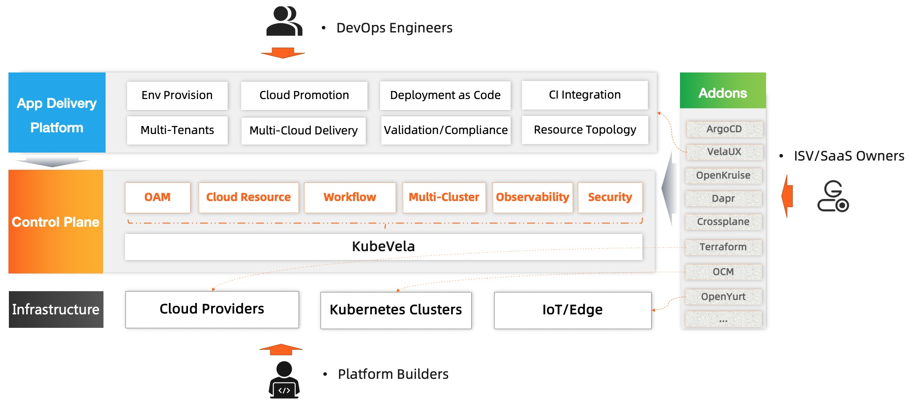

The overall architecture of KubeVela is shown as below:

## KubeVela is a Control Plane System

KubeVela orchestrates application components, cloud resources and pipeline over multiple clusters and hybrid environments. It is designed to be an application delivery and operation control plane instead of a runtime plugin.

The [Application concept](./core-concept.md) is the main KubeVela API, it's designed as declarative and application-centric which can be integrated with upstream CI pipelines and GitOps tools easily.

In implementation, KubeVela relies on a dedicated Kubernetes cluster to achieve above goals. We chose to rely on Kubernetes as the control plane implementation because this approach is battle tested and brings determinism, convergence and automation to application management at scale. In detail, KubeVela is composed by several parts:

- _KubeVela Core Controller_ that provides the core control logic of the entire system. For example, handling KubeVela API resources, orchestrating workflow, storing revisions, parsing and executing CUE code, garbage collecting, etc.
- [_Cluster Gateway Controller_](https://github.com/oam-dev/cluster-gateway) that provides a unified multi-cluster access interface. Working as Kubernetes Aggregated API Server, the gateway leverages the native Authentication and Authorization modules and enforces secure and transparent access to managed clusters.
- [_Addons_](../reference/addons/overview.md) that register and manage definitions along with extended CRD controllers that KubeVela needed to work. For example, several frequently used addons are listed below:
  * The [_VelaUX_](https://github.com/kubevela/velaux) addon is the Web UI for KubeVela. Besides, it acts more like a full functioned "App Delivery Platform" in the architecture that incorporates business logic into fundamental APIs and provides out-of-box user experiences for non-k8s-expert users.
  * The [_Workflow_](https://github.com/kubevela/workflow) addon is a standalone workflow engine that can run as pipeline to deploy multiple applications or other actions. A big difference to traditional ways, it mainly drives the IaC based API with the use of CUE instead of running pods for every step. It shares the same mechanism with the application workflow of KubeVela core controller. 
  * The [_Vela Prism_](https://github.com/kubevela/prism) addon is an extension API server for KubeVela and built upon the Kubernetes Aggregated API Server. It projects native APIs like creating dashboards on Grafana into Kubernetes resource APIs, so that users can manage 3rd-party resources as Kubernetes native resources.
  * The [_Terraform_](https://github.com/kubevela/terraform-controller) addon allows users to use Terraform to manage cloud resources through Kubernetes Custom Resources.
  * Besides, KubeVela has a large growing [catalog](https://github.com/kubevela/catalog) that already contains more than 50 community addons for integrations including ArgoCD, FluxCD, Backstage, OpenKruise, Dapr, Crossplane, Terraform, OpenYurt, etc.
- If you don't have any Kubernetes cluster, the [_VelaD_](https://github.com/kubevela/velad) tool, which is building on top of k3s & k3d, can help launch all these things. It integrates KubeVela with Kubernetes cores, which can be extremely helpful for building dev/test environments.

This control plane Kubernetes cluster will be referenced as the "control plane cluster" in the following documentation.

### Runtime Infrastructure

The runtime infrastructure is where the applications are actually running on.
KubeVela itself is fully runtime infrastructure agnostic and hence allows you to deploy application to both Kubernetes based infrastructure and non-Kubernetes environments such as cloud platforms and edge devices.

## KubeVela is Programmable

In real world, application deployment tends to be complex and varies from teams, environments and scenarios. Hence, KubeVela introduced the [Definition Mechanism](./definition.md) which is a fully programmable approach to implement its deployment model so it can adapt to every need of your application delivery use case in-place.

## Who should use KubeVela?

- Platform builders for PaaS, Serverless, Application Management/Delivery systems
	- KubeVela works as an application delivery engine that you could build your advanced platform with.
- ISV, SaaS owners, and Application Architects who need to distribute software to anywhere
	- KubeVela has full extension and integration capabilities to allow users to distribute applications with [customized addons](../platform-engineers/addon/intro.md) easily. Think about an App Store but on Kubernetes and clouds.
- Application Developers, Operators, DevOps Engineers
	- VelaUX is an addon of KubeVela, with this addon enabled, it provides an out-of-box modern application Continuous Delivery (CD) and Management platform with an easy-to-use UI console.

## Conclusion

- [OAM(Open Application Model)](https://github.com/oam-dev/spec) is the model behind KubeVela, it provides a platform-agnostic application model including the best practices and methodology for different vendors to follow. The evolution of the model depends primarily on the practices of KubeVela currently.
- KubeVela is the control plane running on Kubernetes, it works as a [CRD controller](https://kubernetes.io/docs/concepts/extend-kubernetes/api-extension/custom-resources/) and brings OAM model into your Cloud Native PaaS along with lots of addon capabilities.
- VelaUX is the app delivery platform, it's also one of the KubeVela addons, which provides out-of-box application delivery and management capabilities with **restful API** and **UI console**.

The KubeVela team will mainly focus on the control plane. By building VelaUX, we aim to provide out-of-box solutions for small and medium sized companies, and also eat our own dog food and make the extension, integration and the addon system capabilities of KubeVela better. 

## Next Step

- View [User Guide](../tutorials/webservice.mdx) to look on more of what you can achieve with KubeVela.
