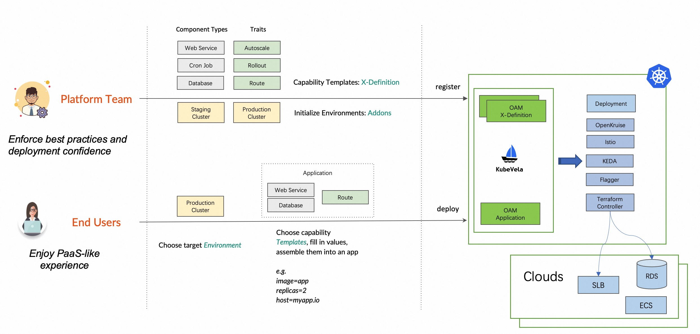

KubeVela designs for separation of concerns, as a result, there're two roles of users:

- **Platform Team**
  - The platform engineers initialize the deployment environments, provide stable infrastructure capabilities (e.g. mysql-operator) and register them as reusable templates using [KubeVela Definitions](./definition.md) into the control plane. They should be experienced and skillful with the infrastructure.
- **End Users**
  - The end users are usually app developers. They choose target environment, and choose capability templates, fill in values and finally assemble them as a [KubeVela Application](./core-concept.md). They don't need to understand the infrastructure details.

The KubeVela community has also maintained a bundle of infrastructure capabilities, they are called [addons](../reference/addons/overview.md).

The work flow is shown as below:

## What's benefit?

The separation of concern benefit the end users most. They can enjoy the "Application-Centric" experience without learning any infrastructure details. To make it more concrete, they can be free from the following scenarios:

- No need to learn Kubernetes API deprecations from versions upgrade.
- No need to care about the difference between several ingress implementations.
- No need to understand the CPU limit or even deeper infrastructure knowledge such as pod disruption budget.
- Declare high availability or other operation requirements as application traits.
- Use the capability with more confidence as they're enforced with best practices provided by platform teams.

As to platform teams, the benefits are also obvious:

- They can provide reusable capabilities, enforce best practices and make application delivery safer.
- They can provide flexible template parameters to serve different application teams with the same platform per their needs.
- They can share and integrate capabilities with the whole open source community easily in a standard way.
