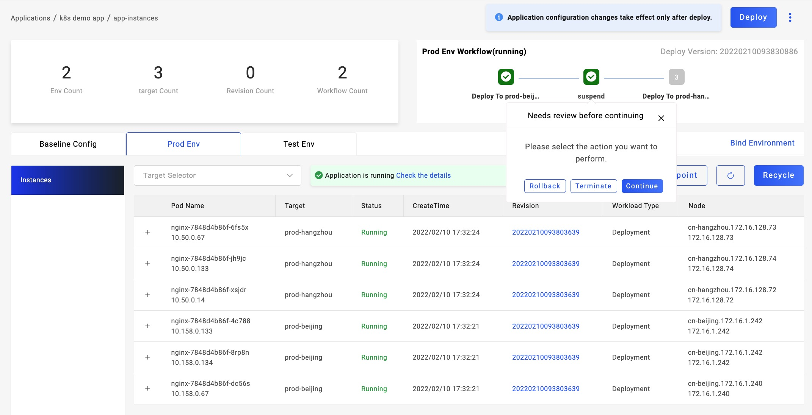

After application created and bond with an environment, you can deploy the application instance.

### First time deploy

You can view the application detail page by click the application name or the UI card.

The tabs on the right side of the `Baseline Config` are environments which bond by the application. Choose one of the environment you want to deploy. Click that tab, you'll see the picture below.

If this is the first time deploy, you'll see the Deploy button in the middle of the environment page, just click the `Deploy` button to deploy.

Then the workflow start to running, you can see the workflow status on the top right corner.

If you have configured a suspend workflow step, it will run and stop in that state. It will wait until you have checked your application well and click the approve button.

If there's something wrong with the workflow step, the workflow node will become red. Move your mouse to hover that area, you'll see the error reason.

### Upgrade the application

There's a `Deploy` button on the top right corner, you can click that for deploy. On the right side of the button, there's detail button, you can choose which workflow to run if there's multiple environments configured.

You can upgrade the application in any state, as KubeVela is a declarative system. There will be a kindly reminder for you if the workflow is running when you want to upgrade.

### Next Step

* [Check Application State](./get-application-instance.md)