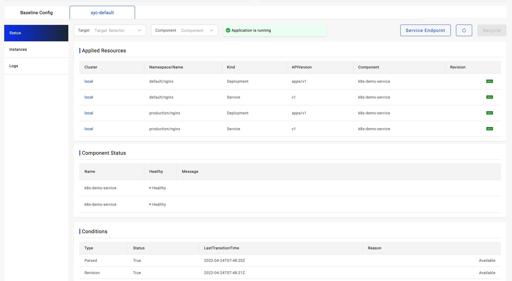

If you want to learn the resources created by the applications, you can open the environment status page.



There're three kinds of information including `Applied Resources`,`Conditions` and `Component Status`. The `Applied Resources` are all resources created by the applications.

## View resources via CLI

```bash
$ vela status <app_name> -n <namespace> --tree
```

### Next Step

* [List Application Revision](./get-application-revision.md)