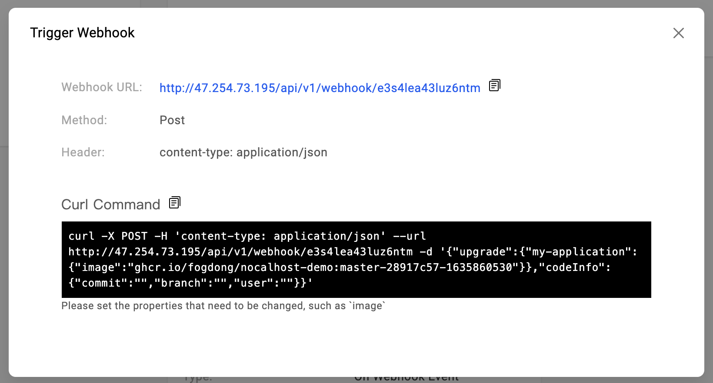
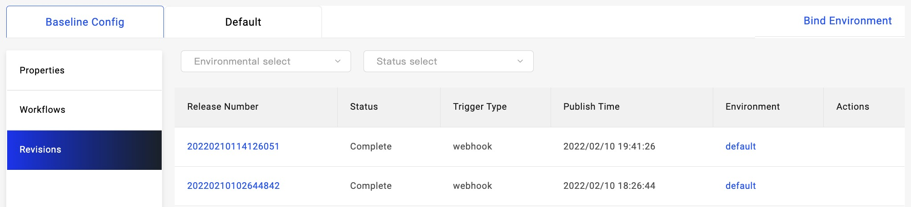

In KubeVela, you can choose to directly use declarative workflow with CI steps, such as: build code, push image, etc. Alternatively, you can choose to use triggers to integrate with external CI systems, such as Jenkins, image registry, etc.

## Use declarative workflow with CI steps

KubeVela v1.7+ provide built-in step for image building, please refer to [Unified Declarative CI/CD](../../../tutorials/s2i.md) for details.

## Use triggers to integrated with CI system.

You can use triggers from [VelaUX addon](../../../reference/addons/velaux.md) to integrate with different CI systems. In VelaUX, a default trigger will be automatically generated after an application created, you can also delete it and create a new one. The architecture and supported platforms are described in the following picture, they're:

- [Custom](#custom-trigger), refer to [Jenkins CI](../../../tutorials/jenkins.md) guide for a real world use case.
- [ACR](#ACR-trigger)
- [Harbor](#Harbor-trigger), refer to [Harbor Integration](../../../tutorials/trigger.md) guide for a real world use case.
- [DockerHub](#DockerHub-trigger)
- [JFrog](#JFrog-trigger)


### Custom Trigger

Custom triggers will provide a webhook URL, which you can use to integrate with your CI tool using the specified request body.

The default trigger is a custom trigger, click `Manual Trigger` to get more info of this trigger:



Webhook URL is the address of this trigger, you can see request body in `Curl Command` example:

```json
  {
    // required, the upgrade of this deployment
    "upgrade": {
      // key is the name of application
      "<application-name>": {
        // the fields that need to be patched
        "image": "<image-name>"
      }
    },
    // optional, the code info of this deployment
    "codeInfo": {
      "commit": "<commit-id>",
      "branch": "<branch>",
      "user": "<user>",
    }
  }
```

`upgrade` is the key of the object that need to be patched, `<application-name>` is the name of application. `image` is the field that need to be patched. You can also add more fields in `<application-name>`.

In `codeInfo`, you can add some code infos of this deployment like commit id, branch or user.

Below is an example of using Custom Trigger in Gitlab CI, we use env in this example:

```shell
webhook-request:
  stage: request
  before_script:
    - apk add --update curl && rm -rf /var/cache/apk/*
  script:
    - |
      curl -X POST -H "Content-Type: application/json" -d '{"upgrade":{"'"$APP_NAME"'":{"image":"'"$BUILD_IMAGE"'"}},"codeInfo":{"user":"'"$CI_COMMIT_AUTHOR"'","commit":"'"$CI_COMMIT_SHA"'","branch":"'"$CI_COMMIT_BRANCH"'"}}' $WEBHOOK_URL
```

After CI have executed this step, we can see that application is deployed successfully in VelaUX. We can also see some relative code infos of this deployment.


You can refer to [Jenkins CI](../../../tutorials/jenkins.md) guide for a real use case about custom trigger.

Apart from this, Custom Triggers also supports some other type of actions, they are :

#### Execute workflow

Integrate Custom Triggers into your CI tool to execute a workflow. This action behaves the same as the default custom trigger with no action provided. The request body for executing a workflow using Custom Triggers is as follows:

```json
  {
    "action":"execute"
    // required, the upgrade of this deployment
    "upgrade": {
      // key is the name of application
      "<application-name>": {
        // the fields that need to be patched
        "image": "<image-name>"
      }
    },
    // optional, the code info of this deployment
    "codeInfo": {
      "commit": "<commit-id>",
      "branch": "<branch>",
      "user": "<user>",
    }
  }
```

#### Approve workflow

During the `suspending` phase of a workflow step, the CI tool can approve the workflow by calling the Custom Trigger with the following request body:

```json
  {
    "action":"approve",
    // optional, name of the suspending step
    "step":"suspend"
  }
```

#### Terminate workflow

If a workflow step is in the `suspending` phase, the CI tool can terminate the workflow by calling the Custom Trigger with the following request body:

```json
  {
    "action":"terminate",
    // optional, name of the suspending step
    "step":"suspend"
  }
```

#### Rollback workflow

If a workflow step is in the `suspending` phase, the CI tool can initiate a rollback of an application workflow to the latest revision by calling the Custom Trigger with the following request body:

```json
  {
    "action":"rollback",
    // optional, name of the suspending step
    "step":"suspend"
  }
```

### Harbor Trigger

Harbor Trigger can be integrated with Harbor image registry.

You can refer to [Harbor Image Registry](../../../tutorials/trigger.md) guide for the end to end tutorial.

### ACR Trigger

ACR Trigger can be integrated with ACR image registry.

We can start with creating a new ACR trigger. The Payload Type is ACR, and the Execution Workflow is the workflow you want to deploy in the trigger.


After creating the trigger, we can setup this trigger in ACR:


After configuring the trigger, we can see the new deploy revisions when a new image is pushed to the registry.




### DockerHub Trigger

DockerHub Trigger can be integrated with DockerHub.

We can start with creating a new DockerHub trigger. The Payload Type is DockerHub, and the Execution Workflow is the workflow you want to deploy in the trigger.


After creating the trigger, we can setup this trigger in DockerHub:


After configuring the trigger, we can see the new deploy revisions when a new image is pushed to the registry.


### JFrog Trigger

jFrog Trigger can be integrated with JFrog Artifactory.

We can start with creating a new jFrog trigger. The Payload Type is jFrog, and the Execution Workflow is the workflow you want to deploy in the trigger.


After creating the trigger, we can setup this trigger in jFrog:


After configuring the trigger, we can see the new deploy revisions when a new image is pushed to the registry.

Note: jFrog webhook callback has no jFrog address, KubeVela will recognize the request header `X-jFrogURL` as jFrog address and use it in application `image` field.