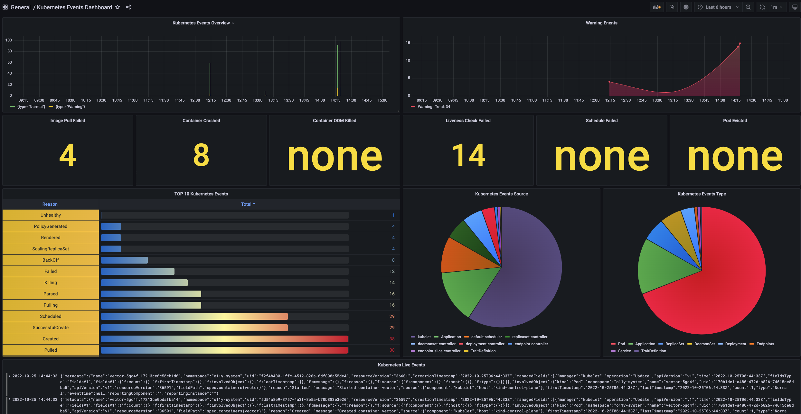
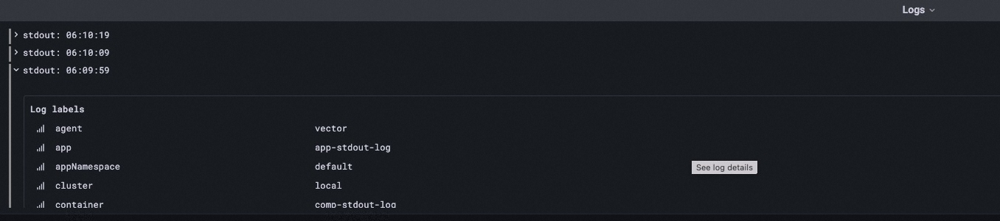

The application logs are very important for users to find and locate problems especially in production environment.
This doc will introduce how to use `loki` addon to collecting application logs and analysis them.

:::tip
This section will more likely to introduce how to collect and analysis logs.
If you just want to get real time logs from application for debug, you can just use `vela logs` command or check it on UI console provided by `velaux` addon.
:::

## Quick start

We need to enable the `loki` and `grafana` addon for this capability.

### Enable the loki addon

The loki addon can be enabled in two modes:

- Collecting application logs by specify trait, this is the default behavior when enabling log collection.
- Collecting all applications logs from container stdout.

#### Collecting logs by traits

To make this mode work, you need to enable loki addon by setting parameter `agent=vector`:

```shell
vela addon enable loki agent=vector
```

:::caution
When enable loki addon without the `agent` parameter, no log collector will be enabled, only loki service deployed.
:::

After this addon enabled with `agent=vector`, a [loki](https://github.com/grafana/loki) service will be deployed in the control plane as a log store, and a log collection agent [vector](http://vector.dev/) will be deployed as daemon for all nodes of each current managed clusters.

:::note
If you want to specify the clusters, you can specify the `clusters` parameter when enabling addon.
When new cluster joined, you need to enable this addon once again to install on these newly joined ones.
:::

Finally, you will get the following traits for log collection.

- `file-logs`
- `stdout-logs`

One application needs to configure above trait to make the log collected. These traits can also support configuring the vector VRL configuration to perform specific parsing method on the log content. The following chapters will introduce this part in detail.


#### Collecting all STDOUT logs automatically

```shell
vela addon enable loki agent=vector stdout=all
```

After the addon enabled with `stdout=all`, the vector agent will collect all stdout logs of application pods automatically. No additional traits need to be configured.
The collected logs will be delivered to the loki service in the control plane cluster for storage.

:::caution
The most advantage of this mode is that all logs configuration is simple and automatic, while the disadvantage are:

1. Collecting all running pods will **cause a lot of pressure** on the loki service when there are too many applications. On the one hand, not all logs are needed, it can waste disk storage a lot. On the other hand, the vector agents of each cluster need to transmit the collected logs to control plane cluster, which will consume lots of network bandwidth.
2. The full collection mode can only collect logs in a unified way, and no special log parsing can be done on different applications.
:::


### Enable the grafana addon

```shell
vela addon enable grafana
```

:::caution
Even if you have enabled the grafana addon as described in the ["Automated Observability Documentation"](../observability.md), you still need to re-enable the addon to register the loki data source to grafana.
:::

## Kubernetes system events logs

After the loki addon enabled, a component will be installed in each cluster, which is responsible for collecting Kubernetes events and converting them to logs transmit to loki. You can also view and analyze the events of the system through the Kubernetes events dashboard in the grafana addon.



<details>
    KubeVela Events dashboard

    ---

    **Kubernetes Event overview** Displays the number of latest Kubernetes events in each time period of the system.

    ---

    **Warning Events** The number of `Warning` type events.

    ---

    **Image Pull Failed/Container Crashed .../Pod Evicted** The number of events that indicate application failures, such as image pull failure and pod eviction in the last 12 hours.

    ---

    **TOP 10 Kubernetes Events** Top 10 types of events with the highest number of occurrences in the last 12 hours.

    ---

    **Kubernetes Events Source** Pie chart of the controllers producing these events.

    ---

    **Kubernetes Events Type** Pie chart of involved resource object types of events.

    ---

    **Kubernetes Live Events ** The recent event logs.

</details>

## Collecting stdout log

As mentioned above, if you're not enable the stdout full collection mode, you can collect stdout logs by specify trait.

Configure the `stdout-logs` trait in the component, as follows:

```yaml
apiVersion: core.oam.dev/v1beta1
kind: Application
metadata:
  name: app-stdout-log
  namespace: default
spec:
  components:
    - type: webservice
      name: comp-stdout-log
      properties:
        image: busybox
      traits:
        - type: command
          properties:
            command:
              - sh
              - -c
              - |
                while :
                do
                  now=$(date +"%T")
                  echo "stdout: $now"
                  sleep 10
                done
        - type: stdout-logs
```

After the application is created, you can find the deployment resource created by the application in the application dashboard of grafana, click `Detail` button to jump to the deployment resource dashboard, and find the log data below. as follows:



### nginx access log analysis

If your application is an nginx gateway, the `stdout-logs` trait provide the capability to parse nginx [combined](https://docs.nginx.com/nginx/admin-guide/monitoring/logging/) format log to json format as follows:

```yaml
apiVersion: core.oam.dev/v1beta1
kind: Application
metadata:
  name: nginx-app-2
spec:
  components:
    - name: nginx-comp
      type: webservice
      properties:
        image: nginx:1.14.2
        ports:
          - port: 80
            expose: true
      traits:
        - type: stdout-logs
          properties:
            parser: nginx
```

Then a special nginx access log analysis dashboard will be generated as follows:


<details>
    KubeVela nginx application dashboard

    ---

    **KPI's** Contains the gateway's core key metrics, such as total request traffic in the last twelve hours, and percentage of 5xx requests.

    ---

    **HTTP status statistic** Statistics of the number of requests for each request code.

    ---

    **Top Request Pages** Statistics of the most visited pages.


</details>

### Customize log processing configuration

You can also set customize parse configuration for your application log in this trait. As follows:

```yaml
apiVersion: core.oam.dev/v1beta1
kind: Application
metadata:
  name: nginx-app-2
spec:
  components:
    - name: nginx-comp
      type: webservice
      properties:
        image: nginx:1.14.2
        ports:
          - port: 80
            expose: true
      traits:
        - type: stdout-logs
          properties:
            parser: customize
            VRL: |
              .message = parse_nginx_log!(.message, "combined")
              .new_field = "new value"
```

In this example, we transform nginx `combinded` format logs to json format, and adding a `new_field` json key to each log, the json value is `new value`. Please refer to [document](https://vector.dev/docs/reference/vrl/) for how to write vector VRL.

If you have a special log analysis dashboard for this processing method, you can refer to [document](./dashboard.md) to import it into grafana.

## Collecting file log

The loki addon also support to collect file logs of containers. It doesn't matter with which mode you're enabling the loki addon, it works for all modes. Use the trait as follows:

```yaml
apiVersion: core.oam.dev/v1beta1
kind: Application
metadata:
  name: app-file
  namespace: default
spec:
  components:
    - type: webservice
      name: file-log-comp
      properties:
        image: busybox
      traits:
        - type: command
          properties:
            command:
              - sh
              - -c
              - |
                while :
                do
                  now=$(date +"%T")
                  echo "file: $now" >> /root/verbose.log
                  sleep 10
                done
        - type: file-logs
          properties:
            path: /root/verbose.log
```

In the example, we let business log of the `my-biz` component write to the `/data/daily.log` path in the container. After the application is created, you can view the corresponding file log results through the `deployment` dashboard.

:::tip
It should be noted that the logs that need to be collected mustn't is in the root directory of the container, otherwise it may cause the container to fail to start.
:::
