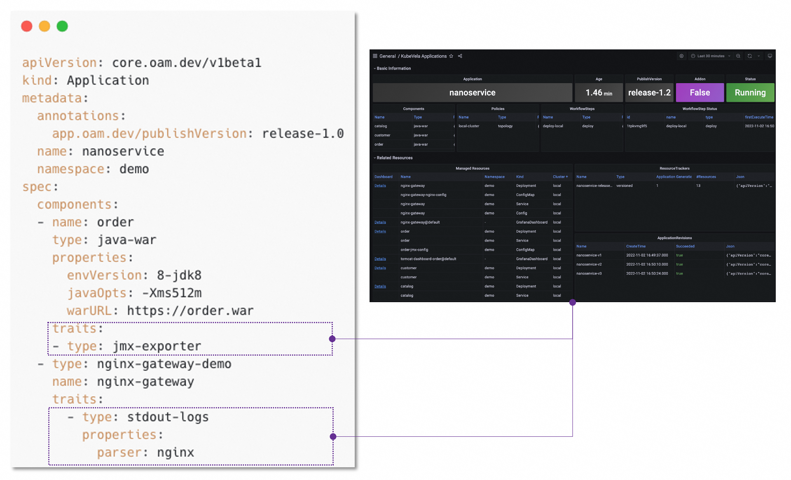

Observability is critical for infrastructures and applications. Without observability system, it is hard to identify what happens when system broke down. On contrary, a strong observability system can not only provide confidences for operators but can also help developers quickly locate the performance bottleneck or the weak points inside the whole system.

KubeVela has made the observability as first class citizen, it includes the following three aspects.

## Build observability infrastructure automatically

To help users build their own observability system from scratch with just one click, KubeVela provides a list of addons, including

**Metrics**
- `prometheus-server`: A server records metrics in time series with flexible queries supported.
- `kube-state-metrics`: A metrics collector for the Kubernetes system.
- `node-exporter`: A metrics collector for the running Kubernetes nodes.

**Logging**
- `loki`: A logging server which stores collected logs of Kubernetes pods and provide query interfaces.

**Dashboard**
- `grafana`: A web application that provides analytics and interactive visualizations.

After these addons enabled, out-of-box dashboard will be generated with real time data collecting.

> More addons for alerting & tracing will be introduced in later versions.

## Application Observability

OAM, as a unified application model, can adopt observability easily as operational traits. As a result, KubeVela also provides several traits for application observability. Once end users added these traits in their app, the data will be collected, delivered and finally shown on the grafana dashboard.

More than that, you can easily define your own observability traits with CUE.

## Observability as Code

The ability of KubeVela to support the application observability is all completed through the IaC (Infrastructure as Code) method, which also means that **KubeVela has glued from the collection of indicators (including logs), analysis, enrichment, storage, data source registration, all the way to visualization by using IaC**.

Based on the IaC system powered by CUE, KubeVela has encapsulated common functions such as creating data sources, creating large disks, and importing large disks. You can use them directly without learning the details. If you want to do some customization, you can also orchestrate your process in a similar way through CUE, and customize the observability for your platform.

In the following documents, we will expand the above in detail one by one.

## What's Next

- [**Enable Observability Addons**](./o11y/installation): Guide for how to install observability addons in your KubeVela system.

- [**Out-of-Box Dashboards**](./o11y/out-of-the-box): Guide for how to use pre-installed dashboards to monitor your system and applications.

- [**Metrics Collection**](./o11y/metrics): Guide for customizing the process of collecting metrics for your application.

- [**Log Collection**](./o11y/logging): Guide for how to customize the log collecting rules for your application.

- [**Customize Dashboard**](./o11y/dashboard): Guide for creating your customized dashboards for applications.

- [**Integration Existing Observability Service**](./o11y/integration): Guide for integrating your existing infrastructure to KubeVela, when you already have Prometheus or Grafana before installing addons.