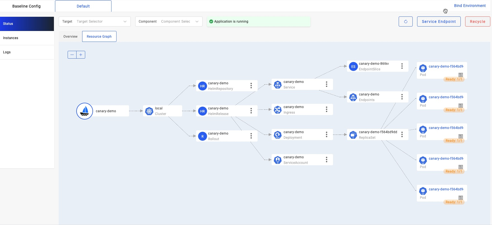
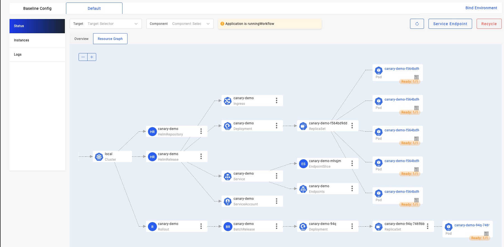

## Before starting

1. Please make sure you have read the doc of about [the basic deployment of helm chart](./helm.md).

2. Make sure you have already enabled the [`kruise-rollout`](../reference/addons/kruise-rollout.md) addon, our canary rollout capability relies on the [rollouts from OpenKruise](https://github.com/openkruise/rollouts).
  ```shell
  vela addon enable kruise-rollout
  ```

3. Please make sure one of the [ingress controllers](https://kubernetes.github.io/ingress-nginx/deploy/) is available in your Kubernetes cluster.
   You can also enable the [ingress-nginx](../reference/addons/nginx-ingress-controller.md) or [traefik](../reference/addons/traefik.md) addon if you don't have any:
  ```shell
  vela addon enable ingress-nginx
  ```
  Please refer to [the addon doc](../reference/addons/nginx-ingress-controller.md) to get the access address of gateway.

4. Some of the commands such as `rollback` relies on vela-cli `>=1.5.0-alpha.1`, please upgrade the command line for convenience. You don't need to upgrade the controller.

## Limitation

A helm chart can contain almost everything, this canary rollout works for most of the cases including:

1. The helm chart contains a service pointing to the workload along with an ingress routing to the service.
2. Workloads supported including Kubernetes Deployment, StatefulSet, and [OpenKruise Cloneset](https://openkruise.io/docs/user-manuals/cloneset/). That means the workload in your helm chart must be one of these three types.

By default, each helm chart created by `helm create` command can meet the requirements.

## First deployment

When you want to use the canary rollout, you need to add the `kruise-rollout` trait at the first time, this configuration will take effect at next release process. Deploy the application with traits like below:

```yaml
cat <<EOF | vela up -f -
apiVersion: core.oam.dev/v1beta1
kind: Application
metadata:
  name: canary-demo
  annotations:
    app.oam.dev/publishVersion: v1
spec:
  components:
  - name: canary-demo
    type: helm
    properties:
      repoType: "helm"
      url: "https://wangyikewxgm.github.io/my-charts/"
      chart: "canary-demo"
      version: "1.0.0"
    traits:
    - type: kruise-rollout
      properties:
        canary:
          # The first batch of Canary releases 20% Pods, and 20% traffic imported to the new version, require manual confirmation before subsequent releases are completed
          steps:
          - weight: 20
          # The second batch of Canary releases 90% Pods, and 90% traffic imported to the new version.
          - weight: 90
          trafficRoutings:
          - type: ingress
EOF
```

This is a general helm chart created by `helm create` command, which contains a deployment whose image is `barnett/canarydemo:v1`, a service and an ingress. You can check the source of chart in [repo](https://github.com/wangyikewxgm/my-charts/tree/main/canary-demo).

Here's an **overview about what will happen** when upgrade under this `kruise-rollout` trait configuration, the whole process will be divided into 3 steps:

1. When the upgrade start, a new canary deployment will be created with `20%` of the total replicas. In our example, we have 5 total replicas, it will keep all the old ones and create `5 * 20% = 1` for the new canary, and serve for `20%` of the traffic. It will wait for a manual approval when everything gets ready.
   - By default, the percent of replicas are aligned with the traffic, you can also configure the replicas individually according to [this doc](../reference/addons/kruise-rollout.md).
2. After the manual approval, the second batch starts. It will create `5 * 90% = 4.5` which is actually `5` replicas of new version in the system with the `90%` traffic. As a result, the system will totally have `10` replicas now. It will wait for a second manual approval.
3. After the second approval, it will update the workload which means leverage the rolling update mechanism of the workload itself for upgrade. After the workload finished the upgrade, all the traffic will route to that workload and the canary deployment will be destroyed.

Let's continue our demo, the first deployment has no difference with a normal deploy, you can check the status of application to make sure it's running for our next step.

```shell
vela status canary-demo
```

If you have enabled [velaux](../reference/addons/velaux.md) addon, you can view the application topology graph that all `v1` pods are ready now.



Access the gateway endpoint. You can see the result always is `Demo: V1`
```shell
$ curl -H "Host: canary-demo.com" <ingress-controller-address>/version
Demo: V1
```

## Day-2 Canary Release

Update the target version of helm chart from `1.0.0` to `2.0.0`:

```shell
cat <<EOF | vela up -f -
apiVersion: core.oam.dev/v1beta1
kind: Application
metadata:
  name: canary-demo
  annotations:
    app.oam.dev/publishVersion: v2
spec:
  components:
  - name: canary-demo
    type: helm
    properties:
      repoType: "helm"
      url: "https://wangyikewxgm.github.io/my-charts/"
      chart: "canary-demo"
      # Upgade to version 2.0.0
      version: "2.0.0"
    traits:
    - type: kruise-rollout
      properties:
        canary:
          # The first batch of Canary releases 20% Pods, and 20% traffic imported to the new version, require manual confirmation before subsequent releases are completed
          steps:
          - weight: 20
          # The second batch of Canary releases 90% Pods, and 90% traffic imported to the new version.
          - weight: 90
          trafficRoutings:
          - type: ingress
EOF
```

The only difference between two versions is image tag. Version `2.0.0` uses `barnett/canarydemo:v2`.

Access the gateway endpoint again. You will find out there is about 20% chance to meet `Demo: v2` result.

```shell
$ curl -H "Host: canary-demo.com" <ingress-controller-address>/version
Demo: V2
```

The other operations such as `continue rollout/rollback` are totally same with the operation for webservice component.


## Continue Canary Process

After verify the success of the canary version through business-related metrics, such as logs, metrics, and other means, you can resume the workflow to continue the process of rollout.

```shell
vela workflow resume canary-demo
```

View topology graph again, you will see `kruise-rollout` trait created a `v2` pod, and this pod will serve the canary traffic. Meanwhile, the pods of `v1` are still running and server non-canary traffic.



Access the gateway endpoint again multi times. You will find out the chance to meet result `Demo: v2` is highly increased, almost 90%.

```shell
$ curl -H "Host: canary-demo.com" <ingress-controller-address>/version
Demo: V2
```

## Canary validation succeed, finished the release

In the end, you can resume again to finish the rollout process.

```shell
vela workflow resume canary-demo
```

Access the gateway endpoint again multi times. You will find out the result always is `Demo: v2`.

```shell
$ curl -H "Host: canary-demo.com" <ingress-controller-address>/version
Demo: V2
```

## Canary verification failed, rollback the release

If you want to cancel the rollout process and rollback the application to the latest version, after manually check. You can rollback the rollout workflow:

You should suspend the workflow before rollback:
```shell
$ vela workflow suspend canary-demo
Rollout default/canary-demo in cluster  suspended.
Successfully suspend workflow: canary-demo
```

Then rollback:
```shell
$ vela workflow rollback canary-demo
Application spec rollback successfully.
Application status rollback successfully.
Rollout default/canary-demo in cluster  rollback.
Successfully rollback rolloutApplication outdated revision cleaned up.
```

Access the gateway endpoint again. You can see the result always is `Demo: V1`.
```shell
$ curl -H "Host: canary-demo.com" <ingress-controller-address>/version
Demo: V1
```

Any rollback operation in middle of a runningWorkflow will rollback to the latest succeeded revision of this application. So, if you deploy a successful `v1` and upgrade to `v2`, but this version didn't succeed while you continue to upgrade to `v3`. The rollback of `v3` will automatically to `v1`, because release `v2` is not a succeeded one.
