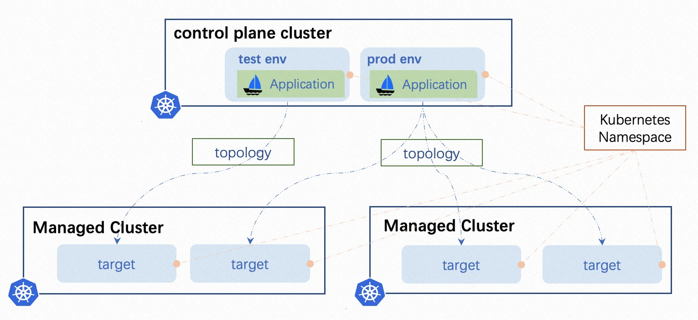

:::tip
This section will mainly focus on UI operation on multi-environments delivery, if you want to deploy with YAML, just refer to [multi-cluster delivery doc](../case-studies/multi-cluster.md), just compose the topology policy with different clusters and namespaces to make them work as environment. 
:::

Environments represent your deployment targets logically ( develop, test, production, etc). VelaUX (the UI of KubeVela) provides [some new concepts, the environment and delivery target](../reference/addons/velaux.md#concept-of-velaux) for more flexible deployments on UI operations.

You can place multi targets to the same environment as you need.
In KubeVela, the environment bond a namespace in the control plane cluster. The application instance will be deployed into the Kubernetes namespace bond with the specified environment. Actually, the application created in VelaUX is an application template before bound with environment. As a result, VelaUX allow you to easily deploy the same app into different environments.

:::note
If no delivery target configured, a default one  will be used with the default namespace in the control plane cluster.
:::

In the following sections, we'll guide you how to manage application to deploy into multi-environments with VelaUX.

## Deploy the application to multi-environment

### 1. Create an environment

Create environment on VelaUX is very straight forward.

One environment could includes multi targets. The environment belongs to a project, One project could include multi environments. Only the application belonging to this project could bond this environment.

:::note
You could create an environment with command ( `vela env init prod --namespace prod` ), but currently( v1.5) that does not sync to UI before you create an application in this environment.
:::

### 2. Bind the application to an environment

You could select multi environments when you create an application, or modify the application later to bind more environments. The UI will automatically generate a workflow when the application bond to an environment, that includes some `deploy` type steps. You can manually modify the workflow later. The default behavior is to deploy targets one by one in workflow steps. You could add other steps such as `suspend` between two `deploy` steps.

### 3. Set the different configuration

We usually need to set different configurations for different environments, such as environment variables, replicas or resource limits. In this case, we can create some override policies. When we create an override policy, we need to choose affected environment or targets through selecting workflow and steps.

You can refer to [override policy](../end-user/policies/references.md#override) documentation for parameter spec details.

### 4. Deploy

By default, all environments are independent with each other. When you deploy an application, you need to select the environment to be deployed. You can also leverage the [custom trigger](../how-to/dashboard/trigger/overview.md) to connect deploy actions between environments.

For example, if you want to deploy the production environment  only after the test environment is completed successfully. You can create a trigger with the custom type for the production environment, and get a webhook URL. Then, edit the workflow of the test environment, add a webhook workflow step at the end. 
